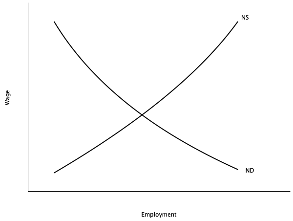
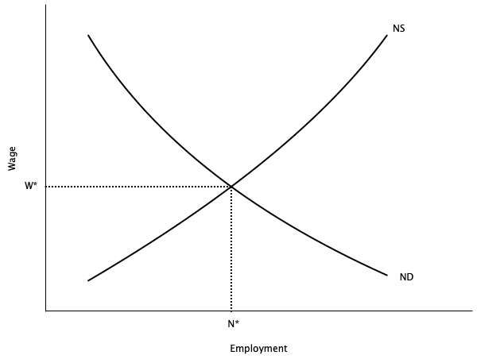
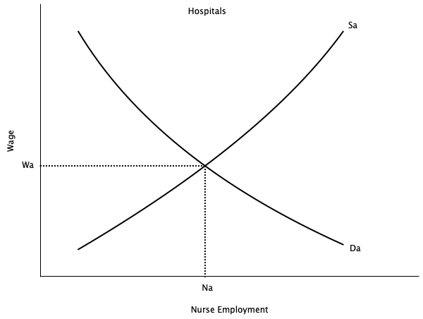
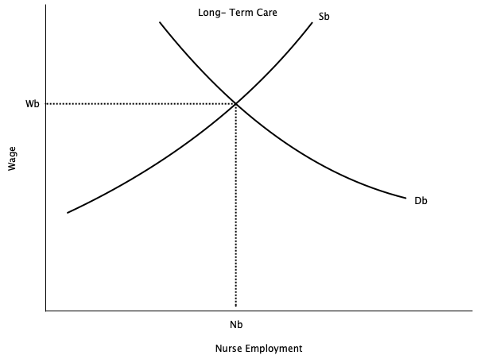
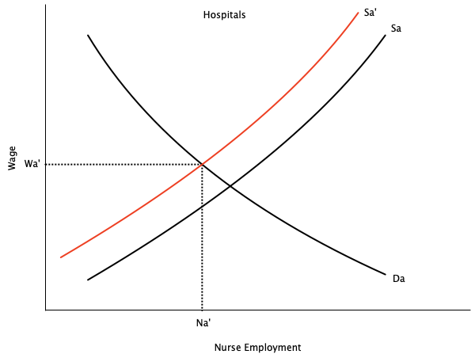
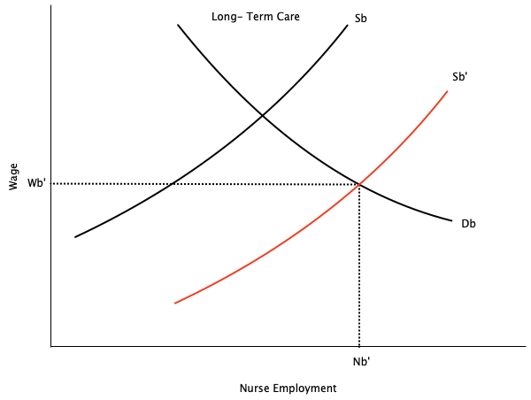

---
format:
  revealjs:
    theme: [default, hygge.scss]
    center-title-slide: false
    slide-number: true
    height: 900
    width: 1600
    chalkboard:
      theme: whiteboard
      src: drawings.json
editor: visual
---

<h1>Introduction to Labour Market Economics</h1>

<h2>EC306- Wages and Employment</h2>

<h2>Justin Smith</h2>

<h2>Wilfrid Laurier University</h2>

<h2>Fall 2026</h2>

{.absolute top="275" left="900" width="550"}

# Goals of This Section

## Goals of This Section

In this section we will:

- Define [**Labour Economics**]{.fg style="color: #2780e3;"}
- Introduce the main economic model used in labour economics
- Discuss some current policy issues

# What is Labour Economics?

## Defining Labour Economics

::: {.callout-important}
## Key Definition
**Labour Economics** is the study of the interaction between workers, employers, and government that determine outcomes like wages and employment
:::

[Key aspects of labour economics:]{.fg style="color: #2780e3;"}

- [Labour supply:]{.fg style="color: #555;"} decisions by individuals about how much to work
- [Labour demand:]{.fg style="color: #555;"} decisions by firms about how many workers to hire
- [Labour market:]{.fg style="color: #555;"} the interaction of labour supply and demand that determines wages and&nbsp;employment
- [Other determinants of wages:]{.fg style="color: #555;"} human capital, discrimination, unions, minimum wage, etc.
- [Inequality and poverty:]{.fg style="color: #555;"} the distribution of income and wealth
- [Unemployment:]{.fg style="color: #555;"} causes and consequences

## Labour Supply

- Studies decisions by individuals about how much to work
- There are many key determinants
  - [Wages:]{.fg style="color: #555;"} higher wages increase the opportunity cost of leisure, leading to more work
    - Can also lead to *less* work if wages are already very high
  - [Non-labour income:]{.fg style="color: #555;"} higher non-labour income reduces the need to work, leading to less&nbsp;work
  - [Preferences:]{.fg style="color: #555;"} some people may prefer more leisure or more work
  - [Public policy:]{.fg style="color: #555;"} taxes, transfers, and regulations can affect labour supply
    - Examples: income tax, welfare programs, minimum wage, pension, workers&nbsp;compensation

## Labour Demand

- Studies decision by firms about how many workers to hire
- Key determinants
  - [Wages:]{.fg style="color: #555;"} higher wages increase the cost of labour, leading to less hiring
  - [Other labour costs:]{.fg style="color: #555;"} benefits, training, and other costs increase the cost of labour, leading to less hiring
  - [Productivity:]{.fg style="color: #555;"} more productive workers are more valuable, leading to more hiring
  - [Output prices:]{.fg style="color: #555;"} higher output prices increase revenue, leading to more hiring
  - [Technology:]{.fg style="color: #555;"} new technology can change the demand for different types of workers
  - [Public policy:]{.fg style="color: #555;"} taxes, subsidies, and regulations can affect labour demand
    - Examples: corporate tax, employment subsidies, minimum wage, occupational licensing

## Relative Wages

- Across the economy, different groups of workers earn different wages
  - [Men earn more than women]{.fg style="color: #c7254e;"}
  - Education is positively related to wages
  - More dangerous jobs tend to pay more
  - Public sector jobs pay differently than private sector ones
  - [Immigrants earn less than non-immigrants]{.fg style="color: #c7254e;"}
- [Labour Economics]{.fg style="color: #2780e3;"} uses supply, demand and other models to explain these differences
  - Returns to schooling explained by [**human capital theory**]{.fg style="color: #2780e3;"}
  - Gender and immigrant wage gaps partly explained by [discrimination]{.fg style="color: #c7254e;"}

## Unions

- [Unions]{.fg style="color: #2780e3;"} are organizations that represent workers in collective bargaining with employers
- Unions increase worker power, and can affect wages and employment
- Typically wages of unionized workers are determined by [**collective bargaining**]{.fg style="color: #2780e3;"}
  - Leads to a collective bargaining agreement, renegotiated every few years
- To study unionized workers, labour economists incorporate bargaining theory into their&nbsp;models
- Unions can also affect non-wage aspects of jobs, such as benefits, working conditions, and job security

## Unemployment

- Most topics in labour economics use [**microeconomic**]{.fg style="color: #2780e3;"} models to explain behaviour
- Unemployment is studied using both microeconomic and macroeconomic models

[Typical microeconomic topics include:]{.fg style="color: #2780e3;"}

- [Job search:]{.fg style="color: #555;"} how workers find jobs and how firms find workers
- [Implicit contracts:]{.fg style="color: #555;"} agreements between workers and firms that are not formal contracts
- [Efficiency wages:]{.fg style="color: #555;"} wages that are above the market-clearing level to increase productivity and reduce turnover
- [Employment insurance:]{.fg style="color: #555;"} government programs that provide income support to unemployed&nbsp;workers

## Unemployment

[Typical macroeconomic topics include:]{.fg style="color: #2780e3;"}

- [Business cycles:]{.fg style="color: #555;"} fluctuations in economic activity that affect employment
- [Inflation:]{.fg style="color: #555;"} the general increase in prices that can affect real wages and employment
- [Productivity:]{.fg style="color: #555;"} the amount of output produced per worker that can affect wages and&nbsp;employment

## iClicker Question {background-color="#f0f4f8"}

The government raises the age at which people can start collecting a public pension, and more 64-year-olds stay in their jobs. Which area of labour economics does this belong to?

A\) Labour supply\
B) Labour demand\
C) Relative wages\
D) Unions\
E) Unemployment

::: {.notes}
Answer: A. The question to ask is *whose decision the policy changed*. Here it is individuals deciding whether to keep working — that is labour supply. Firms have not changed how many workers they want to hire, so it is not labour demand.

Watch for students reasoning "it's a government policy, so it must be demand" — public policy sits on both the supply and demand lists (minimum wage is on both), so the policy label never settles it on its own.
:::

# Basic Economic Model of the Labour Market

## Introduction

- The basic economic model of the labour market is based on [**supply and demand**]{.fg style="color: #2780e3;"}
- The labour market is an [**input market**]{.fg style="color: #2780e3;"}
  - Firms demand labour to produce goods and services
  - Workers supply labour in exchange for wages
  - Different from [**output markets**]{.fg style="color: #2780e3;"} where firms supply goods and services, and consumers demand them
- The interaction of [labour supply]{.fg style="color: #2780e3;"} and [labour demand]{.fg style="color: #2780e3;"} determines the [equilibrium]{.fg style="color: #2780e3;"} wage and employment level
- We will cover the basics here, and fill in details through the course

## Competitive Labour Market

:::: columns
:::: {.column width="50%"}
::: {layout="[[-1], [1], [-1]]"}
{width="796"}
:::
::::

:::: {.column width="50%"}
- Graph shows [demand curve]{.fg style="color: #2780e3;"} (ND) and [supply curve]{.fg style="color: #2780e3;"} (NS) for labour
- [Supply curve]{.fg style="color: #2780e3;"} is upward sloping
  - Shows how much labour people will sell at each wage **all else equal**
  - The higher the wage, the higher the quantity of labour supplied
- [Demand curve]{.fg style="color: #2780e3;"} is downward sloping
  - Shows how much labour a firm wants to hire at each wage **all else equal**
  - The higher the wage, the lower the quantity of labour demanded
::::
::::

## Competitive Labour Market

:::: columns
:::: {.column width="50%"}
::: {layout="[[-1], [1], [-1]]"}
{width="796"}
:::
::::

:::: {.column width="50%"}
- [Equilibrium]{.fg style="color: #2780e3;"} is where demand and supply intersect
  - Wage is W\* and level of employment is N\*
- Why is this equilibrium?
  - If W \> W\*, [excess supply]{.fg style="color: #c7254e;"} of labour
    - Unemployed workers willing to work for&nbsp;less
    - Puts downward pressure on wage
  - If W \< W\*, [excess demand]{.fg style="color: #c7254e;"} for labour
    - Firms cannot find enough workers
    - Puts upward pressure on wage
::::
::::

## Competitive Labour Market

- There are some key considerations of this model

::: {.callout-note}
## Key Assumptions
1. Assumes many buyers and sellers
   - No single firm or worker can influence the wage
   - Need a different model for labour markets with a single buyer (monopsony)
2. Implies no [**involuntary unemployment**]{.fg style="color: #c7254e;"}
   - Everyone who wants to work at the equilibrium wage can find a job
   - People who are unemployed are choosing to be
   - Not very realistic because we know the involuntary unemployed exist
3. Assumes homogeneous set of workers
   - Same in terms of their productive characteristics
:::

## Competitive Labour Market

- An implication of homogeneous labour is that different sectors that hire the same labour pay them the same
- Example: Nurses
  - Nurses in hospitals and long-term care facilities have similar skills and training
  - If hospitals pay more, nurses will leave long-term care to work in hospitals
  - This will continue until wages are equalized
- Other examples
  - Teachers in public and private schools
  - Electricians in construction and manufacturing
  - Data scientists in tech firms and banks

## Competitive Labour Market

:::: columns
:::: {.column width="50%"}
::: {layout="[[-1], [1], [-1]]"}
{width="796"}
:::
::::

:::: {.column width="50%"}
::: {layout="[[-1], [1], [-1]]"}
{width="796"}
:::
::::
::::

## Competitive Labour Market

:::: columns
:::: {.column width="50%"}
::: {layout="[[-1], [1], [-1]]"}
{width="796"}
:::
::::

:::: {.column width="50%"}
::: {layout="[[-1], [1], [-1]]"}
{width="796"}
:::
::::
::::

## Competitive Labour Market {.smaller}

- Graphs show a temporary imbalance in pay between hospitals and long-term care in the market for nurses
- Right graph shows long term care paying more
- Over time nurses move from hospitals to long term care
  - Movement stops when wages are equalized
- Employment in long term care increases, employment in hospitals decreases

::: {.callout-warning}
This depends on key assumptions:

- No barriers to moving between sectors
- No differences in non-wage aspects of jobs
- Homogeneous labour
:::

- We will explore situations in the course where these assumptions do not hold

## iClicker Question {background-color="#f0f4f8"}

Suppose the government made it difficult for nurses to move between hospitals and long-term care. Compared with free movement, we would expect:

A\) Wages to equalize across the two sectors more quickly\
B) The wage gap between the two sectors to persist\
C) Employment to rise in both sectors\
D) Wages to fall in both sectors\
E) No change, because nurses' wages are set nationally

::: {.notes}
Answer: B. Equalization depends on the no-barriers-to-mobility assumption in the callout. Block movement and the gap survives.
:::

# Current Policy Issues

## Introduction

- Most researchers in labour economics analyze various policy issues
  - Use data to estimate their effects
  - Some do experiments
  - Others (not many) create theoretical models
- There are many policies that affect workers and firms with respect to labour
  - In Canada they can be at the federal, provincial, or municipal level
  - Can be policies from other countries (e.g. U.S. tariffs)
- Below we outline some current issues
  - Helpful for the future if you want to write a 481 paper in this area
- Textbook has an extremely long list; we will cover a few here

## Issues in Labour Supply

- How does income tax affect employment?
- Do income support programs (e.g. welfare, Canada Worker Benefit) affect employment?
- How has the [Labour Force Participation Rate]{.fg style="color: #2780e3;"} of women changed over time?
- How do child care costs affect employment of mothers?
- How do pension programs affect retirement decisions?
- Do temporary foreign workers affect the wages of domestic workers?

## Issues in Labour Demand

- How do [minimum wages]{.fg style="color: #2780e3;"} affect employment?
- Do [unions]{.fg style="color: #2780e3;"} affect wages and employment?
- Does technological change (e.g. Automation, AI) reduce employment?
- Does uncertainty (e.g. Trump tariffs, Brexit) affect hiring/firing decisions?
- Do employment subsidies (e.g. Canada Summer Jobs program) increase employment?

## Issues in Wage Structures

- Why do men and women earn different wages?
- Why do immigrants earn lower wages on entry?
- Do immigrant wages catch up after being in Canada for a while?
- What is the return to additional schooling?
- Do public sector workers earn more than private sector workers?
- Do workers in more dangerous jobs earn more?
- Why are CEOs paid so much?

## Issues in Unemployment

- What are the main causes of unemployment?
- How do [unemployment insurance]{.fg style="color: #2780e3;"} programs affect unemployment?
- How quickly does unemployment fall after a recession?
- How long do people typically stay unemployed?
- Does [long term unemployment]{.fg style="color: #c7254e;"} hurt future job prospects?

## iClicker Question {background-color="#f0f4f8"}

Provinces with higher minimum wages tend to have higher youth unemployment. Why can we not conclude that minimum wages *cause* youth unemployment?

A\) Youth unemployment is measured with error\
B) Provinces differ in many other ways that also affect youth unemployment\
C) Minimum wages are reset every year\
D) The correlation is too weak to matter\
E) We can conclude it — the relationship is clear

::: {.notes}
Answer: B. This is the confounding problem, and it is exactly what Chapter 2 is about. Good bridge into the next section.
:::

