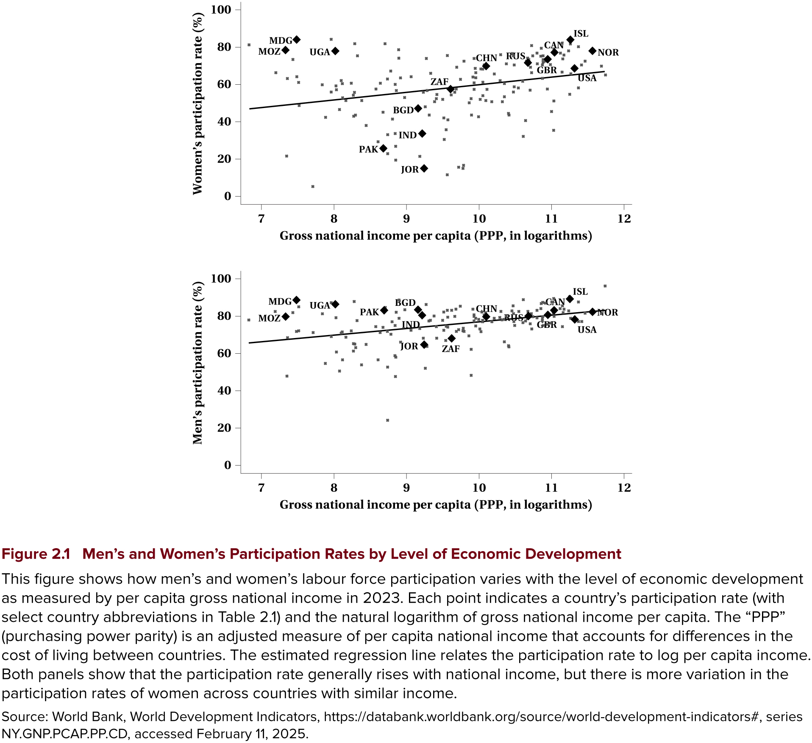
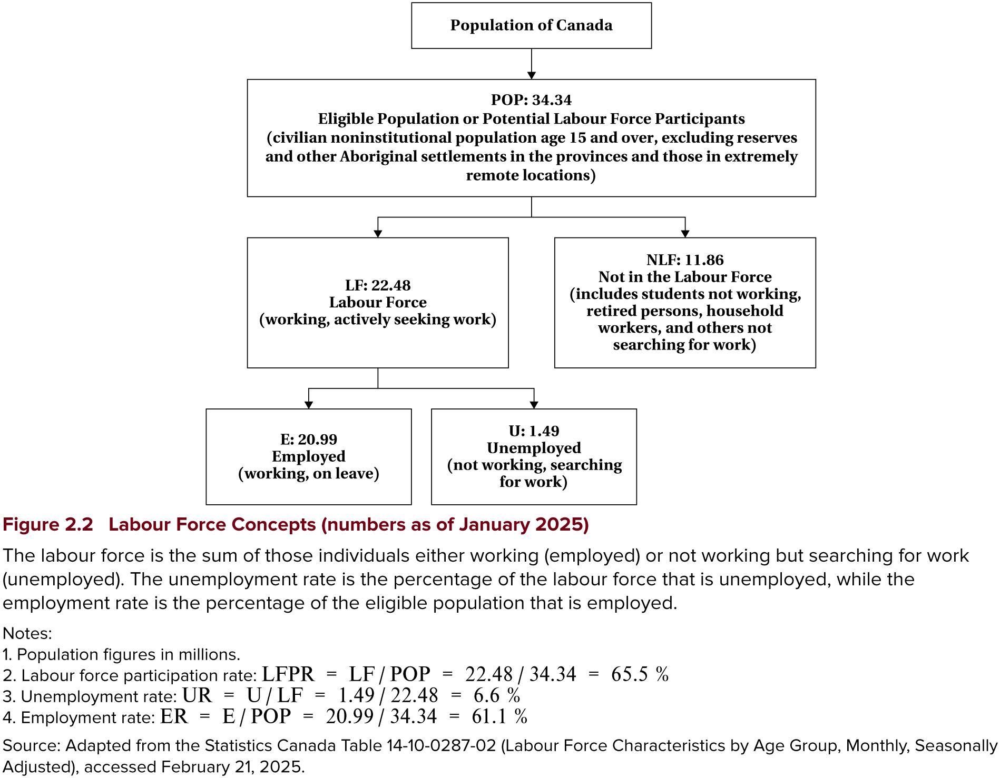
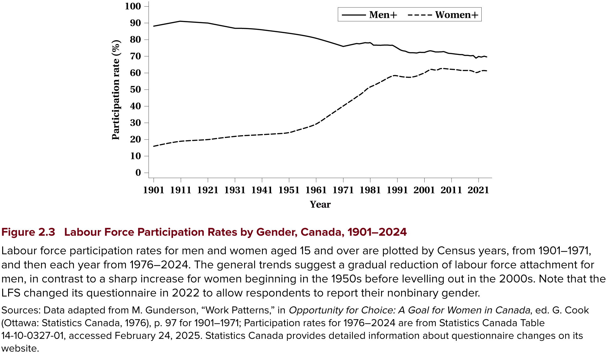

---
format:
  revealjs:
    theme: [default, hygge.scss]
    center-title-slide: false
    slide-number: true
    height: 900
    width: 1600
    chalkboard:
      theme: whiteboard
      src: drawings.json
editor: visual
---

<h1>Introduction to the Canadian Labour Market, Measurement, and Research</h1>

<hr>

<h2>EC306- Wages and Employment</h2>

<h2>Justin Smith</h2>

<h2>Wilfrid Laurier University</h2>

<h2>Fall 2026</h2>

{.absolute top="275" left="900" width="550"}

# Goals of This Section

## Goals of This Section

In this section we will:

- Compare labour market outcomes across countries and across Canada
- Review the legal and institutional context in which people and firms decide
- Define the key labour force concepts and the data we measure them with
- See how regression is used, and why correlation is not causation
- Introduce the research designs that let us estimate [causal]{.fg style="color: #2780e3;"} effects

# Introducing the Canadian Labour Market

## Comparing Labour Markets

- Labour economics has a strongly [empirical]{.fg style="color: #2780e3;"} tilt
- Comparing outcomes across regions tells us how differences in economic structure or policy matter for people's well-being
- The first thing to describe is how [attached]{.fg style="color: #2780e3;"} people are to the labour market
  - Do they participate in paid work, or spend time on unpaid work at home, retirement, volunteering, or school?

::: {.callout-important}
## Key Definition
The [labour force participation decision]{.fg style="color: #2780e3;"} is whether to take part in paid labour market activity. The share of the population doing so is the [participation rate]{.fg style="color: #2780e3;"}.
:::

## Participation Across Countries

- There is huge variation across countries
  - From about 41% in Jordan to 87% in Iceland
- Canada is relatively high at 80.3% in 2023 — nearly 7 points above the United States
  - These comparisons cover ages [15--64]{.fg style="color: #2780e3;"}, which is why they run well above the 15-and-over rates in our Canadian charts later
- Most of the cross-country variation comes from differences in [women's]{.fg style="color: #2780e3;"} participation
- Countries with the largest gaps between men and women tend to have lower average incomes
  - Though there are important exceptions

## Participation and Economic Development

- Plotting participation against log national income per capita, participation generally rises with income for both men and women
- But there is far more variation among [women]{.fg style="color: #2780e3;"} across countries with similar income
  - Mozambique and Madagascar are low-income with very high women's participation
  - The gender gap in Mozambique is only 1.1 percentage points

::: {.callout-note}
The reasons are complex. We expect the availability of high-paying opportunities for women, and social norms around women's paid work, to matter a great deal.
:::

## Participation and Economic Development



## Differences Within Canada

- Nearly 21 million people were employed in Canada in 2024, unevenly distributed
  - Ontario largest at about 8 million; Prince Edward Island smallest at 93,000
- Most people work in [service]{.fg style="color: #2780e3;"} industries — about 80% nationally
  - Alberta is lower, because resource industries are a larger share of jobs
- Populations differ too: median age is highest in Newfoundland and Labrador, lowest in&nbsp;Manitoba

Both labour demand and supply differ by province, given who lives there.

## Two More Indicators

::: {.callout-important}
## Key Definitions
The [job vacancy rate]{.fg style="color: #2780e3;"} is the number of jobs that need to be filled, as a percentage of all jobs — occupied or vacant. It was 3.2% nationally in 2024, highest in British Columbia.

The [union differential]{.fg style="color: #2780e3;"} is the percentage difference between average weekly earnings of union and non-union employees. It was 7.3% nationally, but varies widely — over 30% in Prince Edward Island.
:::

- We return to vacancies in [Chapter 8]{.fg style="color: #555;"} and to unions later in this section

## iClicker Question {background-color="#f0f4f8"}

Across countries, most of the variation in overall labour force participation comes from differences in:

A\) Men's participation\
B) Women's participation\
C) Retirement ages\
D) Unemployment rates\
E) Population size

::: {.notes}
Answer: B. Men's participation is relatively similar across countries; women's varies enormously, and the gap is widest in lower-income countries.
:::

# Institutional and Legal Context

## Introduction

- Before analyzing any market, we need the [context]{.fg style="color: #2780e3;"} in which people and firms decide
- Institutions and legislation shape the employer–employee relationship
- Rules do not just constrain behaviour — they change [wages and employment]{.fg style="color: #2780e3;"}

## Canada and Indigenous Peoples

- Inuit, First Nations, and Métis Peoples have a special constitutional relationship with the Crown
  - Including "existing aboriginal and treaty rights" under [section 35 of the *Constitution Act,&nbsp;1982*]{.fg style="color: #2780e3;"}
- Laws and policies are being reviewed against the *United Nations Declaration on the Rights of Indigenous&nbsp;Peoples*

::: {.callout-tip}
We look at contemporary effects of Canada's historical policies in [Chapter 15]{.fg style="color: #555;"}.
:::

## Canada and Indigenous Peoples

[Which rules apply at work?]{.fg style="color: #2780e3;"}

- Employment relationships follow the same legislation as everyone else, depending on [industry]{.fg style="color: #2780e3;"}
  - Federal jurisdiction covers band councils and Indigenous self-governments

[Taxation:]{.fg style="color: #2780e3;"}

- Employment income may be tax exempt when the work is substantially "situated on a reserve" and done by a registered First Nations individual
  - Section 87 of the *Indian&nbsp;Act*

## Federal and Provincial Jurisdiction

- The *British North America Act* of 1867 divided power between the two levels of government
- Which government regulates your job depends on [what industry you work in]{.fg style="color: #2780e3;"}, not where you&nbsp;live

[Federal jurisdiction]{.fg style="color: #2780e3;"} covers the federal public service plus a short list of industries:

- Interprovincial and international transportation
- Telecommunications and broadcasting
- Banks — but [not]{.fg style="color: #c7254e;"} credit unions
- Postal and courier services

The provinces have everything else — the large majority of workers.

## The Canada Labour Code

::: {.callout-important}
## Key Definition
The [Canada Labour Code (CLC)]{.fg style="color: #2780e3;"} sets labour standards for industries under federal responsibility. It has four&nbsp;parts.
:::

- [Part I]{.fg style="color: #555;"} — Industrial Relations: collective bargaining and unionization
- [Part II]{.fg style="color: #555;"} — Occupational Health and Safety
- [Part III]{.fg style="color: #555;"} — Labour Standards: employment conditions and protections
- [Part IV]{.fg style="color: #555;"} — Penalties and procedures for noncompliant employers

Not every part applies to every worker: federal private sector gets all four, the federal public sector only II and IV.

## Provincial Employment Standards

- Each province has an [*Employment Standards Act*]{.fg style="color: #2780e3;"} or *Code* setting rules on:
  - Minimum wages, vacation time, parental and sick leave
  - Termination of employment, limits on hours
- We care because these rules change the decisions of workers and firms — and therefore [wages and employment]{.fg style="color: #2780e3;"}

## Minimum Wages in Canada, September 2026

:::: columns
:::: {.column width="50%"}
| Jurisdiction | Wage |
|:---|---:|
| Canada (federal) | \$18.15 |
| Newfoundland and Labrador | \$16.35 |
| Prince Edward Island | \$17.00 |
| Nova Scotia | \$16.75 |
| New Brunswick | \$15.90 |
| Quebec | \$16.60 |
| Ontario | \$17.60 |
::::

:::: {.column width="50%"}
| Jurisdiction | Wage |
|:---|---:|
| Manitoba | \$16.00 |
| Saskatchewan | \$15.35 |
| Alberta | \$15.00 |
| British Columbia | \$18.25 |
| Nunavut | \$20.17 |
| Northwest Territories | \$17.20 |
| Yukon | \$18.51 |
::::
::::

- Most jurisdictions now [index annually]{.fg style="color: #2780e3;"} — Ontario, Manitoba, Nova Scotia, and PEI all adjust on [October 1, 2026]{.fg style="color: #2780e3;"}, partway through this course
- Alberta has not changed since 2019, the longest freeze in the country

We analyze minimum wages properly in [Chapter 12]{.fg style="color: #555;"}.

## Labour Relations, Equity, and Human Rights

- A separate provincial [*Labour Relations Act*]{.fg style="color: #2780e3;"} governs forming a union, negotiations, and dispute resolution
  - This helps explain differences across provinces in unionization rates

::: {.callout-important}
## Employment Equity vs. Pay Equity
[Employment equity]{.fg style="color: #2780e3;"} removes barriers to employment for designated groups — women, Indigenous Peoples, persons with disabilities, and members of visible minorities.

[Pay equity]{.fg style="color: #2780e3;"} requires that women and men receive the same pay for work of [equal value]{.fg style="color: #2780e3;"}.
:::

- The *Canadian Human Rights Act* protects against discrimination on grounds including race, religion, age, sex, sexual orientation, gender identity, disability, and family status
- Provinces have related legislation for workers outside the federal jurisdiction

## iClicker Question {background-color="#f0f4f8"}

A teller at a credit union in Ontario is covered by:

A\) The Canada Labour Code, because banking is federal\
B) Ontario's employment standards legislation, because credit unions are provincial\
C) Both, equally\
D) Neither\
E) Whichever the employer chooses to register under

::: {.notes}
Answer: B. Banks are federal, but credit unions are explicitly not. This is the trap in the jurisdiction list — the test is the industry, not the job title.
:::

# Quantifying the Canadian Labour Market

## Types of Data

Labour economists catalogue data by the [unit of observation]{.fg style="color: #2780e3;"}.

- [Aggregate (time-series)]{.fg style="color: #555;"} — economy-wide measures like the unemployment rate, inflation, or GDP, reported over time
- [Cross-section microdata]{.fg style="color: #555;"} — earnings, hours, or education at the [individual level]{.fg style="color: #2780e3;"} at one point in&nbsp;time
- [Panel (longitudinal)]{.fg style="color: #555;"} — the *same* individuals followed over several periods

## Why Panel Data Matter

- Panel data let us study [dynamics]{.fg style="color: #2780e3;"} — transitions into and out of the labour market
- They also let us control for things we normally cannot observe but that are [fixed]{.fg style="color: #2780e3;"} within a person, like motivation
- Few Canadian surveys are longitudinal, and access is restricted for privacy
  - The [Longitudinal Administrative Database]{.fg style="color: #555;"} follows income through tax records
  - The [Canadian Employer–Employee Dynamics Database]{.fg style="color: #555;"} links firms to their workers

::: {.callout-note}
Increasingly researchers combine sources, including "big data" like online job ads and text analysis of media&nbsp;reports.
:::

## Where the Numbers Come From

- The [Labour Force Survey (LFS)]{.fg style="color: #2780e3;"} measures all of the concepts above
  - Monthly, about 68,000 households and 100,000 individuals aged 15+
  - Its main purpose is the official unemployment rate used to administer EI
  - Coverage excludes reserves and extremely remote areas
- The [Census]{.fg style="color: #2780e3;"} runs every five years — most recently in May&nbsp;2026
  - Adds characteristics the LFS does not have: ethnicity, language, country of birth
- The [Canadian Income Survey (CIS)]{.fg style="color: #2780e3;"} is annual, with much more detail on earnings and family&nbsp;circumstances

## Where the Numbers Come From

- Two employer-side surveys matter too:
  - [SEPH]{.fg style="color: #555;"} — jobs, earnings, and hours within industries
  - [Job Vacancy and Wage Survey]{.fg style="color: #555;"} — vacancies by occupation

::: {.callout-tip}
## Finding the data yourself
Three routes are open to students: [Statistics Canada]{.fg style="color: #2780e3;"} PUMFs, the [Data Liberation Initiative]{.fg style="color: #2780e3;"} through your library, and the [Research Data Centres]{.fg style="color: #2780e3;"} for confidential files.
:::

We use the CIS later in this section, and you will work with this kind of data yourself.

## Key Definitions: The Labour Force

::: {.callout-important}
**[Labour Force (LF)]{.fg style="color: #2780e3;"}**: people in the eligible population who participate in labour market activities, as either employed or unemployed

**[Labour Force Participation Rate (LFPR)]{.fg style="color: #2780e3;"}**: the share of the eligible population in the labour force
:::

$$LFPR = LF/POP$$

:::: columns
:::: {.column width="50%"}
[Eligible population (POP)]{.fg style="color: #2780e3;"}

- Aged 15 and over
- Non-institutionalized
- Not living on reserve
- Civilians
::::

:::: {.column width="50%"}
[Not in the labour force]{.fg style="color: #2780e3;"}

- Retired people
- Unpaid work in the home
- Full-time students
- People who gave up looking
::::
::::

## Key Definitions: Employment and Unemployment

People in the labour force are either [employed]{.fg style="color: #5cb85c;"} or [unemployed]{.fg style="color: #c7254e;"}.

::: {.callout-important}
**[Employed (E)]{.fg style="color: #2780e3;"}**: worked during the reference period — including those normally employed but temporarily&nbsp;absent

**[Unemployed (U)]{.fg style="color: #2780e3;"}**: did not work, but were available and actively looked in the past four weeks, are waiting to start a job within four weeks, or are on temporary layoff expecting recall
:::

$$ER = E/POP \qquad UR = U/LF$$

- Economists split the choice in two: the [extensive margin]{.fg style="color: #2780e3;"} is whether to work at all, the [intensive margin]{.fg style="color: #2780e3;"} is how many hours once you do
  - We measure the intensive margin with hours worked — full time or part&nbsp;time

## The Labour Force Hierarchy



## iClicker Question {background-color="#f0f4f8"}

A 22-year-old full-time student who is not looking for work is counted as:

A\) Employed\
B) Unemployed\
C) In the labour force, but not employed\
D) Not in the labour force\
E) Outside the eligible population

::: {.notes}
Answer: D. They are in the eligible population — 15+, civilian, non-institutional — but they are neither working nor searching, so they sit outside the labour force. Not E: age and residence, not activity, decide eligibility.
:::

## iClicker Question {background-color="#f0f4f8"}

In January 2025 the eligible population was 34.34 million, the labour force 22.48 million, employment 20.99 million, and unemployment 1.49 million. What was the unemployment&nbsp;rate?

A\) 4.3%\
B) 6.6%\
C) 61.1%\
D) 65.5%\
E) 93.4%

::: {.notes}
Answer: B — 1.49 / 22.48. The wrong answers are each a specific slip: A divides by the population instead of the labour force; C is the employment rate (20.99 / 34.34); D is the participation rate (22.48 / 34.34); E is employment as a share of the labour force. Worth noting: these figures cannot tell you Canada's total population — the eligible population excludes under-15s, institutional residents, and others.

These are Figure 2.2's own numbers, so students checking against the text will find an exact match.
:::

## What the Data Look Like

With the concepts and the sources in hand, let's look at real Canadian data.

- First the [Labour Force Survey]{.fg style="color: #555;"} — how participation, employment, unemployment, and hours have moved over time
- Then the [Canadian Income Survey]{.fg style="color: #555;"} — where income comes from, and how earnings differ across people

::: {.callout-note}
None of this is causal — these are [descriptions]{.fg style="color: #2780e3;"}. They are the facts the rest of the course sets out to explain.
:::

## A Century of Participation

- The census lets us push the participation story back to [1901]{.fg style="color: #2780e3;"}
- Men's participation has [drifted down]{.fg style="color: #2780e3;"} the whole century — from just over 90% to about 70% by&nbsp;2024
- Women's participation was [below 30% as recently as 1961]{.fg style="color: #2780e3;"}, then rose sharply before levelling out in the 2000s at around&nbsp;61%
- The rise of women's participation is one of the [biggest changes in the Canadian labour market]{.fg style="color: #2780e3;"} on record
  - Candidate explanations — wages, education, contraception, social attitudes, life expectancy — are questions this course comes back&nbsp;to

::: {.notes}
The two lines converging is the story of the twentieth-century labour market in one picture. Worth pausing on the men's line too — students expect it flat, and it is not: earlier retirement and longer schooling both pull it down. The figure splices census years 1901–1971 with annual LFS data from 1976, which is why our own chart on the next slide starts in 1976.
:::

## A Century of Participation



## Labour Force Participation Rate, Canada

```{r echo=FALSE}
library(tidyverse)
library(readr)
library(janitor)
library(tidyr)
library(gt)
library(here)
library(scales)

lfstats <- read_csv("lfstats.csv") %>% clean_names() %>%
  filter(geo == "Canada",  labour_force_characteristics == "Participation rate",
         gender %in%  c("Total - Gender", "Men+", "Women+") , age_group == "15 years and over") %>%
  mutate(
    group = recode(gender,
                   "Total - Gender" = "All",
                   "Men+" = "Men",
                   "Women+" = "Women"),
    group = factor(group, levels = c("All", "Men", "Women")) # legend order
  )
lfstats %>% ggplot(aes(x = ref_date, y = value, color = group)) + geom_line(linewidth = 1.5) +
    theme_minimal(base_size = 16) +
  labs(x = "Year", y = "Percent in Labour Force", caption = "Source: CANSIM Table 14-01-0327-02",
        color = NULL) +
  scale_y_continuous(breaks = breaks_pretty(n=10), limits = c(0, NA)) +
  scale_x_continuous(breaks = seq(1976, 2024, by = 4)) +
  guides(linetype = guide_legend(override.aes = list(linewidth = 1.5))) +
  theme(
    legend.position = c(0.85, 0.25),  # (x,y) in [0,1], relative to plot area
    legend.background = element_rect(fill = alpha("white", 0.7), color = NA)
  )

```

## iClicker Question {background-color="#f0f4f8"}

Which statistic is the best proxy for the [demand]{.fg style="color: #2780e3;"} side of the labour market?

A\) The participation rate\
B) The job vacancy rate\
C) The employment rate\
D) The unemployment rate\
E) The size of the eligible population

::: {.notes}
Answer: B. Participation reflects supply — it counts people offering their labour. Vacancies are firms' unfilled hiring plans, so they proxy demand directly.

C is the tempting one, and the distinction is worth making out loud: the employment rate is the *outcome* of supply and demand interacting — a hire needs both a willing worker and a willing firm — so it proxies neither side on its own. The unemployment rate is worse still: it mixes the two and moves when either side moves. This is exactly how the text sorts the indicators.
:::

## Employment Rate, Canada

```{r echo=FALSE}

lfstats <- read_csv("lfstats.csv") %>% clean_names() %>%
  filter(geo == "Canada",  labour_force_characteristics == "Employment rate",
         gender %in%  c("Total - Gender", "Men+", "Women+") , age_group == "15 years and over") %>%
  mutate(
    group = recode(gender,
                   "Total - Gender" = "All",
                   "Men+" = "Men",
                   "Women+" = "Women"),
    group = factor(group, levels = c("All", "Men", "Women")) # legend order
  )
lfstats %>% ggplot(aes(x = ref_date, y = value, color = group)) + geom_line(linewidth = 1.5) +
    theme_minimal(base_size = 16) +
  labs(x = "Year", y = "Percent Employed", caption = "Source: CANSIM Table 14-01-0327-02",
        color = NULL) +
  scale_y_continuous(breaks = breaks_pretty(n=10), limits = c(0, NA)) +
  scale_x_continuous(breaks = seq(1976, 2024, by = 4)) +
  guides(linetype = guide_legend(override.aes = list(linewidth = 1.5))) +
  theme(
    legend.position = c(0.85, 0.25),  # (x,y) in [0,1], relative to plot area
    legend.background = element_rect(fill = alpha("white", 0.7), color = NA)
  )

```

## Unemployment Rate, Canada

```{r echo=FALSE}

lfstats <- read_csv("lfstats.csv") %>% clean_names() %>%
  filter(geo == "Canada",  labour_force_characteristics == "Unemployment rate",
         gender %in%  c("Total - Gender", "Men+", "Women+") , age_group == "15 years and over") %>%
  mutate(
    group = recode(gender,
                   "Total - Gender" = "All",
                   "Men+" = "Men",
                   "Women+" = "Women"),
    group = factor(group, levels = c("All", "Men", "Women")) # legend order
  )
lfstats %>% ggplot(aes(x = ref_date, y = value, color = group)) + geom_line(linewidth = 1.5) +
    theme_minimal(base_size = 16) +
  labs(x = "Year", y = "Percent Unemployed", caption = "Source: CANSIM Table 14-01-0327-02",
        color = NULL) +
  scale_y_continuous(breaks = breaks_pretty(n=10), limits = c(0, NA)) +
  scale_x_continuous(breaks = seq(1976, 2024, by = 4)) +
  guides(linetype = guide_legend(override.aes = list(linewidth = 1.5))) +
  theme(
    legend.position = c(0.85, 0.25),  # (x,y) in [0,1], relative to plot area
    legend.background = element_rect(fill = alpha("white", 0.7), color = NA)
  )

```

## iClicker Question {background-color="#f0f4f8"}

Someone who has been unemployed for a year stops looking for work. Holding everything else constant, what happens to the measured statistics?

A\) The unemployment rate rises; the participation rate is unchanged\
B) The unemployment rate falls; the participation rate falls\
C) The unemployment rate falls; the participation rate is unchanged\
D) Neither changes, because the person is still jobless\
E) The unemployment rate rises; the participation rate falls

::: {.notes}
Answer: B. They leave the labour force entirely, so both the numerator and the denominator of the unemployment rate fall by one — and because the rate is well below 50%, the ratio falls. The participation rate falls too, since the labour force shrinks while the eligible population does not. D is the intuitive trap: joblessness only counts if you are searching. This is the discouraged-worker problem, and it is why the unemployment rate can improve in a bad labour market.
:::

## Discouraged Workers and Hidden Unemployment

::: {.callout-important}
## Key Definitions
**[Discouraged workers]{.fg style="color: #2780e3;"}**: people who want a job but have stopped searching because they believe no work is&nbsp;available

**[Hidden unemployment]{.fg style="color: #2780e3;"}**: joblessness the unemployment rate misses, because non-searchers are counted as outside the labour&nbsp;force
:::

- The previous question is exactly this mechanism — discouragement makes the unemployment rate [look better]{.fg style="color: #c7254e;"} as the labour market gets worse
- People who want work but are not searching have [marginal labour force attachment]{.fg style="color: #2780e3;"}
  - Jones and Riddell (1999) find they behave more like the [unemployed]{.fg style="color: #2780e3;"} than like others outside the labour force
- So "unemployed" versus "not in the labour force" is a [measurement line]{.fg style="color: #2780e3;"}, not a bright line in&nbsp;behaviour

::: {.notes}
The payoff line is the last one. The survey has to draw the line somewhere, and search activity is where it draws it — but the marginally attached straddle it. When discouragement is widespread, the unemployment rate understates slack, which is why Statistics Canada also publishes supplementary measures that fold these people back in.
:::

## Usual Weekly Hours: Men vs Women

```{r echo = FALSE}
lfsapr <- read_csv("pub0425.csv") %>% clean_names()

# Plot: side-by-side bars with percentages
ggplot(lfsapr %>%
         filter(!is.na(utothrs), utothrs >= 1, gender %in% c(1, 2)) %>%
         mutate(
           utothrs = utothrs/10,
           gender = recode(gender, "1" = "Men", "2" = "Women"),
           bin = case_when(
             utothrs >= 1  & utothrs <= 14 ~ "1–14",
             utothrs >= 15 & utothrs <= 29 ~ "15–29",
             utothrs >= 30 & utothrs <= 39 ~ "30–39",
             utothrs == 40                  ~ "40",
             utothrs >= 41 & utothrs <= 49 ~ "41–49",
             utothrs >= 50                  ~ "50+"
           )
         ) %>%
         filter(!is.na(bin)) %>%
         group_by(gender, bin) %>%
         summarise(weighted_n = sum(finalwt, na.rm = TRUE), .groups = "drop") %>%
         group_by(gender) %>%
         mutate(prop = weighted_n / sum(weighted_n)),
       aes(x = bin, y = prop, fill = gender)) +
  geom_col(position = position_dodge(width = 0.9)) +
  geom_text(
    aes(label = scales::percent(prop, accuracy = 0.1)),
    position = position_dodge(width = 0.9),
    vjust = -0.3, size = 4
  ) +
  scale_y_continuous(labels = percent_format(accuracy = 1), limits = c(0, NA)) +
  labs(
    x = "Usual weekly hours worked",
    y = "Share of workers",
    caption = "Source: Labour Force Survey April 2025"
  ) +
  scale_fill_manual(values = c("Men" = "#1F77B4", "Women" = "#FF7F0E")) +
  theme_minimal(base_size = 15) +
  theme(
    legend.position = c(0.8, 0.8),
    legend.background = element_rect(fill = alpha("white", 0.7), color = NA),
    axis.text.x = element_text(angle = 0, hjust = 0.5)
  )

```

## Income Sources

```{r echo = FALSE}
library(tidyverse)
library(readr)
library(janitor)
library(tidyr)
library(gt)
library(here)


maindata <- read_csv("CIS2022_PUMF.csv") %>%  clean_names() %>%
  filter(between(as.numeric(agegp), 5, 13)) %>%
  select(personid, earng, inva, othinc, ottxm, gtr, inctx, alhrwk, fsemp, prpen, oas, cpqpp, fweight, sex, fworked, wgsal, hlev2g, agegp, immst) %>%
  mutate(pension = prpen + oas + cpqpp,
         other = othinc + ottxm,
         alhrwk = case_when(alhrwk == 9996 ~ 0,
                            alhrwk != 9995 ~ alhrwk),
         wage = case_when(fworked == 1 ~ wgsal/alhrwk,
                          fworked != 1 ~ 0),) %>%
  select(-c(prpen, oas, cpqpp, othinc, ottxm))


# 1) Columns to summarize (wage handled specially for the mean)
vars <- c("earng", "inva", "pension", "other", "gtr", "inctx", "alhrwk")

# Helper for wage mean excluding zeros
wage_mean_nozero <- function(x, w) weighted.mean(ifelse(x == 0, NA, x), w, na.rm = TRUE)

# 2) Summary function (weighted mean; share positive weighted)
summarize_stats <- function(df) {
  df %>%
    summarise(
      across(
        all_of(vars),
        list(
          mean = ~weighted.mean(.x, fweight, na.rm = TRUE),
          share_pos = ~100*weighted.mean(.x > 0, fweight, na.rm = TRUE)
        ),
        .names = "{.col}_{.fn}"
      ),
      wage_mean      = wage_mean_nozero(wage, fweight),
      wage_share_pos = 100*weighted.mean(wage > 0, fweight, na.rm = TRUE)
    ) %>%
    pivot_longer(
      everything(),
      names_to = c("variable", ".value"),
      names_sep = "_"
    )
}

# 3) Overall and by-sex summaries
overall <- summarize_stats(maindata) %>% mutate(group = "All")

by_sex <- maindata %>%
  mutate(group = case_when(
    sex %in% c("Male", "M", 1L)   ~ "Men",
    sex %in% c("Female", "F", 2L) ~ "Women",
    TRUE ~ NA_character_
  )) %>%
  filter(!is.na(group)) %>%
  group_by(group) %>%
  do(summarize_stats(.)) %>%
  ungroup()

# 4) Side-by-side table with desired column order
final_table <- bind_rows(overall, by_sex) %>%
  pivot_wider(
    id_cols = variable,
    names_from = group,
    values_from = c(mean, share),
    names_glue = "{.value}_{group}"
  ) %>%
  # Order columns: Mean then Share for All, Men, Women
  select(
    variable,
    mean_All,  share_All,
    mean_Men,  share_Men,
    mean_Women, share_Women
  )

# 5) Optional: pretty variable labels for the deck
var_labels <- c(
  earng = "Earnings",
  inva = "Investment Income",
  pension = "Pension",
  other = "Other Income",
  gtr = "Government Transfers",
  inctx = "Income Taxes",
  alhrwk = "Annual Hours Worked",
  wage = "Wage"
)
final_table <- final_table %>%
  mutate(variable = recode(variable, !!!var_labels))

# 6) Presentation-ready table with super-column headers
final_gt <- final_table %>%
  gt(rowname_col = "variable") %>%
  tab_stubhead(label = "Variable") %>%
  cols_label(
    mean_All = "Mean", share_All = "% Positive",
    mean_Men = "Mean", share_Men = "% Positive",
    mean_Women = "Mean", share_Women = "% Positive"
  ) %>%
  tab_spanner(label = "All",   columns = c(mean_All, share_All)) %>%
  tab_spanner(label = "Men",   columns = c(mean_Men, share_Men)) %>%
  tab_spanner(label = "Women", columns = c(mean_Women, share_Women)) %>%
  fmt_number(columns = c(mean_All, mean_Men, mean_Women), decimals = 0) %>%
  fmt_number(columns = c(share_All, share_Men, share_Women), decimals = 1) %>%
  tab_options(
    table.font.size = px(18),
    column_labels.font.weight = "bold",
    data_row.padding = px(6)
  )

final_gt

```

## Distribution of Earnings

```{r echo = FALSE}
library(scales)

ggplot(filter(maindata, between(percent_rank(earng), .01, 0.98)), aes(x = earng, weight = fweight)) +
  geom_histogram(
    aes(y = after_stat(count / sum(count))),
    bins =20,
    fill="black", col="grey"
  ) +
  labs(x = "Earnings", y = "Share of Individuals", caption = "Source: Canadian Income Survey (2022). Plot includes earnings from the 1st percentile to the 98th percentile") +
  scale_y_continuous(labels = percent_format()) +
  scale_x_continuous(breaks = breaks_pretty(n=10)) +
  theme_minimal(base_size = 16) +
      theme(
    legend.position = "none",
    plot.caption.position = "plot",      # puts caption in bottom-left of plot area
    plot.caption = element_text(hjust = 0, size = 11, face = "italic")
  )


```

## Distribution of Annual Hours Worked

```{r echo = FALSE}
library(scales)

ggplot(filter(maindata, between(percent_rank(alhrwk), .01, 0.99)), aes(x = alhrwk, weight = fweight)) +
  geom_histogram(
    aes(y = after_stat(count / sum(count))),
    bins =20,
    fill="black", col="grey"
  ) +
  labs(x = "Annual Hours Worked", y = "Share of Individuals", caption = "Source: Canadian Income Survey (2022). Plot includes hours from the 1st percentile to the 99th percentile") +
  scale_y_continuous(labels = percent_format()) +
  scale_x_continuous(breaks = breaks_pretty(n=10)) +
  theme_minimal(base_size = 16) +
    theme(
    legend.position = "none",
    plot.caption.position = "plot",      # puts caption in bottom-left of plot area
    plot.caption = element_text(hjust = 0, size = 11, face = "italic")
  )


```

## Distribution of Hourly Earnings

```{r echo = FALSE}
library(scales)

ggplot(filter(maindata, between(wage, 5, 100)), aes(x = wage, weight = fweight)) +
  geom_histogram(
    aes(y = after_stat(count / sum(count))),
    bins =20,
    fill="black", col="grey"
  ) +
  labs(x = "Hourly Earnings", y = "Share of Individuals", caption = "Source: Canadian Income Survey (2022). Plot includes wages from the $5 to $100") +
  scale_y_continuous(labels = percent_format()) +
  scale_x_continuous(breaks = breaks_pretty(n=10)) +
  theme_minimal(base_size = 16) +
    theme(
    legend.position = "none",
    plot.caption.position = "plot",      # puts caption in bottom-left of plot area
    plot.caption = element_text(hjust = 0, size = 11, face = "italic")
  )


```

## Earnings by Highest Level of Schooling

```{r echo = FALSE}

library(ggrain)

ggplot(filter(maindata, between(percent_rank(earng), .01, 0.98), hlev2g !=9, between(as.numeric(agegp), 10,11)), aes(x = as.factor(hlev2g), y = earng, weight = fweight,
           fill = as.factor(hlev2g), colour = as.factor(hlev2g))) +
  geom_rain(
    # faint, small points: the raw layer is tens of thousands of observations
    point.args = list(size = 0.4, alpha = 0.12),
    # earnings are rounded in the PUMF, which combs the points into stripes;
    # a small jitter along the earnings axis breaks that up
    point.args.pos = list(position = position_jitter(width = 0.07, height = 500, seed = 42)),
    violin.args = list(alpha = 0.6, colour = NA),
    boxplot.args = list(outlier.shape = NA, alpha = 0.9, colour = "grey20")
  ) +
  scale_fill_manual(values = c("#c7254e", "#f0ad4e", "#5cb85c", "#2780e3")) +
  scale_colour_manual(values = c("#c7254e", "#f0ad4e", "#5cb85c", "#2780e3")) +
  theme_minimal(base_size = 16) +
  labs(x = "Highest Level of Education", y = "Earnings", caption = "Source: Canadian Income Survey (2022). Plot includes individuals aged 40-50, earnings from the 1st percentile to the 98th percentile") +
  scale_y_continuous(breaks = breaks_pretty(n=10)) +
  scale_x_discrete(labels = c("Less than HS", "HS Grad", "Other Postsecondary", "University")) + coord_flip() +
  theme(
    legend.position = "none",
    plot.caption.position = "plot",      # puts caption in bottom-left of plot area
    plot.caption = element_text(hjust = 0, size = 11, face = "italic")
  )

```

## Earnings by Gender

```{r echo = FALSE}

library(ggrain)

ggplot(filter(maindata, between(percent_rank(earng), .01, 0.98)), aes(x = as.factor(sex), y = earng, weight = fweight,
           fill = as.factor(sex), colour = as.factor(sex))) +
  geom_rain(
    # faint, small points: the raw layer is tens of thousands of observations
    point.args = list(size = 0.35, alpha = 0.05),
    # earnings are rounded in the PUMF, which combs the points into stripes;
    # a small jitter along the earnings axis breaks that up
    point.args.pos = list(position = position_jitter(width = 0.07, height = 500, seed = 42)),
    violin.args = list(alpha = 0.6, colour = NA),
    boxplot.args = list(outlier.shape = NA, alpha = 0.9, colour = "grey20")
  ) +
  scale_fill_manual(values = c("#2780e3", "#f0ad4e")) +
  scale_colour_manual(values = c("#2780e3", "#f0ad4e")) +
  theme_minimal(base_size = 16) +
  labs(x = "Gender", y = "Earnings", caption = "Source: Canadian Income Survey (2022). Plot includes earnings from the 1st percentile to the 98th percentile") +
  scale_y_continuous(breaks = breaks_pretty(n=10)) +
  scale_x_discrete(labels = c("Men", "Women")) + coord_flip() +
  theme(
    legend.position = "none",
    plot.caption.position = "plot",      # puts caption in bottom-left of plot area
    plot.caption = element_text(hjust = 0, size = 11, face = "italic")
  )

```

## Earnings by Immigration Status

```{r echo = FALSE}

library(ggrain)

ggplot(filter(maindata, between(percent_rank(earng), .01, 0.98), immst %in% c(1,2), between(as.numeric(agegp), 10,11)), aes(x = as.factor(immst), y = earng, weight = fweight,
           fill = as.factor(immst), colour = as.factor(immst))) +
  geom_rain(
    # faint, small points: the raw layer is tens of thousands of observations
    point.args = list(size = 0.4, alpha = 0.1),
    # earnings are rounded in the PUMF, which combs the points into stripes;
    # a small jitter along the earnings axis breaks that up
    point.args.pos = list(position = position_jitter(width = 0.07, height = 500, seed = 42)),
    violin.args = list(alpha = 0.6, colour = NA),
    boxplot.args = list(outlier.shape = NA, alpha = 0.9, colour = "grey20")
  ) +
  scale_fill_manual(values = c("#2780e3", "#5cb85c")) +
  scale_colour_manual(values = c("#2780e3", "#5cb85c")) +
  theme_minimal(base_size = 16) +
  labs(x = "Immigration Status", y = "Earnings", caption = "Source: Canadian Income Survey (2022). Plot includes aged 40-50, earnings from the 1st percentile to the 98th percentile") +
  scale_y_continuous(breaks = breaks_pretty(n=10)) +
  scale_x_discrete(labels = c("Immigrant", "Non-Immigrant")) + coord_flip() +
  theme(
    legend.position = "none",
    plot.caption.position = "plot",      # puts caption in bottom-left of plot area
    plot.caption = element_text(hjust = 0, size = 11, face = "italic")
  )

```

## iClicker Question {background-color="#f0f4f8"}

The charts show men earning more than women on average. Based on these data alone, we can&nbsp;conclude:

A\) Discrimination causes the gap\
B) Women choose lower-paying occupations\
C) The gap is real, but these data cannot tell us why\
D) The gap is fully explained by differences in hours worked\
E) There is no meaningful gap

::: {.notes}
Answer: C. Everything so far is descriptive. Sorting out why is what the rest of the chapter — and much of the course — is for.
:::

# Empirical Research

## Correlation

::: {.callout-important}
## Key Definition
The [correlation coefficient]{.fg style="color: #2780e3;"} describes the relationship between two variables, ranging from $-1$ to $1$.
:::

- Close to [1]{.fg style="color: #5cb85c;"}: strong positive · [0]{.fg style="color: #555;"}: none · close to [-1]{.fg style="color: #c7254e;"}: strong negative
- Across countries, participation and log national income correlate at 0.28 for women and 0.41 for men

## Regression Analysis

- Regression fits the line that [best fits]{.fg style="color: #2780e3;"} the data, rather than eyeballing it

$$\text{Participation rate} = a + b \times \ln(GNI) + e$$

- [Ordinary least squares]{.fg style="color: #2780e3;"} chooses the line minimizing the sum of squared residuals
- Estimating across 168 countries gives a slope of 4.12 for women
  - A one unit increase in log income is associated with a 4.12 percentage point higher participation rate
- [R-squared]{.fg style="color: #2780e3;"} measures goodness of fit — income explains only 7.85% of the variation in women's participation
- Every estimate comes with a [standard error]{.fg style="color: #2780e3;"} measuring its precision
  - Rule of thumb: a coefficient at least [twice its standard error]{.fg style="color: #2780e3;"} is [statistically significant]{.fg style="color: #2780e3;"} — unlikely to be zero

## Multiple Regression

- We can add more variables. For the union wage differential:

$$\text{Weekly Earnings} = a + b\,\text{Unionized} + e$$

- Adding controls for education, gender, age, and industry shrinks the differential
- Adding [job tenure]{.fg style="color: #2780e3;"} shrinks it further — even negative in some provinces

::: {.callout-warning}
But if a main role of unions is [job security]{.fg style="color: #5cb85c;"} — letting people stay in higher-paying jobs — then controlling for tenure understates how much unions matter. Be careful what you control for.
:::

## Correlation versus Causation

- The number of movies Margot Robbie appears in correlates with the number of firefighters in South Dakota
- The divorce rate in Maine correlates with margarine consumption in the United States

::: {.callout-important}
## Key Definition
These are [spurious correlations]{.fg style="color: #c7254e;"}. A strong correlation does not mean one variable is [causing]{.fg style="color: #2780e3;"} changes in the&nbsp;other.
:::

- We usually want [causal]{.fg style="color: #2780e3;"} relationships, not just associations — which is what the next section is&nbsp;about

## iClicker Question {background-color="#f0f4f8"}

Adding job tenure as a control shrinks the estimated union wage differential. Why should we be&nbsp;cautious?

A\) Job tenure is measured with error\
B) If unions raise wages partly by increasing job security, controlling for tenure removes part of the effect\
C) Job tenure is unrelated to earnings\
D) Adding more controls always biases estimates downward\
E) The sample becomes too small

::: {.notes}
Answer: B. Tenure is partly an outcome of unionization, so controlling for it absorbs some of the very effect we want to measure.
:::

# Advanced Research Design in Labour Economics

## The Fundamental Problem

- University graduates earn more ([Chapter 14]{.fg style="color: #555;"}) — but is that [causal]{.fg style="color: #2780e3;"}?
  - Perhaps they already had marketable skills that would have raised their wages anyway
  - We suspect [confounding factors]{.fg style="color: #c7254e;"} driving both wages and schooling

::: {.callout-important}
## Key Definition
The [counterfactual outcome]{.fg style="color: #2780e3;"} is what would have happened to the treated had they *not* received the intervention. We can never observe it.
:::

## The Fundamental Problem

You injure your ankle, your doctor prescribes physiotherapy, and six weeks later it is healed.

Did the physiotherapy [cause]{.fg style="color: #2780e3;"} it to heal? Or would it have healed anyway?

- You cannot answer this, because you cannot observe the healing that would have happened without treatment
- [Research designs]{.fg style="color: #2780e3;"} are strategies for estimating that missing counterfactual

::: {.callout-note}
## Why bother?
To design policy that addresses causes rather than symptoms, to predict what happens when conditions change, and to anticipate [unintended consequences]{.fg style="color: #c7254e;"}.
:::

## Experimental Methods

::: {.callout-important}
## Key Definition
[Random assignment]{.fg style="color: #2780e3;"} to treatment and control groups. The gold standard.
:::

- We simply compare the mean outcomes of the two groups
- Easy to explain to, and be understood by, policymakers and the public
- Everything else is [nonexperimental]{.fg style="color: #2780e3;"}, using observational data

::: {.callout-tip}
In 2021 the Canadian labour economist [David Card]{.fg style="color: #2780e3;"} won the Nobel Prize for his empirical contributions to labour economics, sharing it with Joshua Angrist and Guido Imbens for their work on analyzing causal&nbsp;relationships.
:::

## Audit and Resumé Studies

::: {.callout-important}
## Key Definition
[Audit studies]{.fg style="color: #2780e3;"} approximate random assignment by comparing outcomes where the treatment is manipulated or hidden.
:::

- [Resumé studies]{.fg style="color: #555;"} submit artificially manipulated resumés to real job ads and record which get [call backs]{.fg style="color: #5cb85c;"}
- Resumés are varied to signal demographic differences — common foreign versus domestic names, volunteer work signalling child care responsibilities, activities signalling sexual&nbsp;orientation

Several examples appear in [Chapter 15]{.fg style="color: #555;"}.

## Simple Comparisons and Their Problems

[Before-and-after comparison of those treated]{.fg style="color: #2780e3;"}

- Compares the treated before and after; needs longitudinal data
- Assumes pre-treatment outcomes estimate the counterfactual — often [unconvincing]{.fg style="color: #c7254e;"}
  - Some unemployed workers would have found jobs without a job search program

[Post-treatment comparison of treated and comparison groups]{.fg style="color: #2780e3;"}

- Compares the treated to a similar untreated group; needs only cross-section data
- But with no pre-treatment data, [existing differences]{.fg style="color: #c7254e;"} between the groups bias the estimate

## Difference-in-Differences

::: {.callout-important}
## Key Definition
Take both groups, [before and after]{.fg style="color: #2780e3;"}. Contrast each group's change over time; the [difference in those two differences]{.fg style="color: #2780e3;"} estimates the causal effect.
:::

- This fixes the main limitations of both simpler designs
- The comparison group's change over time estimates the counterfactual

::: {.callout-tip}
We use this twice: Maine vs New Brunswick in [Chapter 5]{.fg style="color: #555;"}, and Card and Krueger in [Chapter 12]{.fg style="color: #555;"}.
:::

## Selection Bias and Natural Experiments

::: {.callout-warning}
## The main threat
[Selection bias]{.fg style="color: #c7254e;"} — unobserved factors that determine who gets treated *and* affect the outcome. Regression cannot control for what you cannot see.
:::

- Training program participants chose to apply, perhaps because of motivation the researcher never observes

::: {.callout-important}
## Key Definition
A [natural experiment]{.fg style="color: #2780e3;"} arises when an event — a policy change, a disaster — affects some people and not others, for reasons [unrelated]{.fg style="color: #5cb85c;"} to the treatment of interest.
:::

- Because nobody chose to be affected, selection bias is much less of a problem

## Discontinuities and Instruments

::: {.callout-important}
## Regression discontinuity design
When treatment depends on a [score]{.fg style="color: #2780e3;"} crossing a threshold, compare those just above and just below. A student scoring 92 and one scoring 91 are otherwise [nearly identical]{.fg style="color: #5cb85c;"} — the jump at the threshold estimates the effect.
:::

::: {.callout-important}
## Instrumental variables
Find an [instrument]{.fg style="color: #2780e3;"} that shifts the treatment exogenously but does not affect the outcome directly — the [exclusion restriction]{.fg style="color: #c7254e;"}. Compulsory schooling laws instrument for education in [Chapter 14]{.fg style="color: #555;"}.
:::

## Building a Comparison Group

::: {.callout-important}
## Fixed effects
[Panel data]{.fg style="color: #2780e3;"} let us use only the changes a *given individual* makes, differencing out anything fixed within them — motivation, ability. The twin studies in [Chapter 14]{.fg style="color: #555;"} work this way.
:::

::: {.callout-important}
## Matching and propensity scores
[Construct]{.fg style="color: #2780e3;"} a control group that looks like the treated. The [propensity score]{.fg style="color: #2780e3;"} is each person's estimated probability of being treated; match treated and untreated people with the same score.
:::

::: {.callout-important}
## Synthetic comparison groups
With one treated group and several imperfect candidates, build a weighted comparison group matching the treated group's pre-treatment path.
:::

## Research Designs: Summary

| Design | Main worry |
|:---|:---|
| Audit / resumé studies | External validity |
| Before-and-after | No counterfactual |
| Post-treatment comparison | Pre-existing differences |
| Difference-in-differences | Selection bias |
| Natural experiment | Is the event really exogenous? |
| Regression discontinuity | Effects only near the cut-off |
| Instrumental variables | Exclusion restriction |
| Fixed effects | Only handles *fixed* unobservables |
| Matching / propensity score | Unobservables remain |
| Synthetic comparison | Pre-treatment fit |

## iClicker Question {background-color="#f0f4f8"}

You have earnings before and after a new training program, for participants and for a comparable group of non-participants. Which design does this support?

A\) A randomized experiment\
B) Before-and-after comparison of those treated\
C) Difference-in-differences\
D) A regression discontinuity design\
E) Instrumental variables

::: {.notes}
Answer: C. Two groups, two periods. Not B, which uses only the treated group; not A, since nobody was randomly assigned.
:::

# Summary

## Summary

::: {.nonincremental}
- Participation varies enormously across countries, and most of that variation is in [women's]{.fg style="color: #2780e3;"}&nbsp;participation
- Which employment law applies to you depends on your employer's [industry]{.fg style="color: #2780e3;"}, not where you&nbsp;live
- The LFS, Census, and CIS are the workhorses; the LFS defines every unemployment number you hear
- A regression coefficient is not automatically a [causal effect]{.fg style="color: #2780e3;"}
- Estimating a causal effect means estimating a [counterfactual]{.fg style="color: #2780e3;"} we can never observe — every research design is a different way of building one
:::

When you see evidence in this course, ask what the [comparison group]{.fg style="color: #2780e3;"} is, and whether you believe it.
