---
format:
  revealjs:
    theme: [default, hygge.scss]
    center-title-slide: false
    slide-number: true
    height: 900
    width: 1600
    chalkboard:
      theme: whiteboard
      src: drawings.json
    post-render: "scripts/decktape.sh"
editor: visual
---

<h1>Labour Supply</h1>

<h2>EC306- Wages and Employment</h2>

<h2>Justin Smith</h2>

<h2>Wilfrid Laurier University</h2>

<h2>Fall 2026</h2>

{.absolute top="275" left="900" width="550"}

# Goals of This Section

## Goals of This Section

In this section we will:

- Build market labour supply from individual choices
- Build the labour supply model and derive the supply curve
- Look at evidence on how responsive labour supply is to wages
- Apply the model to situations workers face

# Supply in the Labour Market

## Why We Supply Labour

- Almost everything we enjoy as consumers has to be bought
  - Consuming goods and services requires income
  - For most people, income requires a job
- So labour supply is [derived]{.fg style="color: #2780e3;"} from wanting to consume
  - We sell labour services to get the income that pays for consumption
- The basic model assumes [work itself yields no utility]{.fg style="color: #2780e3;"}
  - Utility comes only from what the wage lets you buy
- Not literally true, but it keeps the first model clean

::: {.notes}
Push back on the assumption before they do. People work for lots of reasons other than the paycheque — satisfaction from being productive or creative, the status attached to certain jobs, the people they work with. The text says this outright. We are not denying any of that; we are setting it aside so the first model has one clear motive. Later models can add these benefits back in.
:::

## Leisure and Nonmarket Time

::: {.callout-important}
## Key Definition
**[Nonmarket time]{.fg style="color: #2780e3;"}**: all time not sold to an employer — not just fun, but chores, cooking, cleaning, education, and other unpaid production
:::

- We will say [leisure]{.fg style="color: #2780e3;"} as shorthand for all of it
  - The phrasing goes back to Robbins (1930) and stuck in the literature
  - Worth flagging, because "leisure" makes it sound like the beach
- Time is limited, so leisure is never free
- Every hour of leisure is an hour not earning
  - The [opportunity cost]{.fg style="color: #2780e3;"} of leisure is the wage

::: {.notes}
The naming matters more than it looks. Students hear "leisure" and picture doing nothing, then conclude the model says unemployed people are relaxing. Nonmarket time includes a parent doing childcare and a student studying. The model is about time not sold to an employer, not time spent idle.
:::

## Two Decisions

- Labour supply is really two separate choices

::: {.callout-note}
- [Extensive margin:]{.fg style="color: #2780e3;"} whether to work at all
- [Intensive margin:]{.fg style="color: #2780e3;"} how many hours, once you do
:::

- The extensive margin is governed by the [reservation wage]{.fg style="color: #2780e3;"}
  - The lowest wage that gets you to work even a small amount
- The intensive margin is not so tidy
  - A higher wage pulls hours in two opposing directions
  - Theory alone cannot say which one wins

::: {.notes}
This is the setup for comparative statics. Flag now that the hours answer is genuinely ambiguous — students expect economics to deliver a sign, and here it does not. That ambiguity is the whole reason the empirical evidence section exists.
:::

## From Individual to Market Supply

- Every individual has their own labour supply curve
- To get the market, we add them up
- Focus on a [homogeneous group]{.fg style="color: #2780e3;"} of workers
  - Same skills and effort offered to employers
  - Keeps us comparing like with like
- At each wage, sum the hours all potential employees will supply

::: {.callout-important}
## Key Definition
**[Market labour supply curve]{.fg style="color: #2780e3;"}**: the total hours all potential workers are willing to supply at each wage rate
:::

## Building a Market Supply Curve

- Survey two typical students, Robin and Sam, in a neighbourhood of 10,000
- Take each to represent 5,000 students

| Wage | Robin | Sam | Combined | Market (×5,000) |
|:-----|------:|----:|---------:|----------------:|
| \$10 | 4 | 10 | 14 | 70,000 |
| \$20 | 15 | 25 | 40 | 200,000 |
| \$30 | 25 | 35 | 60 | 300,000 |
| \$40 | 30 | 40 | 70 | 350,000 |
| \$50 | 33 | 43 | 76 | 380,000 |

: Hours per week {tbl-colwidths="[16,16,16,22,30]"}

- Both individuals slope up, so the market curve does too

::: {.notes}
Ask what is wrong with this before moving on. Two people is not a sample. They are stating what they would do, not doing it, and stated intentions and actual behaviour come apart badly on questions like this. Statistics Canada does this properly with large probability samples. The point of the exercise is the mechanics of scaling up, not the numbers.
:::

# Labour Supply Model

## Introduction

- In this section we introduce a model we use throughout the course
- The model helps us understand how individuals make decisions about work
- Based on utility maximization as you saw in EC270
- Individual choose between two goods
  - [Consumption of goods and services]{.fg style="color: #555;"}
  - [Leisure]{.fg style="color: #555;"}
- Choices are constrained by time, wage rate, and non-labour income
- There are a few wrinkles that make this market unique

## Preferences

- Individuals have preferences over [consumption (C)]{.fg style="color: #2780e3;"} and [leisure (L)]{.fg style="color: #2780e3;"}
  - People like consuming goods and services
  - Also like having non-work time
    - Includes fun activities but also non-work tasks like chores, education, etc.
- The tradeoffs people are willing to make between C and L are represented by [indifference curves]{.fg style="color: #2780e3;"}
  - At every point along the curve the individual is equally happy
  - Curves further from the origin represent higher levels of utility

## Preferences {.smaller}

:::: columns
:::: {.column width="50%"}
::: {layout="[[-1], [1], [-1]]"}
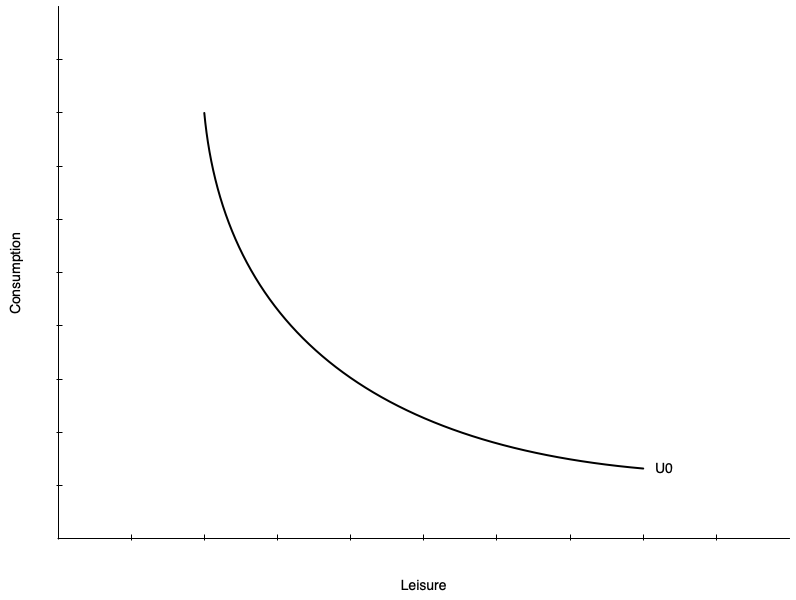
:::
::::

:::: {.column width="50%"}
- On the left is a single indifference curve
- Any point represents equal utility ($U_{0}$)

::: {.callout-important}
## Key Definition
**[Marginal Rate of Substitution (MRS)]{.fg style="color: #2780e3;"}**: the rate at which a person is willing to trade consumption for leisure while remaining equally happy
:::

- The MRS is the slope of the indifference curve at a&nbsp;point
- Individuals have [diminishing MRS]{.fg style="color: #c7254e;"}
  - Willing to give up less consumption for additional leisure the more leisure they already have
  - Slope gets shallower with more leisure
::::
::::

## Preferences

- Indifference curves do not have to be smooth curves like the one shown
- Could be straight lines
  - Means the tradeoff between consumption and leisure is constant
  - Willingness to trade away leisure for consumption does not depend on leisure
- Could be "L" shaped
  - Consumption and leisure must be consumed in fixed proportions
- Mostly we will deal with smooth preferences

## Preferences

:::: columns
:::: {.column width="50%"}
::: {layout="[[-1], [1], [-1]]"}
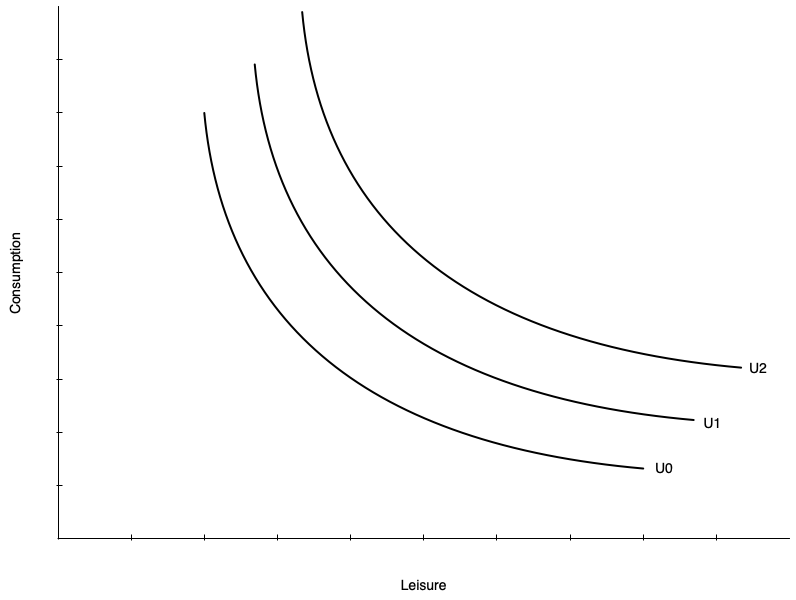
:::
::::

:::: {.column width="50%"}
- Utility increases with curves further from the origin
  - $U_{2} > U_{1} > U_{0}$
::::
::::

## Constraints

- Individuals do not choose consumption and leisure bundles on preference alone
- They are constrained by their [budget]{.fg style="color: #2780e3;"}
- The budget is determined by
  - [The wage rate]{.fg style="color: #555;"}
  - [Total number of hours available]{.fg style="color: #555;"}
  - [Non-labour income]{.fg style="color: #555;"}
- [Budget constraint]{.fg style="color: #2780e3;"} is also called
  - Potential income constraint
  - Full income constraint

## Constraints

:::: columns
:::: {.column width="50%"}
::: {layout="[[-1], [1], [-1]]"}
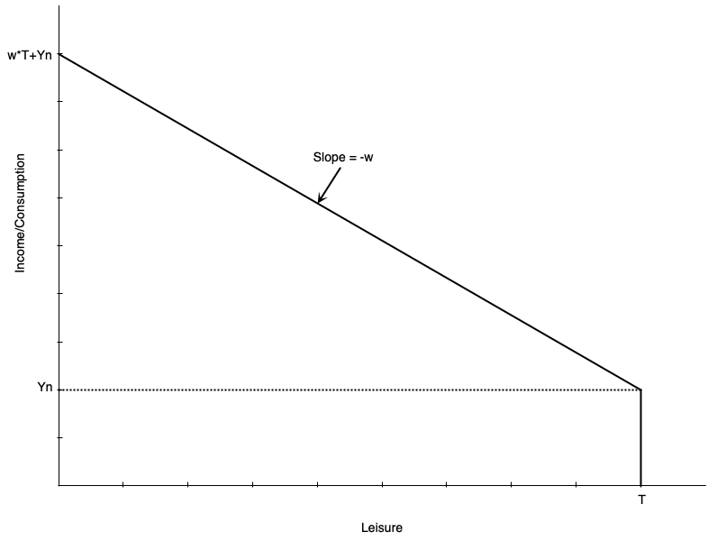
:::
::::

:::: {.column width="50%"}
- Graph shows a linear [budget constraint]{.fg style="color: #2780e3;"}
- Assume no saving, so consumption = income
- There are $T$ total hours to allocate to work or&nbsp;leisure
- Individual earns $Y_{n}$ [non-labour income]{.fg style="color: #2780e3;"}
  - Earned even with zero work hours (full leisure hours)
- Each hour worked gets wage of $w$
- Person working $T$ hours (no leisure) earns $wT+Y_{n}$ income
  - Called [\"full income\"]{.fg style="color: #5cb85c;"}
::::
::::

## Constraints

- Mathematically, the [budget constraint]{.fg style="color: #2780e3;"} is

$$C = w(T - L) + Y_{n}$$

- Consumption is equal to income from working $(w(T - L))$ plus non-labour income $(Y_{n})$
- The slope of the budget constraint is $-w$
  - The [opportunity cost]{.fg style="color: #c7254e;"} of leisure is the wage rate
  - Each hour of leisure means one less hour worked, which means $w$ less income
- Someone who works zero hours has $T$ leisure hours and $Y_{n}$ consumption
- Someone who works $T$ hours has zero leisure hours and $wT + Y_{n}$ consumption

## Constraints

:::: columns
:::: {.column width="50%"}
::: {layout="[[-1], [1], [-1]]"}
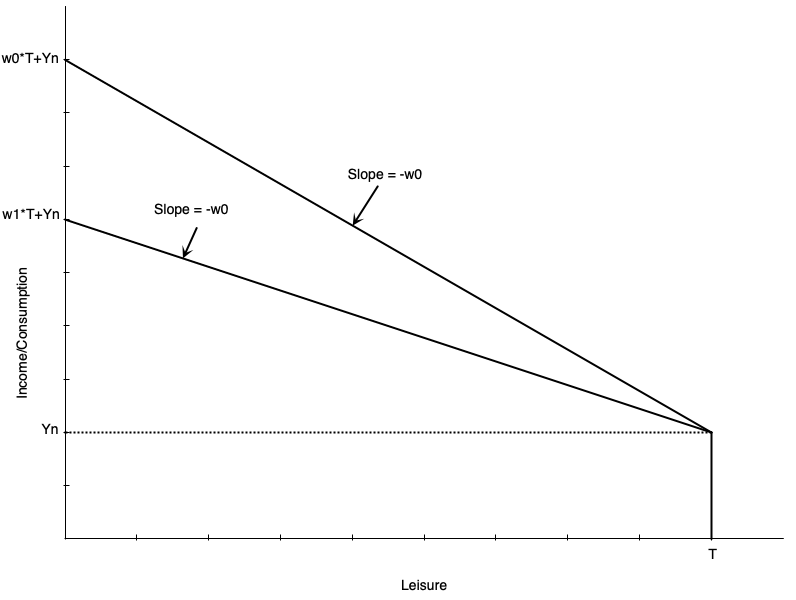
:::
::::

:::: {.column width="50%"}
- Slope is the negative of the wage rate $w$
- A lower wage means shallower slope
  - If $w_{1} < w_{0}$, the budget line swivels down
  - They intersect at leisure = $T$ because there are no work hours
- Lower wage also means [full income is lower]{.fg style="color: #c7254e;"}
  - Working all hours leads to less total labour&nbsp;earnings
::::
::::

## Constraints

:::: columns
:::: {.column width="50%"}
::: {layout="[[-1], [1], [-1]]"}
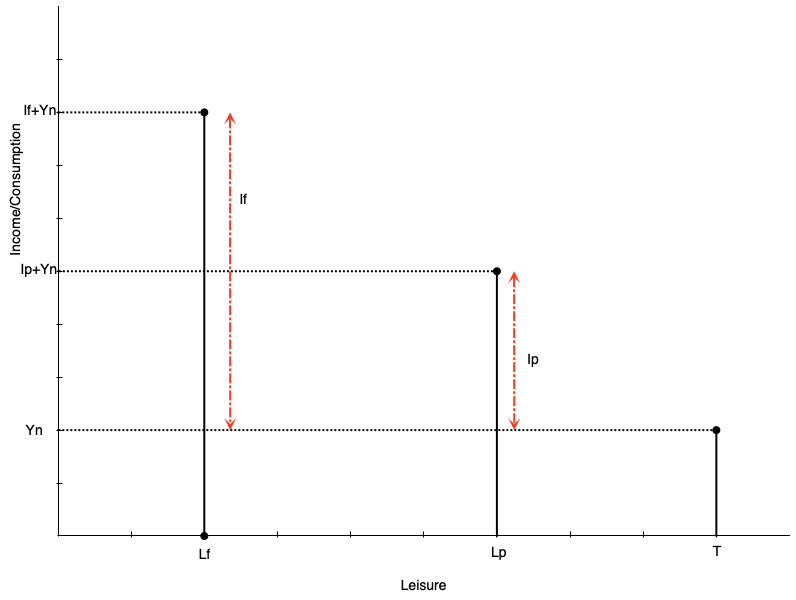
:::
::::

:::: {.column width="50%"}
- Often people cannot adjust their work hours&nbsp;freely
- They may only be able to work full time or part time
- Budget constraint is no longer a line, but a set of points
- Suppose an individual chooses [part time work]{.fg style="color: #2780e3;"}
  - Work hours are $h_{p} = T-L_{p}$
  - Labour earnings are $I_{p} = w*h_{p}$
  - Total consumption (and income) is $C_{p} = I_{p} + Y_{n}$
::::
::::

## Constraints

:::: columns
:::: {.column width="50%"}
::: {layout="[[-1], [1], [-1]]"}

:::
::::

:::: {.column width="50%"}
- A person working [full time hours]{.fg style="color: #2780e3;"}
  - Work hours are $h_{f} = T-L_{f}$
  - Labour earnings are $I_{f} = w*h_{f}$
  - Total consumption (and income) is $C_{f} = I_{f} + Y_{n}$
- In theory wage could also be different for full time work
::::
::::

## Consumer Optimum

- Work hours are chosen using the combination of preferences and constraints
- The [consumer optimum]{.fg style="color: #2780e3;"} is the point that maximizes utility subject to the budget constraint
- The optimum occurs where the budget constraint is tangent to an indifference curve

::: {.callout-note}
There are two possibilities for the optimum:

- [Non-participation:]{.fg style="color: #2780e3;"} optimum occurs at the end of the budget constraint (full leisure) — a [corner solution]{.fg style="color: #2780e3;"}
- [Participation:]{.fg style="color: #2780e3;"} optimum occurs at an interior point (some leisure, some work) — an [interior solution]{.fg style="color: #2780e3;"}
:::

- Model also defines the [reservation wage]{.fg style="color: #2780e3;"}
  - Lowest wage rate at which a person will choose to work

## Consumer Optimum

:::: columns
:::: {.column width="50%"}
::: {layout="[[-1], [1], [-1]]"}
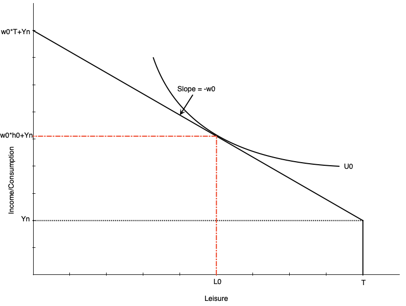
:::
::::

:::: {.column width="50%"}
- Graph shows an optimum with [participation]{.fg style="color: #5cb85c;"}
- Optimum is where indifference curve is tangent to budget constraint

::: {.callout-tip}
At the optimum, [MRS = wage rate]{.fg style="color: #2780e3;"}

- Willingness to trade leisure for consumption (MRS) equals ability to trade them (wage)
:::

- Optimal work hours are $h_{0} = T - L_{0}$
- Optimal consumption is $C_{0} = W_{0}h_{0}+Y_{n}$
::::
::::

## Consumer Optimum {.smaller}

:::: columns
:::: {.column width="50%"}
::: {layout="[[-1], [1], [-1]]"}
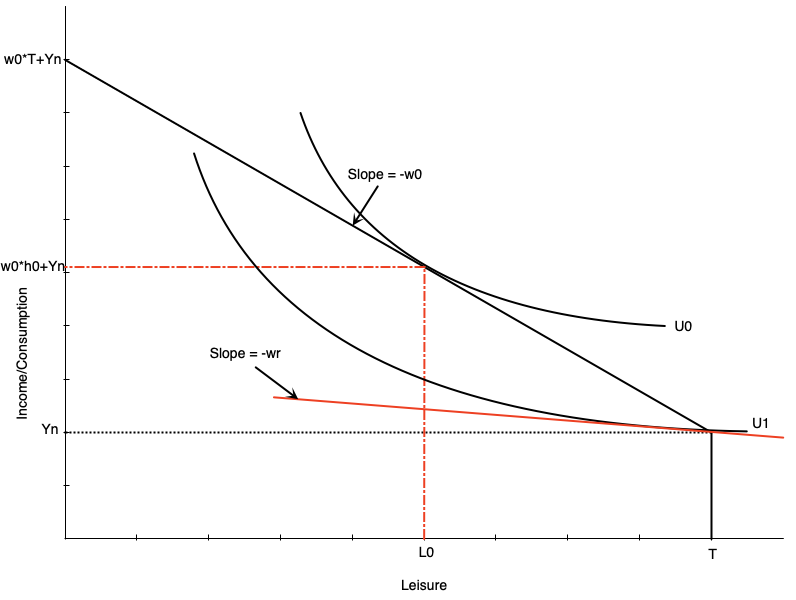
:::
::::

:::: {.column width="50%"}
::: {.callout-important}
## Key Definition
**[Reservation wage]{.fg style="color: #2780e3;"}**: the lowest wage at which a person will choose to work
:::

- It occurs where the budget constraint is tangent to the indifference curve at full leisure
  - At that point, MRS = reservation wage
- If the wage is any lower, the person will [choose not to&nbsp;work]{.fg style="color: #2780e3;"}
- If it is any higher, they will [work positive&nbsp;hours]{.fg style="color: #2780e3;"}
- The red line shows the hypothetical reservation wage
  - In this case, it is $w_{r}$
::::
::::

## Consumer Optimum

:::: columns
:::: {.column width="50%"}
::: {layout="[[-1], [1], [-1]]"}
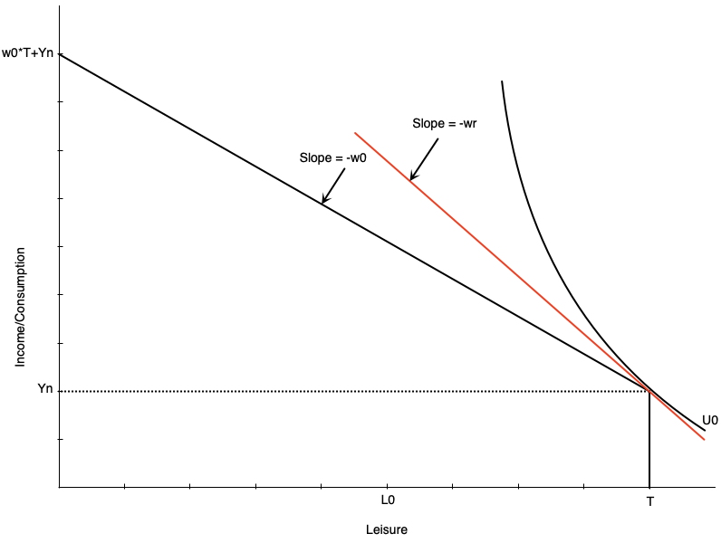
:::
::::

:::: {.column width="50%"}
- Graph to the left shows a [non-participation]{.fg style="color: #c7254e;"}&nbsp;optimum
- The slope of the indifference curve is steeper than the budget constraint at full leisure
  - The extra consumption you want from one less hour of leisure (MRS) is more than you can get from working an hour (wage)
- So your optimal choice is to not work at all
- Indifference curve touches the budget constraint at the kink
- Notice the wage $w_{0}$ is [lower than the reservation wage]{.fg style="color: #c7254e;"} $w_{r}$
::::
::::

## {background-color="#f0f4f8"}

::: {style="text-align: center; font-size: 1.3em;"}
**Discussion**

Suppose a person receives a large inheritance, increasing their non-labour income substantially. Using the budget constraint and indifference curve framework, what would you predict happens to their reservation wage, and why?
:::

# Comparative Statics

## Introduction

- The model can be used to predict how changes in the environment affect work decisions
- Changes could be to the wage or non-labour income
- Often these arise because of policy changes
  - [Introduction or increase in welfare payment]{.fg style="color: #555;"}
  - [Wage subsidy]{.fg style="color: #555;"}
  - [Tax credits]{.fg style="color: #555;"}
  - [Employment insurance]{.fg style="color: #555;"}
  - [Child care]{.fg style="color: #555;"}
- We can examine these change with our model

## Increase in Non-Labour Income

- Suppose that individuals receive an increase in [non-labour income]{.fg style="color: #2780e3;"}
  - Could be from a government transfer program
- How does this affect optimal work hours?
- Depends on whether leisure is a [normal]{.fg style="color: #2780e3;"} or [inferior]{.fg style="color: #2780e3;"} good
  - [Normal good:]{.fg style="color: #2780e3;"} leisure increases when non-labour income increases
  - [Inferior good:]{.fg style="color: #2780e3;"} leisure decreases when non-labour income increases
- Generally economists think of leisure as normal

## Increase in Non-Labour Income {.smaller}

:::: columns
:::: {.column width="50%"}
::: {layout="[[-1], [1], [-1]]"}
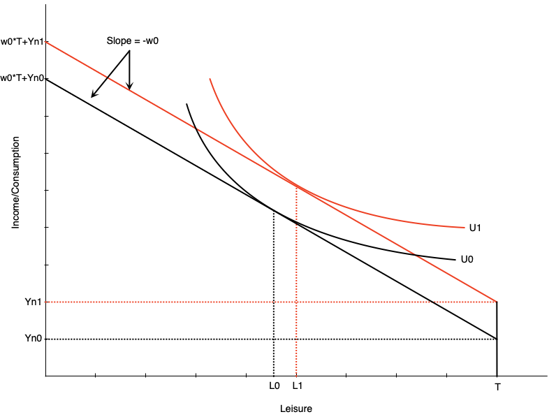
:::
::::

:::: {.column width="50%"}
- Graph shows an increase in non-labour income from $Y_{n0}$ to $Y_{n1}$
- Budget line shifts up vertically but parallel
  - No change in slope because wage is the&nbsp;same
- If leisure is a normal good, optimal leisure increases from $L_{0}$ to $L_{1}$
- Means work hours decrease by the same&nbsp;amount
- Consumption also increases
- This illustrates a pure [income effect]{.fg style="color: #2780e3;"}
  - Increases in income increase demand for normal&nbsp;goods
::::
::::

## Increase in the Wage

:::: columns
:::: {.column width="50%"}
::: {layout="[[-1], [1], [-1]]"}
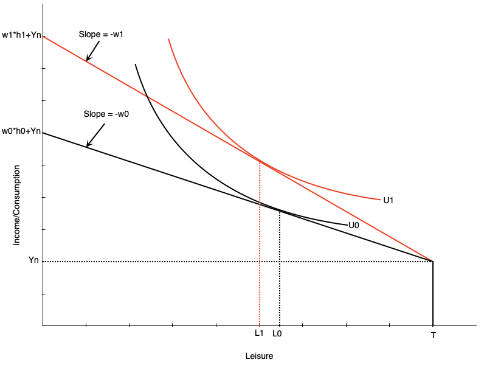
:::
::::

:::: {.column width="50%"}
- If the wage changes, the budget constraint&nbsp;pivots
- In graph to the left, the wage increases from $w_{0}$ to $w_{1}$
- The slope becomes steeper
- Full income also increases because working all hours earns more
- Graph is drawn such that leisure falls from $L_{0}$ to $L_{1}$ at the new wage rate
- There are two effects underlying this change
  - [Substitution effect]{.fg style="color: #2780e3;"}
  - [Income effect]{.fg style="color: #2780e3;"}
::::
::::

## Increase in the Wage

:::: columns
:::: {.column width="50%"}
::: {layout="[[-1], [1], [-1]]"}
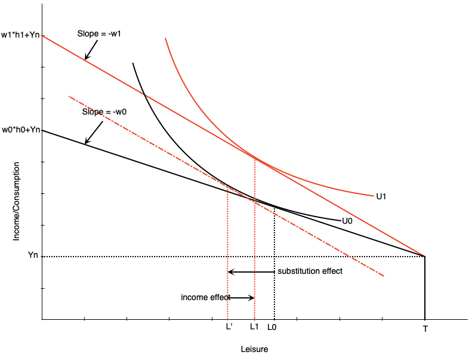
:::
::::

:::: {.column width="50%"}
::: {.callout-important}
## Key Definition
**[Substitution Effect]{.fg style="color: #2780e3;"}**: change in leisure when wage changes but utility is held constant
:::

- When wage increases, leisure becomes more&nbsp;expensive
- People substitute away from leisure and towards consumption
- To measure this, draw a hypothetical budget line with the new slope but tangent to the original indifference curve
- Difference in leisure measures substitution&nbsp;effect
::::
::::

## Increase in the Wage

:::: columns
:::: {.column width="50%"}
::: {layout="[[-1], [1], [-1]]"}

:::
::::

:::: {.column width="50%"}
::: {.callout-important}
## Key Definition
**[Income Effect]{.fg style="color: #2780e3;"}**: change in leisure when income changes but wage is held constant
:::

- When wage increases, workers become richer at same hours of work
- Want to consume more of all normal goods
- To measure this, move from hypothetical budget line to new budget line
- Difference in leisure measures income effect
::::
::::

## Increase in the Wage

:::: columns
:::: {.column width="50%"}
::: {layout="[[-1], [1], [-1]]"}

:::
::::

:::: {.column width="50%"}
- The income and substitution effects move in [opposite directions]{.fg style="color: #c7254e;"}
- For a wage increase
  - [Substitution effect]{.fg style="color: #2780e3;"} encourages more work (less leisure)
  - [Income effect]{.fg style="color: #2780e3;"} encourages less work (more&nbsp;leisure)
- The overall effect on work hours depends on which effect is stronger
- Graph on the left shows a stronger substitution effect
::::
::::

## Increase in the Wage

:::: columns
:::: {.column width="50%"}
::: {layout="[[-1], [1], [-1]]"}
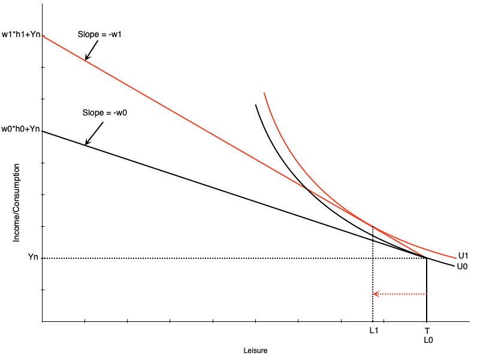
:::
::::

:::: {.column width="50%"}
- Changing the wage can also affect&nbsp;[participation]{.fg style="color: #2780e3;"}
- Recall that workers do not work if the wage is below their [reservation wage]{.fg style="color: #2780e3;"}
- If an increase in the wage moves it above the reservation wage, they will [start working]{.fg style="color: #5cb85c;"}
- Graph to the left shows how this would&nbsp;happen
::::
::::

## {background-color="#f0f4f8"}

::: {style="text-align: center; font-size: 1.3em;"}
**Think About It**

A worker currently earning $20/hour gets a raise to $25/hour and decides to work fewer hours per week. Which effect -- income or substitution -- must be dominant for this worker? What does this tell you about how they value leisure relative to consumption at the margin?
:::

## The Individual Labour Supply Curve

- The [labour supply curve]{.fg style="color: #2780e3;"} shows the relationship between the wage rate and hours worked
- It is derived from the consumer optimum at different wage rates
- We will see that the labour supply curve can be [backward bending]{.fg style="color: #c7254e;"}
  - It is [upward sloping]{.fg style="color: #2780e3;"} when the substitution effect is stronger
  - It is [downward sloping]{.fg style="color: #2780e3;"} when the income effect is stronger
  - The curve tends to bend backwards at higher wage rates

## The Individual Labour Supply Curve

:::: columns
:::: {.column width="50%"}
::: {layout="[[-1], [1], [-1]]"}
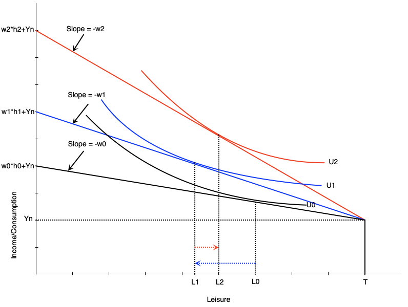
:::
::::

:::: {.column width="50%"}
- Suppose wage goes from $w_{0}$ to $w_{1}$ to $w_{2}$
- At $w_{0}$, work hours are $h_{0} = T - L_{0}$
- At $w_{1}$, work hours increase to $h_{1} = T - L_{1}$
  - [substitution effect stronger]{.fg style="color: #2780e3;"}
- At $w_{2}$, work hours decrease to $h_{2} = T - L_{2}$
  - [income effect stronger]{.fg style="color: #2780e3;"}
::::
::::

## The Individual Labour Supply Curve

:::: columns
:::: {.column width="50%"}
::: {layout="[[-1], [1], [-1]]"}

:::
::::

:::: {.column width="50%"}
::: {layout="[[-1], [1], [-1]]"}
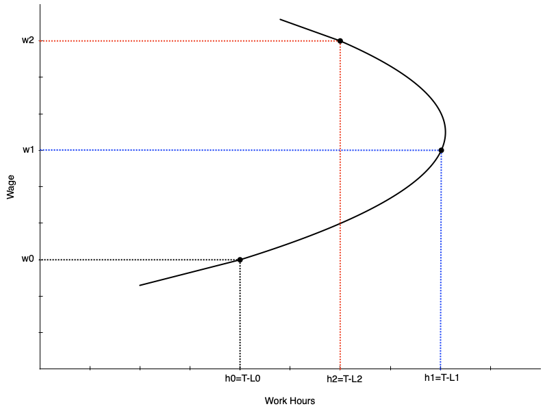
:::
::::
::::

## The Individual Labour Supply Curve

- The text runs the numbers for one person with \$10 of non-labour income

| Wage | Hours/day | Earnings | Total income |
|:-----|----------:|---------:|-------------:|
| \$6 | 0 | \$0 | \$10 |
| \$8 | 8 | \$64 | \$74 |
| \$10 | 12 | \$120 | \$130 |
| \$14 | 10 | \$140 | \$150 |

- At \$6 the wage sits below the \$7 [reservation wage]{.fg style="color: #2780e3;"}, so hours are zero
- From \$8 to \$10 the [substitution effect]{.fg style="color: #2780e3;"} dominates and hours rise
- At \$14 the [income effect]{.fg style="color: #2780e3;"} dominates and the curve [bends back]{.fg style="color: #c7254e;"}

::: {.notes}
Four wages, four points on the supply curve. Worth walking the \$8 row out loud: eight hours at \$8 is \$64 of earnings, plus the \$10 they get regardless, so \$74 of consumption for the day. Everything is per day here, which is why the hours look small.
:::

## Summary

- We have used the labour supply model to examine changes in the wage
- For people participating, wage changes alter leisure and work hours
- If the wage goes up then
  - Work hours go up if the [substitution effect]{.fg style="color: #2780e3;"} is strongest
  - Work hours go down if the [income effect]{.fg style="color: #2780e3;"} is strongest
- For non-participants, a wage increase can induce them to enter the labour force
  - If the wage goes above their [reservation wage]{.fg style="color: #2780e3;"}
- The labour supply curve maps different wages to work hours
- It slopes up at lower wages, but can [bend backwards]{.fg style="color: #c7254e;"} at higher wages

## {background-color="#f0f4f8"}

::: {style="text-align: center; font-size: 1.3em;"}
**Discussion**

Why might we observe that high-income professionals (doctors, lawyers, executives) often work very long hours, even though the backward-bending supply curve predicts that higher wages should eventually lead to fewer hours worked?
:::

# Empirical Evidence

## Introduction

- There are many labour economists working on evidence of these theories
- We will look at a few examples of empirical evidence on labour supply
- First we look at evidence on participation
  - The [extensive margin]{.fg style="color: #2780e3;"} of labour supply
  - Many studies look specifically at married women
- Then at evidence on work hours
  - The [intensive margin]{.fg style="color: #2780e3;"} of labour supply

## Participation

- Table below shows participation rates for married women
- Broken down by age, children, education, spousal income
- Each of these demographic factors are related to wage
  - e.g. higher education -> higher wage
- We expect to see that where wage is higher, participation is also higher

::: {.callout-warning}
This is not a perfect way to examine this relationship — there could be other related factors that drive&nbsp;participation
:::

## Participation

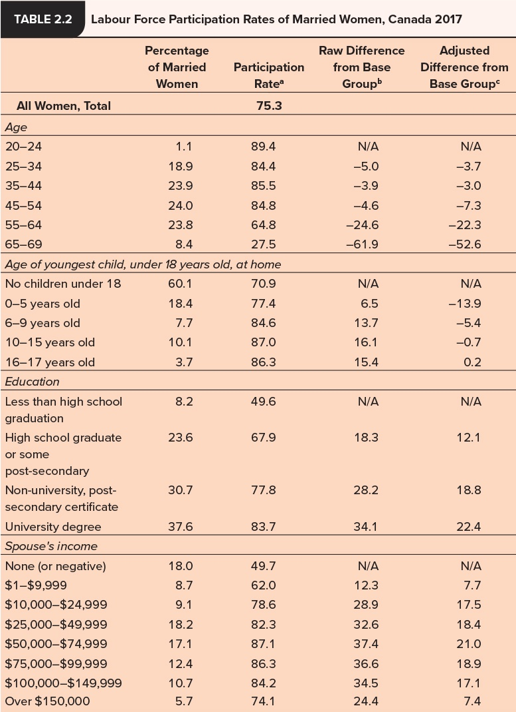

## Elasticity of Labour Supply

::: {.callout-important}
## Key Definition
**[Elasticity of labour supply]{.fg style="color: #2780e3;"}**: the percentage change in labour supply from a 1% change in the wage
:::

- Measures how responsive work hours are to changes in the wage
- There are different ways of measuring elasticity
  - [Uncompensated Elasticity]{.fg style="color: #2780e3;"}: measures total change in work hours from a wage change
    - Includes both income and substitution effects
    - Effect is theoretically ambiguous
  - [Compensated Elasticity]{.fg style="color: #2780e3;"}: measures change in work hours after removing income effect
    - Isolates the substitution effect
    - Should be [positive]{.fg style="color: #5cb85c;"}

## Elasticity of Labour Supply

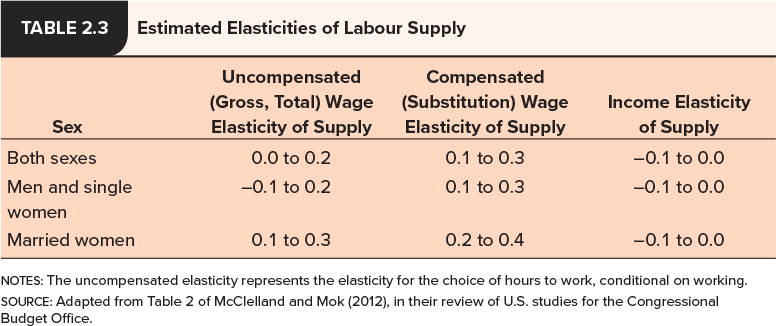

## Elasticity of Labour Supply

- The text collects a range of estimates from a review of the literature

| Group | Uncompensated | Compensated | Income |
|:------|:--------------|:------------|:-------|
| Men and women | 0.0 to 0.2 | 0.1 to 0.3 | −0.1 to 0.0 |
| Men and single women | −0.1 to 0.2 | 0.1 to 0.3 | −0.1 to 0.0 |
| Married women | 0.1 to 0.3 | 0.2 to 0.4 | −0.1 to 0.0 |

- Rows split by [marital status]{.fg style="color: #2780e3;"}, not simply by gender
  - Men and single women are assumed to decide on their own
  - Married women's choices are tied to a spouse's, and to entry costs like [child care]{.fg style="color: #2780e3;"}
- Estimates are [inelastic]{.fg style="color: #2780e3;"} throughout — well under 1 in absolute value
- [Compensated elasticity]{.fg style="color: #2780e3;"} is positive everywhere, as theory requires
- [Source: McClelland and Mok (2012), for the Congressional Budget Office]{.fg style="color: #555;"}

::: {.notes}
Source is McClelland and Mok (2012), a review of the US literature done for the Congressional Budget Office. The married-women estimates line up with Canadian work, so we are not importing something foreign. Worth stressing that the split is a modelling assumption about who decides jointly, not a claim about ability.
:::

## Elasticity of Labour Supply

- Three generalizations come out of this literature

::: {.callout-note}
1. Overall supply for men and women is [slightly upward sloping]{.fg style="color: #2780e3;"}
2. For men it may be [slightly backward bending]{.fg style="color: #2780e3;"}
3. For women it is [more strongly forward sloping]{.fg style="color: #2780e3;"}
:::

- Point 2 is the [backward-bending]{.fg style="color: #c7254e;"} case we built earlier
  - A negative uncompensated elasticity means the income effect wins
  - The effect is small and could plausibly be zero
- Women's stronger response is a bigger substitution effect

::: {.notes}
This is the payoff for the theory. We drew a backward-bending curve and it looked like a classroom curiosity. Here it is in the estimates: men's uncompensated elasticity can come out negative. Do not oversell it — the range straddles zero, so vertical supply is just as consistent with the evidence.
:::

## Elasticity of Labour Supply

- Two more generalizations, both about who and when

::: {.callout-note}
4. Married women's elasticities have [fallen substantially]{.fg style="color: #2780e3;"} since the 1980s
5. [Low-income workers]{.fg style="color: #2780e3;"} are more elastic than high-income workers
:::

- Evidence on the decline: Blau and Kahn (2007), Dostie and Kromann (2013), Morissette and Hou (2008)
- Men's elasticities went the other way, [rising slightly]{.fg style="color: #2780e3;"}

::: {.callout-warning}
These numbers describe responses in the early 2000s, and magnitudes vary a lot across studies — use them with&nbsp;caution
:::

::: {.notes}
Generalization 4 is the interesting one. Married women's labour supply used to be highly responsive to wages because participation was still very much in play; as participation rose toward men's, the responsiveness fell toward men's too. Point 5 matters for policy — minimum wages and transfers hit exactly the group whose hours move most.
:::

# Applications

## Introduction

- We can use the model to analyze various situations faced by workers
- In this section we will look at
  - [Added worker effects]{.fg style="color: #555;"}
  - [Side hustles (holding multiple jobs)]{.fg style="color: #555;"}
  - [Overtime]{.fg style="color: #555;"}
- The list is not exhaustive
- The same reservation wage logic explains [discouraged workers]{.fg style="color: #2780e3;"}, which we covered in [Chapter&nbsp;2]{.fg style="color: #555;"}
- In the next chapter we will look at government policies

## Added Worker Effect

::: {.callout-important}
## Key Definition
**[Added worker effect]{.fg style="color: #2780e3;"}**: occurs when a negative income shock to a family leads to increased labour supply from secondary earners
:::

- e.g. husband loses job, wife enters labour force or increases work hours
- Explicitly considers the family unit rather than treating labour supply as purely individual
- Spousal income is treated as a person's non-labour income
- In the model we can look at what happens when this amount falls

## Added Worker Effect

:::: columns
:::: {.column width="50%"}
::: {layout="[[-1], [1], [-1]]"}
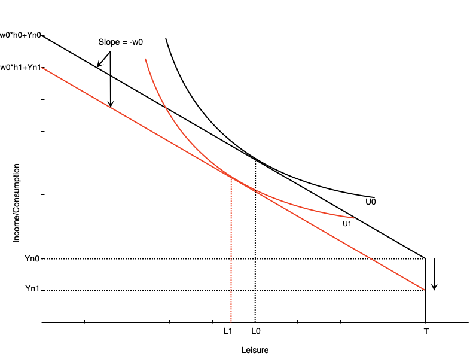
:::
::::

:::: {.column width="50%"}
- When non-labour income falls, the budget constraint shifts down
- If leisure is a normal good, optimal leisure falls from $L_{0}$ to $L_{1}$
- Work hours [increase]{.fg style="color: #5cb85c;"} from $h_{0}$ to $h_{1}$
- Means that the spouse increases work hours to compensate for lost family income
::::
::::

## Added Worker Effect

:::: columns
:::: {.column width="50%"}
::: {layout="[[-1], [1], [-1]]"}
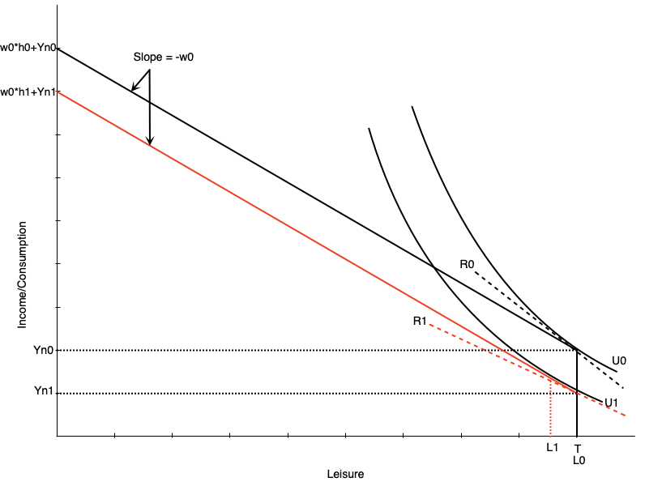
:::
::::

:::: {.column width="50%"}
- If the spouse was not already working, the fall in income can [induce participation]{.fg style="color: #5cb85c;"}
- Happens because the fall in income reduces the [reservation wage]{.fg style="color: #2780e3;"}
  - If the wage is now above the reservation wage, they will start working
- Graph to the left shows how this happens
  - The slope of reservation wage $R_{1}$ is smaller than $R_{0}$ after the drop in non-labour&nbsp;income
  - Person enters the labour market in response because wage is now above reservation wage
::::
::::

## Rigid Schedules and Flexible Work Hours

::: {.callout-important}
## Key Definition
**[Side hustle]{.fg style="color: #2780e3;"}**: a second job with flexible hours, usually at a lower wage, taken because hours at the main job are&nbsp;fixed
:::

- The older term for the same thing is [moonlighting]{.fg style="color: #2780e3;"}
  - From a time when main jobs ran 9-5 and extra work happened after&nbsp;dark
- Hours really are fixed for a lot of people
  - In the 2024 LFS, over a third of working Canadians report exactly 40 or 37.5 hours a week
- Someone who wants more hours than the main job allows is [underemployed]{.fg style="color: #c7254e;"}

::: {.notes}
The 40 and 37.5 figures are the anchor. Those two numbers are not what a third of Canadians independently decided was optimal — they are what employers offer. Private sector tends to be Monday to Friday, eight hours a day; public sector reports 37.5 because an eight-hour day carries a half hour of unpaid breaks.
:::

## Rigid Schedules and Flexible Work Hours

:::: columns
:::: {.column width="50%"}
::: {layout="[[-1], [1], [-1]]"}
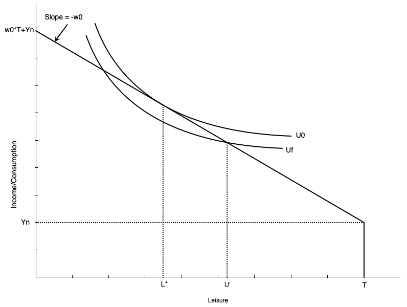
:::
::::

:::: {.column width="50%"}
- In this graph people ideally would work $h^* = T-L^*$ hours
  - Maximizes utility subject to budget&nbsp;constraint
- Can only work $h_f = T- L_f$ hours at their main job
  - Employer does not allow more hours
- This puts them on a [lower indifference curve]{.fg style="color: #c7254e;"} $U_f$
- The outcome is not optimal
::::
::::

## Rigid Schedules and Flexible Work Hours

:::: columns
:::: {.column width="50%"}
::: {layout="[[-1], [1], [-1]]"}
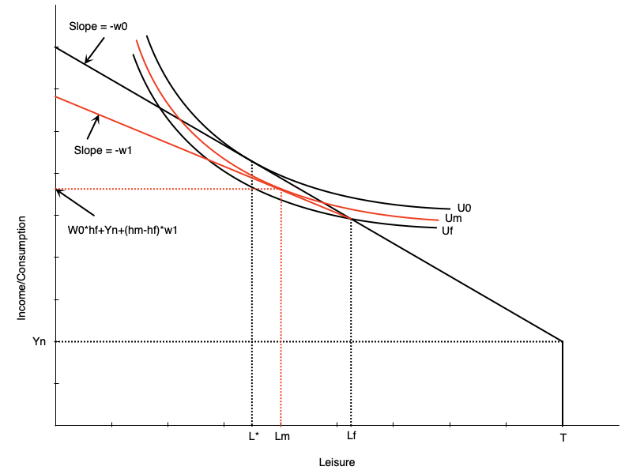
:::
::::

:::: {.column width="50%"}
- Now imagine they can take a second job at a lower wage rate
- The budget constraint pivots out from the fixed hours point
- Beyond those hours, the wage falls
- Allows worker to access [higher utility curve]{.fg style="color: #5cb85c;"}
  - They can increase hours worked
  - But not as much as if they could extend hours in main job
::::
::::

## {background-color="#f0f4f8"}

::: {style="text-align: center; font-size: 1.3em;"}
**Think About It**

During the COVID-19 pandemic, many households experienced both job losses (added worker effect) and falling wages in available jobs (discouraged worker effect) at the same time. What would the model predict about labour force participation for secondary earners in these households, and why might the two effects work against each other?
:::

## Overtime

:::: columns
:::: {.column width="50%"}
::: {layout="[[-1], [1], [-1]]"}
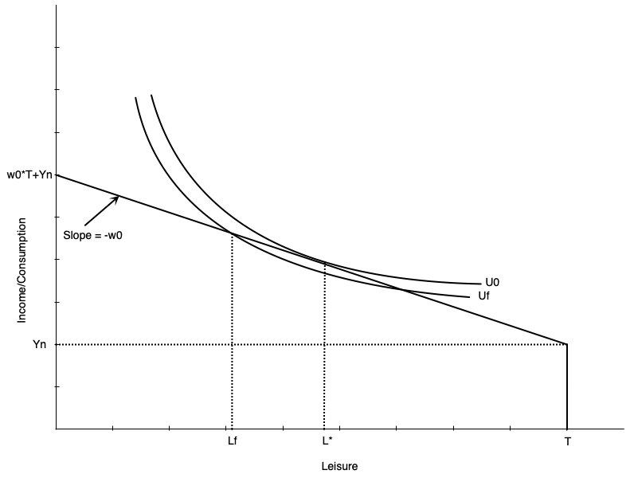
:::
::::

:::: {.column width="50%"}
- In this graph, people would ideally work $h^* = T-L^*$ hours
  - Maximizes utility subject to budget&nbsp;constraint
- But employer requires them to work $h_f = T- L_f$ hours
  - Employer does not allow fewer hours
- Puts them on a [lower indifference curve]{.fg style="color: #c7254e;"} $U_f$
- They are [overemployed]{.fg style="color: #c7254e;"} — working more than they would choose at that&nbsp;wage
::::
::::

## Overtime {.smaller}

:::: columns
:::: {.column width="50%"}
::: {layout="[[-1], [1], [-1]]"}
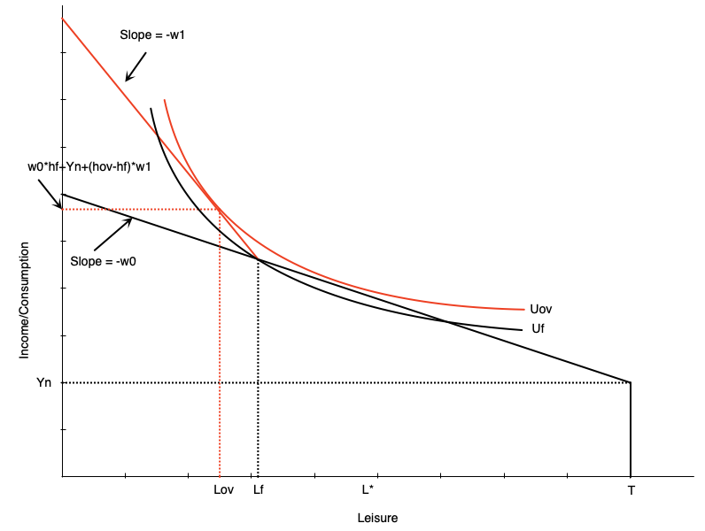
:::
::::

:::: {.column width="50%"}
- If the employer offers [overtime wages]{.fg style="color: #5cb85c;"}, the budget constraint pivots out from the fixed hours point
  - Beyond those hours, the wage increases from $w_{0}$ to $w_{1}$
- Allows worker to access [higher utility curve]{.fg style="color: #5cb85c;"}
- Also increases hours worked even though they are initially overemployed
  - The higher wage induces a [substitution effect]{.fg style="color: #2780e3;"} to work more
  - There is a small [income effect]{.fg style="color: #2780e3;"} that only applies to the extra hours
- The alternative — paying more for *all* hours — is [Review Questions 7 and 8]{.fg style="color: #555;"}
::::
::::

# Summary

## Summary

- We have explored the [labour-leisure model]{.fg style="color: #2780e3;"} for labour supply
- The model is based on utility maximization subject to a budget constraint
- The model can explain both participation and work hours decisions
- Changes in non-labour income and the wage affect work decisions
- The labour supply curve can be [backward bending]{.fg style="color: #c7254e;"}
- The model can be used to analyze various situations faced by workers
  - [Added worker effects]{.fg style="color: #555;"}
  - [Side hustles]{.fg style="color: #555;"}
  - [Overtime]{.fg style="color: #555;"}
- Next chapter we will analyze government policy within this model

## References {.smaller}

- Benjamin, D., Foley, K., Gunderson, M., Lemieux, T., Schirle, T., & Skuterud, M. (2026). *Labour Market Economics*, 2026 Release. McGraw Hill. Chapter 3.
- Blau, F. D., & Kahn, L. M. (2007). Changes in the labor supply behavior of married women: 1980–2000. *Journal of Labor Economics*, 25(3), 393–438.
- Dostie, B., & Kromann, L. (2013). Canadian estimates of married women's labour supply elasticities.
- McClelland, R., & Mok, S. (2012). *A review of recent research on labor supply elasticities*. Congressional Budget Office Working Paper 2012-12.
- Morissette, R., & Hou, F. (2008). Does the labour supply of wives respond to husbands' wages? Canadian evidence from micro data and grouped data. *Canadian Journal of Economics*, 41(4), 1185–1210.
- Robbins, L. (1930). On the elasticity of demand for income in terms of effort. *Economica*, 29, 123–129.
