<h1>Labour Supply and Income Support Programs</h1>

<h2>EC306- Wages and Employment</h2>

<h2>Justin Smith</h2>

<h2>Wilfrid Laurier University</h2>

<h2>Fall 2026</h2>

{.absolute top="275" left="900" width="550"}

# Goals of This Section

## Goals of This Section

In this section we will:

::: {.nonincremental}
- Describe the main income support programs in Canada
- Show the effect of these programs on work decisions using the labour supply model
  - Demogrants, social assistance, negative income tax, wage subsidies, refundable tax credits
- Examine statistical evidence for the model predictions
:::

# Income Maintenance Programs

## Overview of Income Maintenance Programs

::: {.nonincremental}
- Represent about [10% of GDP]{.fg style="color: #c7254e;"} in Canada
- [Primary aims:]{.fg style="color: #2780e3;"}
  - Raise income of specific groups (parents, elderly)
  - Supplement low wages
- [Major programs:]{.fg style="color: #2780e3;"} child benefits, employment insurance, social assistance, pensions
:::

::: {.callout-important}
## Key Challenge
Balancing income support with work incentives
:::

## Government Transfers in Canada

In 2017, [83% of families]{.fg style="color: #c7254e;"} received some form of government transfer:

| Program | % Receiving | Average Amount |
|---------|-------------|----------------|
| Federal Child Benefits | 20.2% | $6,314 |
| Employment Insurance | 14.0% | $8,352 |
| Social Assistance | 11.3% | $8,367 |
| Old Age Security | 25.1% | $8,566 |
| CPP/QPP | 32.4% | $10,092 |

## Issues in Program Design

::: columns
::: {.column width="50%"}
[Universal vs. Targeted Programs]{.fg style="color: #2780e3;"}

- Universal: easy to implement but expensive
- Targeted: benefits only those in need but costly to administer
:::

::: {.column width="50%"}
[Work Disincentives]{.fg style="color: #2780e3;"}

- Some programs reduce incentive to work
- Example: welfare benefits can encourage labour force dropout for those with strong preference for leisure
:::
:::

[Permanent vs. Transitory Income Loss]{.fg style="color: #2780e3;"}

- Different situations require different program designs
- Temporary layoff → short-term support
- Long-term disability → longer support + reintegration costs

## {background-color="#f0f4f8"}

::: {style="text-align: center; font-size: 1.3em;"}
**Think About It**

If 83% of Canadian families receive some form of government transfer, why is program design so important? What happens if a program is too generous or too stingy?
:::

# Demogrants, Welfare, Wage Subsidies

## Four Standard Income Support Programs

We will examine four policy approaches:

::: {.nonincremental}
1. [Demogrants]{.fg style="color: #2780e3;"} - Fixed payment to all regardless of income/employment
2. [Welfare]{.fg style="color: #2780e3;"} - Lump-sum payment for non-workers, reduced dollar-for-dollar with earnings
3. [Negative Income Tax (NIT)]{.fg style="color: #2780e3;"} - Welfare payment that decreases at rate < 100% with earnings
4. [Wage Subsidies]{.fg style="color: #2780e3;"} - Addition to the wage rate
:::

## Demogrant: Theory

::: columns
::: {.column width="50%"}
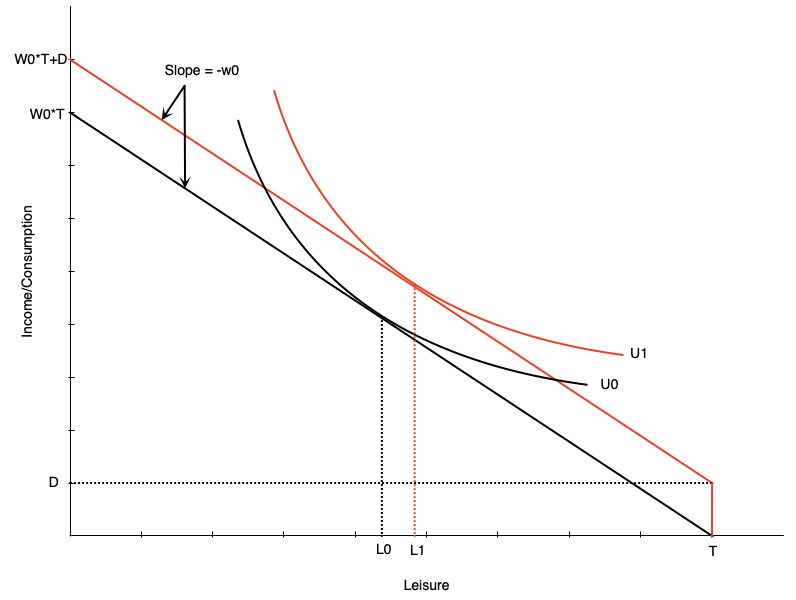
:::

::: {.column width="50%"}
[How it works:]{.fg style="color: #2780e3;"}

- Unconditional lump sum transfer $D$
- Shifts budget line up parallel
- Wage unchanged → [pure income effect]{.fg style="color: #c7254e;"}

[Labor supply impact:]{.fg style="color: #2780e3;"}

- If leisure is normal → optimal leisure rises
- Reduces hours worked
- May induce non-participation
:::
:::

::: {.callout-warning}
## Work Incentive Effect
Unambiguously negative
:::

## Demogrant: Canadian Example

[Universal Child Care Benefit (UCCB)]{.fg style="color: #2780e3;"}

::: {.nonincremental}
- Paid to families with children under 18
  - $160/month per child under 6
  - $60/month per child aged 6-17
- Replaced in 2016 by Canada Child Benefit (CCB)
  - More targeted to low/middle income families
:::

::: {.callout-note}
## Evidence (Schirle, 2015)
UCCB reduced labour supply of women with children under 6 by [~3.2 percentage points]{.fg style="color: #c7254e;"} for low-educated married women
:::

## Welfare: Overview

[Welfare = Social/Income Assistance in Canada]{.fg style="color: #2780e3;"}

- Lump-sum payment to non-workers
- Reduced [dollar-for-dollar]{.fg style="color: #c7254e;"} with earned income

::: {.callout-important}
## Historical Criticism
Creates negative work incentives for some, but must balance against need for income support
:::

## Welfare: Budget Constraint

::: columns
::: {.column width="50%"}
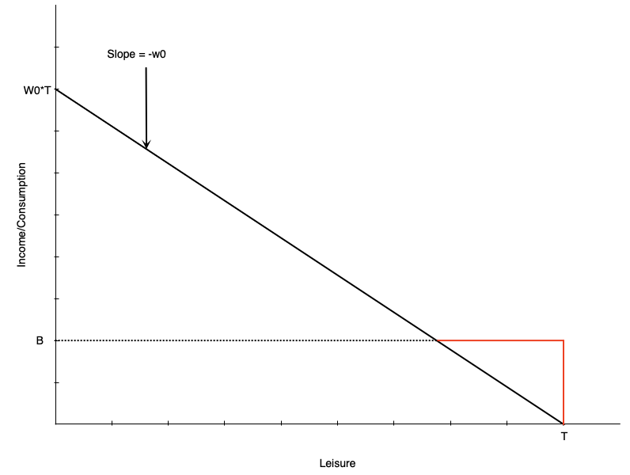
:::

::: {.column width="50%"}
[Budget line structure:]{.fg style="color: #2780e3;"}

- [Black line:]{.fg style="color: #555;"} original budget (leisure at $L_0$)
- [Red then black:]{.fg style="color: #c7254e;"} with welfare benefit $B$

[Key features:]{.fg style="color: #2780e3;"}

- Benefit $B$ at zero hours of work
- Reduced $1 for each $1 earned
  - Equivalent to [100% tax rate]{.fg style="color: #c7254e;"} on earnings
- Income constant at $B$ until earned income equals benefit
- After that, earn wage $w_0$ per hour worked
:::
:::

## Welfare: No Effect Case

::: columns
::: {.column width="50%"}
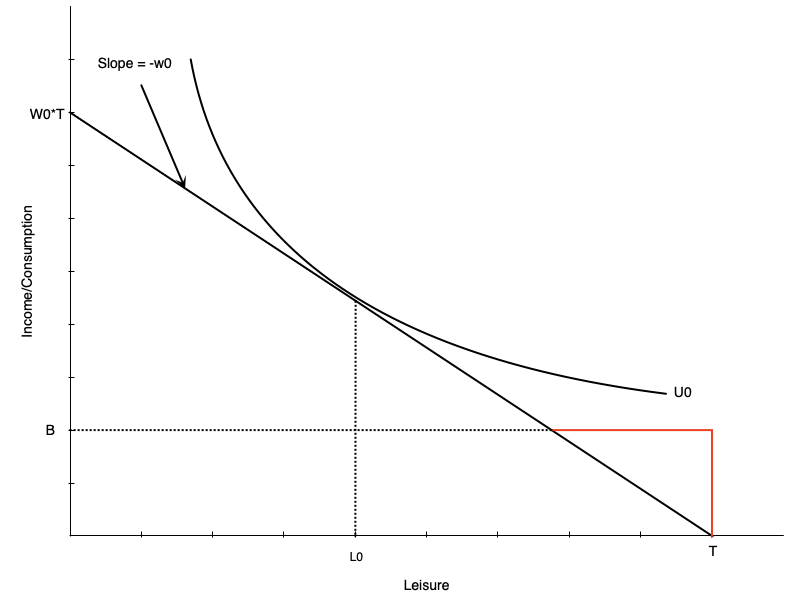
:::

::: {.column width="50%"}
[For some workers, welfare has no effect:]{.fg style="color: #2780e3;"}

- Person working $H_0$ hours before benefit
- Still maximizes utility at $H_0$ hours after
- Generally occurs with people already working many hours
:::
:::

## Welfare: Work Disincentive Case

::: columns
::: {.column width="50%"}
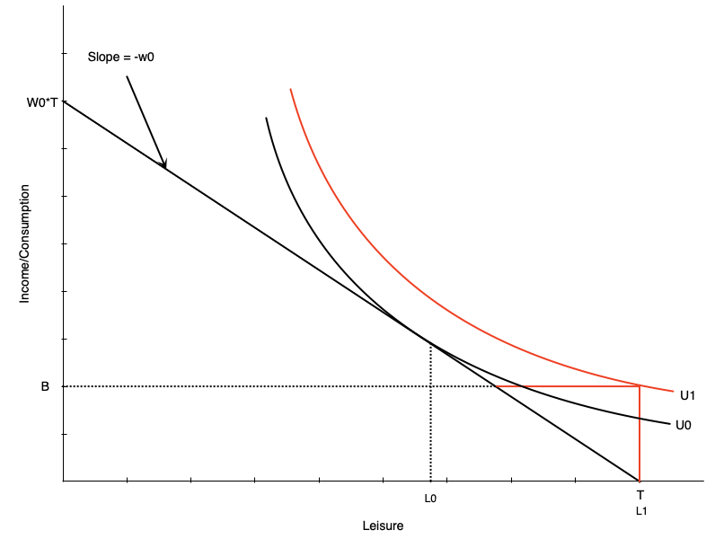
:::

::: {.column width="50%"}
[Others face strong work disincentive:]{.fg style="color: #2780e3;"}

- Person chooses [zero hours]{.fg style="color: #c7254e;"} after welfare benefit

[This occurs when:]{.fg style="color: #2780e3;"}

- Welfare benefit is generous
- Individual places high value on leisure
:::
:::

::: {.callout-warning}
This is the problematic effect of welfare programs
:::

## {background-color="#f0f4f8"}

::: {style="text-align: center; font-size: 1.3em;"}
**Discussion**

Why might someone who was working 20 hours per week before welfare was introduced choose to stop working entirely, while someone working 40 hours per week continues to work the same amount?
:::

## Combating Work Disincentives

[Policy options:]{.fg style="color: #2780e3;"}

::: columns
::: {.column width="50%"}
1. [Reduce benefit level]{.fg style="color: #555;"}
   - But may not provide adequate support

2. [Increase wages]{.fg style="color: #555;"}
   - Through minimum wages, subsidies, training, unions
   - Can be expensive and may reduce labour demand
:::

::: {.column width="50%"}
3. [Change preferences]{.fg style="color: #555;"}
   - Alter attitudes toward work/leisure
   - Difficult to achieve

4. [Negative income tax]{.fg style="color: #555;"}
   - Reduce tax-back rate on earnings
   - Discussed next...
:::
:::

## Welfare: Evidence from Quebec

[Natural experiment:]{.fg style="color: #2780e3;"} Welfare benefit structure changed in 1989

::: columns
::: {.column width="50%"}
[Before 1989:]{.fg style="color: #2780e3;"}

- Age-based benefits for singles/couples with no kids
- Under 30: $185/month
- 30 and over: $507/month
:::

::: {.column width="50%"}
[Results at age 30:]{.fg style="color: #2780e3;"}

- Much longer time on welfare
- Lower employment rates
:::
:::

::: {.callout-note}
Turning 30 created a [large discontinuous jump]{.fg style="color: #c7254e;"} in benefits
:::

## Negative Income Tax: Overview

[What is NIT?]{.fg style="color: #2780e3;"}

- Welfare program where benefit reduced at rate [< 100%]{.fg style="color: #c7254e;"} of earnings
- Example: $10,000 benefit reduced by 50¢ per dollar earned

::: {.callout-tip}
## Advantages
Provides income support with fewer work disincentives. Still maintains incentive to work since benefit reduces slowly.
:::

[Also known as:]{.fg style="color: #2780e3;"} Guaranteed Annual Income (GAI) or Basic Income

## Negative Income Tax: Budget Constraint

::: columns
::: {.column width="50%"}
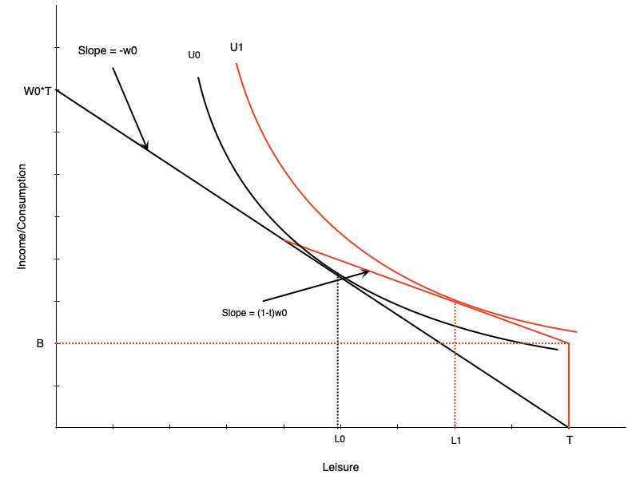
:::

::: {.column width="50%"}
[NIT has two components:]{.fg style="color: #2780e3;"}

- Benefit $B$ at zero hours of work
- Tax rate $t$ on earned income (until earned income equals benefit)

[Effect on labour supply:]{.fg style="color: #2780e3;"}

- Pivots budget line up vs. pure welfare
- Work hours reduced from $H_0$ to $H_1$
- Person still works some hours 
:::
:::

::: {.callout-important}
Work disincentive [less than pure welfare]{.fg style="color: #5cb85c;"}
:::

## Negative Income Tax: Income and Substitution Effects

[Income effects:]{.fg style="color: #2780e3;"}

::: {.nonincremental}
- Benefit increases non-labour income → increases leisure ↑
- Tax has negative income effect → reduces leisure ↓
- [Net:]{.fg style="color: #c7254e;"} benefit effect dominates → leisure ↑
:::

[Substitution effect:]{.fg style="color: #2780e3;"}

::: {.nonincremental}
- Tax rate reduces effective wage
- Makes leisure relatively cheaper → reduces work hours ↓
:::

::: {.callout-note}
## Overall Effect
Negative effect on work hours, but [smaller than pure welfare]{.fg style="color: #5cb85c;"}
:::

## Negative Income Tax: Math

The budget constraint with NIT:

$$
C = 
\begin{cases}
wh + B - twh, & \text{if } B - t wh \geq 0 \\
wh, & \text{otherwise}
\end{cases}
$$

[Interpretation:]{.fg style="color: #2780e3;"}

- Consumption = earned income ($wh$) + net benefit ($B - twh$) if net benefit > 0
- Otherwise just earned income ($wh$)

[Break-even point:]{.fg style="color: #c7254e;"} benefit reaches zero when $wh = \frac{B}{t}$

## MINCOME: Manitoba's NIT Experiment

[Program details (1970s):]{.fg style="color: #2780e3;"}

::: {.nonincremental}
- Randomized controlled trial
  - Treatment group received NIT
  - Control group did not
- Conducted in Dauphin (saturated - everyone got NIT) and Winnipeg
- 7 treatment groups with different benefit levels and tax rates
- Ended in 1979 due to political changes
:::

## MINCOME Treatment Groups

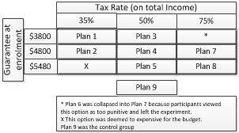{fig-align="center" width="50%"}

## MINCOME: Results

::: columns
::: {.column width="33%"}
[Labour supply effects:]{.fg style="color: #2780e3;"}

- Small decline in hours worked
  - Mainly mothers of newborns
  - Women in two-parent families
  - No significant decline for men
:::

::: {.column width="33%"}
[Health outcomes:]{.fg style="color: #2780e3;"}

- Fewer hospitalizations and doctor visits
- Especially for mental health and accidents
:::

::: {.column width="33%"}
[Education:]{.fg style="color: #2780e3;"}

- Increase in adolescents finishing high school
:::
:::

## Wage Subsidies: Theory

[What is a wage subsidy?]{.fg style="color: #2780e3;"}

- Payment to workers that increases their wage rate
- Example: $5/hour subsidy increases $15/hour wage to $20/hour

[Effect on budget constraint:]{.fg style="color: #2780e3;"}

- Budget line pivots upward

[Labour supply effects:]{.fg style="color: #2780e3;"}

::: columns
::: {.column width="50%"}
- Income effect → increases leisure ↑
:::
::: {.column width="50%"}
- Substitution effect → decreases leisure ↓
:::
:::

::: {.callout-warning}
Overall effect on work hours is [ambiguous]{.fg style="color: #c7254e;"}
:::

## Wage Subsidies: Diagram

::: columns
::: {.column width="50%"}
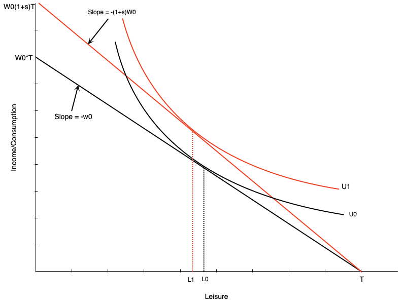
:::

::: {.column width="50%"}
[Budget line pivots up with subsidy]{.fg style="color: #2780e3;"}

- Graph shows person working more
- But effect is theoretically ambiguous
- Income and substitution effects work in opposite directions
:::
:::

## Wage Subsidies: Policy Implications

::: columns
::: {.column width="50%"}
::: {.callout-tip}
## Advantages
- Less negative work incentives than welfare or NIT
- No reduction in effective wage rate
:::
:::

::: {.column width="50%"}
::: {.callout-warning}
## Disadvantages
- Do not provide income support to non-workers
- May not help those in most need
:::
:::
:::

[In Canada:]{.fg style="color: #2780e3;"}

- Pure wage subsidies mostly go to [employers]{.fg style="color: #c7254e;"}
- Unclear if any benefits passed on to workers

## {background-color="#f0f4f8"}

::: {style="text-align: center; font-size: 1.3em;"}
**Think About It**

A negative income tax reduces the benefit as you earn more, while a wage subsidy increases your pay for each hour worked. Which program would you expect to have a larger positive effect on labour force participation among non-workers, and why?
:::

## Tax Credits: Overview

[Two types of tax credits:]{.fg style="color: #2780e3;"}

1. [Non-refundable:]{.fg style="color: #555;"} Can reduce tax owed to zero (but not below)
2. [Refundable:]{.fg style="color: #555;"} Can reduce tax owed below zero (results in payment)

::: {.callout-note}
## Income Maintenance Programs via Refundable Tax Credits
- [Canada Worker Benefit (CWB)]{.fg style="color: #2780e3;"} - Canada
- [Earned Income Tax Credit (EITC)]{.fg style="color: #2780e3;"} - US
:::

## Tax Credits: Budget Constraint

::: columns
::: {.column width="50%"}
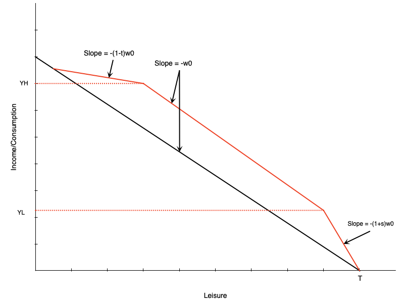
:::

::: {.column width="50%"}
[Three segments:]{.fg style="color: #2780e3;"}

1. [Phase-in:]{.fg style="color: #5cb85c;"} Subsidy proportional to earned income
2. [Plateau:]{.fg style="color: #f0ad4e;"} Maximum benefit level
3. [Phase-out:]{.fg style="color: #d9534f;"} Benefit reduced with earned income

[Combines elements of:]{.fg style="color: #2780e3;"}

- Wage subsidy (phase-in)
- Demogrant (plateau)
- NIT (phase-out)
:::
:::

## Tax Credits: Effect in Plateau Range

::: columns
::: {.column width="50%"}
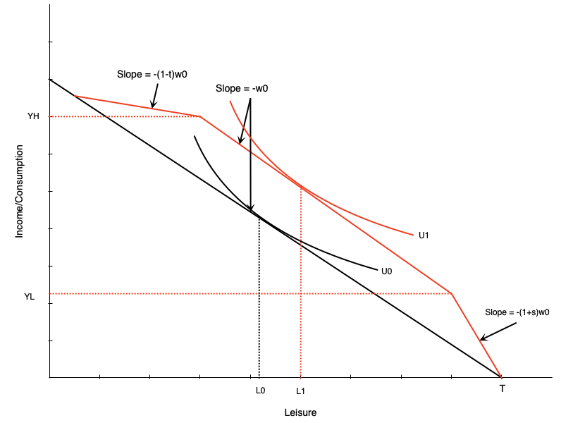
:::

::: {.column width="50%"}
[Person initially in middle range:]{.fg style="color: #2780e3;"}

- Tax credit gives maximum benefit
- Acts like [pure income effect]{.fg style="color: #c7254e;"}
- If leisure is normal good → reduce work hours
:::
:::

## Tax Credits: Effect in Phase-In Range

::: columns
::: {.column width="50%"}
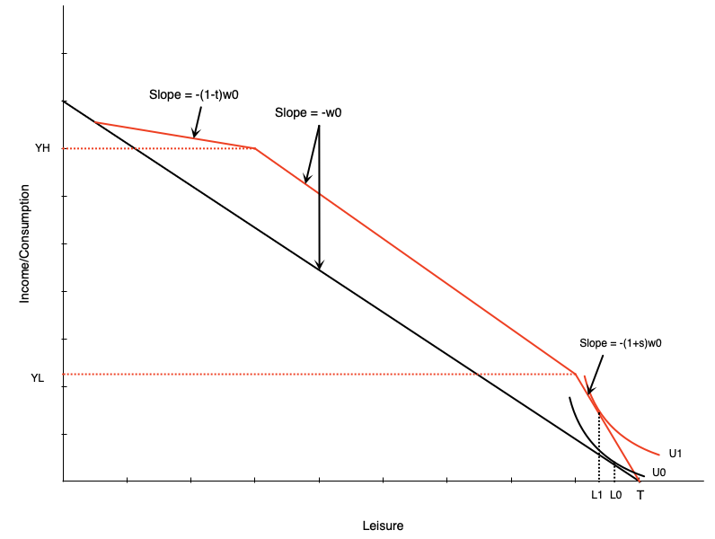
:::

::: {.column width="50%"}
[Person in phase-in range:]{.fg style="color: #2780e3;"}

- Sees increase in effective wage
- Acts like [pure wage subsidy]{.fg style="color: #5cb85c;"}
- Income and substitution effects in opposite directions
:::
:::

::: {.callout-warning}
Effect on hours is [ambiguous]{.fg style="color: #c7254e;"}
:::

## Tax Credits: Effect in Phase-Out Range

::: columns
::: {.column width="50%"}
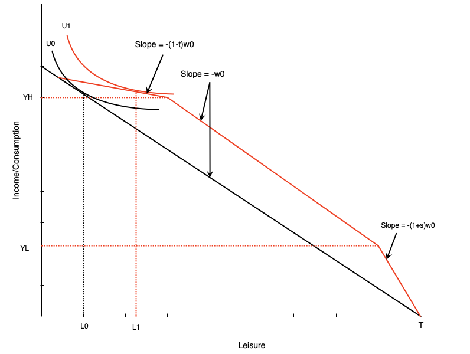
:::

::: {.column width="50%"}
[Person in phase-out range:]{.fg style="color: #2780e3;"}

- Similar to [negative income tax]{.fg style="color: #d9534f;"}
- Income effect → reduce hours ↓
- Substitution effect → reduce hours ↓
:::
:::

::: {.callout-important}
Effect on work is [unambiguously negative]{.fg style="color: #d9534f;"}
:::

## TODO — The Self-Sufficiency Project {background-color="#fff8e1"}

::: {.callout-warning}
## Not yet written

BFGLSS 2026 covers:

- A large Canadian earnings-supplement experiment, listed in Chapter 4 under
  *Empirical Evidence of Incentive Effects*. No slides exist for it.
:::

# Summary

## Summary

[Income support programs:]{.fg style="color: #2780e3;"}

::: {.nonincremental}
- Provide crucial income support to various groups
- Can create work disincentives in some cases
- Must balance support needs against incentive effects
:::

[We examined several programs through the labour supply model:]{.fg style="color: #2780e3;"}

- Demogrants, welfare, negative income tax
- Wage subsidies and refundable tax credits

