<h1>Labour Supply and Social Insurance Programs</h1>

<h2>EC306- Wages and Employment</h2>

<h2>Justin Smith</h2>

<h2>Wilfrid Laurier University</h2>

<h2>Fall 2026</h2>

{.absolute top="275" left="900" width="550"}

# Goals of This Section

## Goals of This Section

In this section we will:

::: {.nonincremental}
- Describe the main social insurance programs in Canada
- Show the effect of Employment Insurance on work decisions
- Analyze disability insurance and workers' compensation
- Examine statistical evidence for the model predictions
:::

# Unemployment Insurance

## Employment Insurance: Overview

[Purpose:]{.fg style="color: #2780e3;"}

- Safety net for workers who lose their job
- Collect income while unemployed

[Funding:]{.fg style="color: #2780e3;"}

- Payroll taxes on employers and employees

[Two main components:]{.fg style="color: #2780e3;"}

1. [Regular benefits]{.fg style="color: #555;"} - for those unemployed through no fault of their own
2. [Special benefits]{.fg style="color: #555;"} - sickness, maternity, parental leave, caregiving

## Employment Insurance: Benefits

::: {.callout-note}
## Regular Benefits Structure
- [55%]{.fg style="color: #c7254e;"} of average insurable weekly earnings
- Up to a maximum amount
- Duration: [14 to 45 weeks]{.fg style="color: #c7254e;"}
  - Depends on unemployment rate and hours worked in last year
:::

## EI: Simplified Model Parameters

[To analyze with income-leisure diagram:]{.fg style="color: #2780e3;"}

::: {.nonincremental}
- Must work [14 weeks]{.fg style="color: #c7254e;"} in the year to qualify
- Benefit is [60% of weekly wage]{.fg style="color: #c7254e;"} (we use 60% for simplicity)
- Maximum of [20 weeks]{.fg style="color: #c7254e;"} of benefits
- Can work up to 32 weeks and get full benefits
- Each week worked beyond 32 → lose benefits for that week
- 60% benefit = [60% tax]{.fg style="color: #c7254e;"} on earnings beyond 32 weeks
- [Cannot work and collect EI simultaneously]{.fg style="color: #d9534f;"}
:::

## EI: Budget Constraint

::: columns
::: {.column width="50%"}
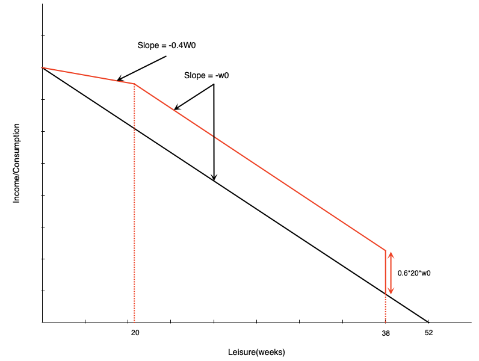
:::

::: {.column width="50%"}
[Three segments:]{.fg style="color: #2780e3;"}

1. [First 14 weeks:]{.fg style="color: #555;"} Paid at usual wage $w_0$

2. [Weeks 14-32 of work:]{.fg style="color: #555;"} Get 20 weeks of benefits
   - Benefit = $0.6 \times 20 \times w_0$

3. [More than 32 weeks of work:]{.fg style="color: #555;"} Benefits reduced week-for-week
   - Benefits paid at 60% of wage
   - Work paid at 100% of wage
   - [Keep 40% of wage]{.fg style="color: #c7254e;"} in this range
:::
:::

## {background-color="#f0f4f8"}

::: {style="text-align: center; font-size: 1.3em;"}
**Discussion**

The EI budget constraint has a segment where the effective wage is only 40% of the market wage. Why might a seasonal worker in the Maritimes choose to work exactly 14 weeks per year under this system?
:::

## EI: Effect on Non-Participants

::: columns
::: {.column width="50%"}
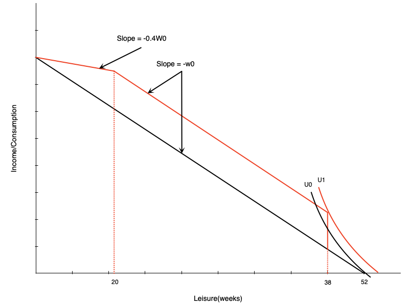
:::

::: {.column width="50%"}
::: {.callout-tip}
## Effect on Non-Workers
A non-participant might start working due to large increase in non-labour income after 14 weeks of work. Induces labour force entry.
:::
:::
:::

## EI: Effect in Middle Range

::: columns
::: {.column width="50%"}
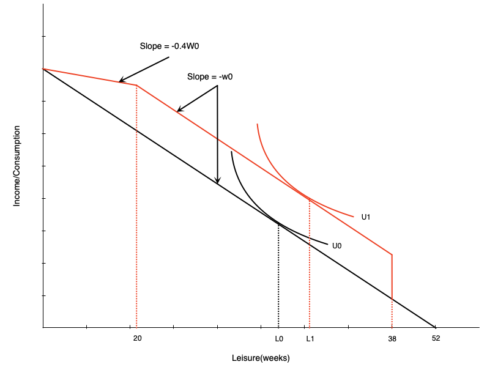
:::

::: {.column width="50%"}
[Person getting full benefits:]{.fg style="color: #2780e3;"}

- Acts like [pure income effect]{.fg style="color: #c7254e;"}
- Will reduce work weeks
:::
:::

## EI: Effect on High-Hour Workers

::: columns
::: {.column width="50%"}
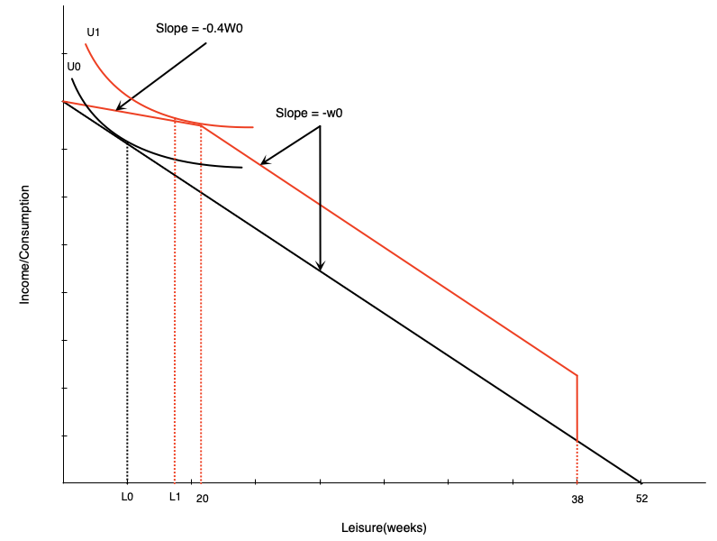
:::

::: {.column width="50%"}
[In phase-out range:]{.fg style="color: #2780e3;"}

- Acts like [negative income tax]{.fg style="color: #d9534f;"}
- Income effect → reduce hours ↓
- Substitution effect → reduce hours ↓
:::
:::

::: {.callout-important}
Effect [unambiguously negative]{.fg style="color: #d9534f;"}
:::

## Evidence: Maine vs. New Brunswick

[Natural experiment:]{.fg style="color: #2780e3;"}

::: {.nonincremental}
- Initially had very similar EI schemes
- Later, New Brunswick increased benefit generosity relative to Maine
- [Difference-in-differences approach:]{.fg style="color: #2780e3;"}
  - Compare changes in NB before/after to Maine over same period
  - Maine acts as control group
  - Controls for other time-varying factors
:::

## Evidence: Maine vs. New Brunswick Results

::: columns
::: {.column width="50%"}
[New Brunswick experienced:]{.fg style="color: #2780e3;"}

- Higher labour force participation for marginally-attached workers
- Lower hours for those with stronger attachments
:::

::: {.column width="50%"}
::: {.callout-note}
## Interpretation
- Corresponds exactly to model predictions
- Highlights work disincentive effects of income maintenance programs
:::
:::
:::

# Disability and Workers Compensation

## Introduction

[What are these programs?]{.fg style="color: #2780e3;"}

- Provide income support to injured/ill workers
- Come from public and private sources
- Premiums paid by employers and employees

::: {.callout-note}
## Work Incentive Considerations
- [Severe injury/disability:]{.fg style="color: #555;"} work incentives not a concern (unable to work)
- [Partial disability:]{.fg style="color: #555;"} people may still be able to work
:::

## Effect of Disability on Labour Supply

::: columns
::: {.column width="50%"}
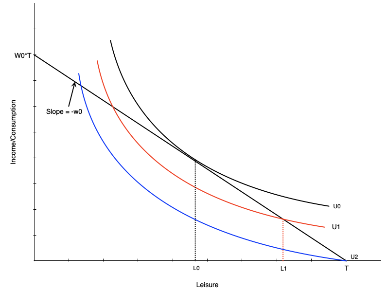
:::

::: {.column width="50%"}
[Three scenarios:]{.fg style="color: #2780e3;"}

1. [Initially:]{.fg style="color: #555;"} Choose $L_0$ leisure, work $H_0$ hours

2. [Injured but can work:]{.fg style="color: #f0ad4e;"} Choose $L_1$ leisure, work $H_1$ hours
   - Lower (non-optimal) indifference curve

3. [Completely disabled:]{.fg style="color: #d9534f;"} Choose $T$ leisure, zero work
   - Even lower indifference curve
:::
:::

## Disability and Preferences

::: columns
::: {.column width="50%"}
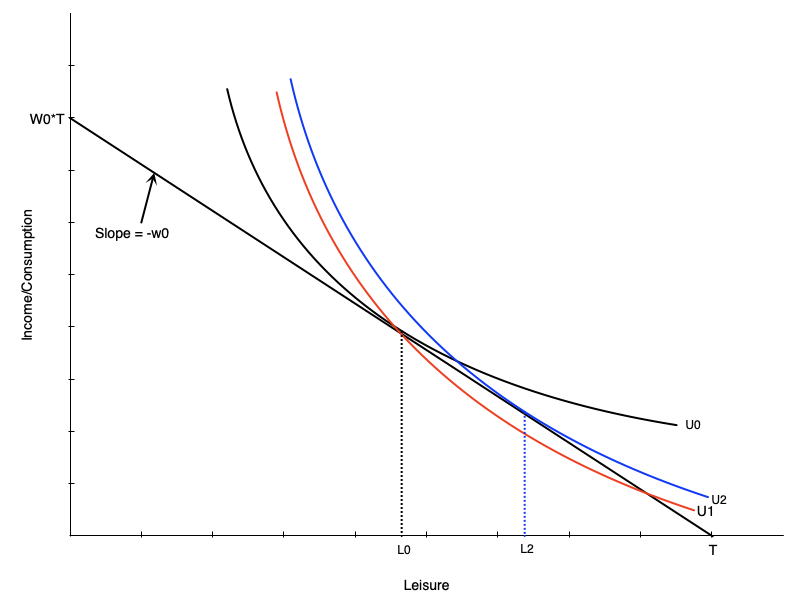
:::

::: {.column width="50%"}
[Disability may change preferences:]{.fg style="color: #2780e3;"}

- Work becomes more difficult
- Preferences tilt toward leisure
- Indifference curve becomes steeper
- MRS increases at each point
- More willing to give up consumption for leisure

[Result:]{.fg style="color: #c7254e;"}

- Even if unconstrained, choose more leisure
- Person moves from $L_0$ to $L_2$
:::
:::

## Compensation Schemes

[Typical disability insurance structure:]{.fg style="color: #2780e3;"}

- Pays a fraction of previous earnings

::: {.callout-note}
## Example: Ontario WSIB
- [85%]{.fg style="color: #c7254e;"} of net earnings (up to maximum)
- Lasts until return to work or age 65
:::

[Two schemes we'll examine:]{.fg style="color: #2780e3;"}

1. Two-thirds income replacement
2. Full income replacement

## Two-Thirds Compensation

::: columns
::: {.column width="50%"}
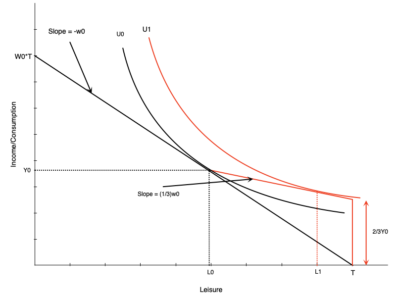
:::

::: {.column width="50%"}
[Looks like negative income tax:]{.fg style="color: #2780e3;"}

- At zero hours: get 2/3 of previous income
- For each hour worked:
  - Gain full wage
  - Lose 2/3 of wage in benefits
  - [Keep 1/3 of wage]{.fg style="color: #c7254e;"}

[For workers with flexible hours:]{.fg style="color: #2780e3;"}

- Effects match NIT
- Negative effect on hours worked
:::
:::

## Restricted Hours: Generous Compensation

::: columns
::: {.column width="50%"}
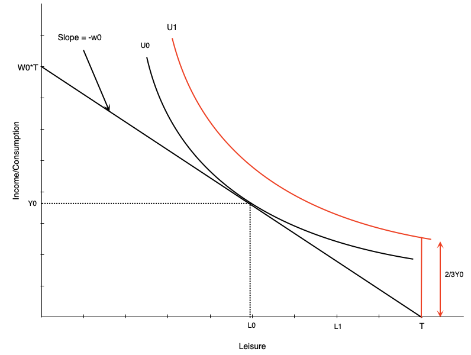
:::

::: {.column width="50%"}
[What if worker can only work $H_0$ hours or zero?]{.fg style="color: #2780e3;"}

- If scheme generous enough → choose zero hours
- Utility at zero hours > utility at $H_0$ hours
:::
:::

::: {.callout-warning}
## Implication
Strong work disincentives of generous scheme
:::

## No Compensation Case

::: columns
::: {.column width="50%"}
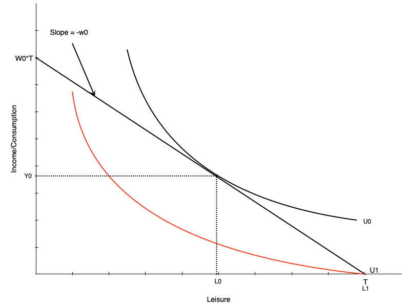
:::

::: {.column width="50%"}
::: {.callout-important}
## Not Providing Compensation is Problematic
- Person who can work chooses $H_0$ hours
- Person who cannot work gets lower utility
- End up substantially worse off
:::
:::
:::

## Medical Expenses Case

::: columns
::: {.column width="50%"}
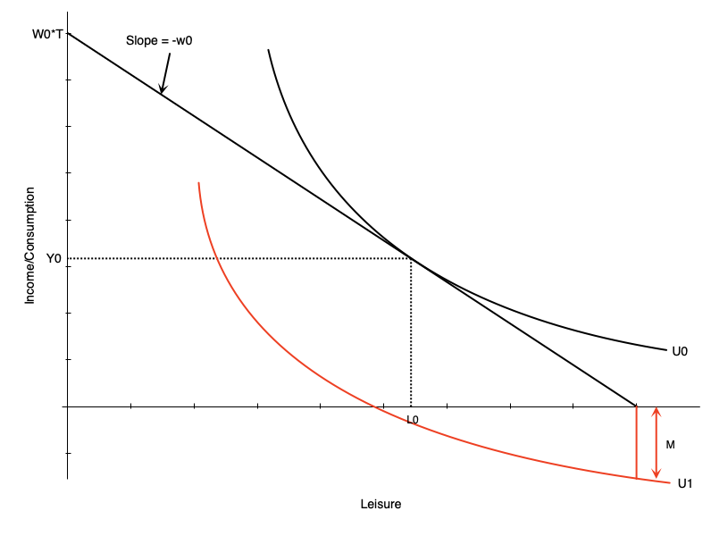
:::

::: {.column width="50%"}
[Medical expenses worsen situation:]{.fg style="color: #2780e3;"}

- Act like reduction in non-labour income
- If large enough, non-labour income could go negative
- Occurs with no/very low compensation

[This is an extreme scenario]{.fg style="color: #d9534f;"}
:::
:::

## Optimal Compensation Level

::: columns
::: {.column width="50%"}
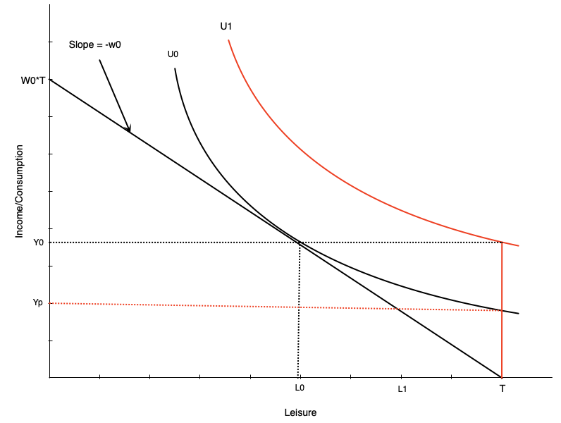
:::

::: {.column width="50%"}
[How much to compensate non-workers?]{.fg style="color: #2780e3;"}

[Two options:]{.fg style="color: #2780e3;"}

1. [Full income replacement]{.fg style="color: #5cb85c;"}
   - Higher indifference curve ($U_1$) than working
   
2. [Same satisfaction as working]{.fg style="color: #f0ad4e;"}
   - Same indifference curve as working
   - Lower compensation ($Y_p$)
:::
:::

::: {.callout-note}
The optimal level is a policy question
:::

## TODO — Empirical Evidence of Work Incentives (Disability) {background-color="#fff8e1"}

::: {.callout-warning}
## Not yet written

BFGLSS 2026 covers:

- Chapter 5 closes with evidence on disability insurance and workers' compensation
  and work incentives. The deck has the theory but no evidence slides.
:::

# Summary

## Summary

[Social insurance programs:]{.fg style="color: #2780e3;"}

::: {.nonincremental}
- Insure workers against job loss, illness, and workplace injury
- Change both the budget constraint and the incentive to work
:::

[We examined:]{.fg style="color: #2780e3;"}

- Employment Insurance, and its effect across the hours distribution
- Disability insurance and workers' compensation, and the trade-off in setting
  the compensation rate

