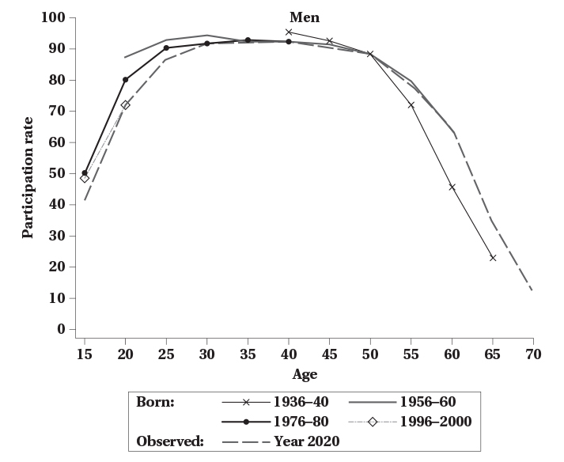
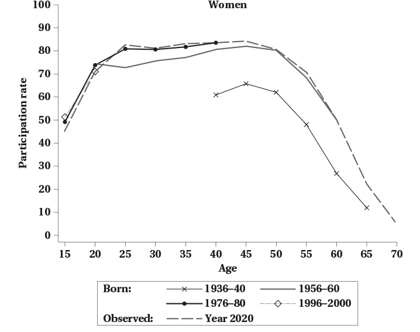
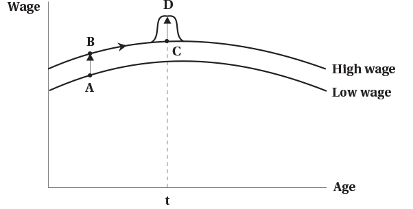
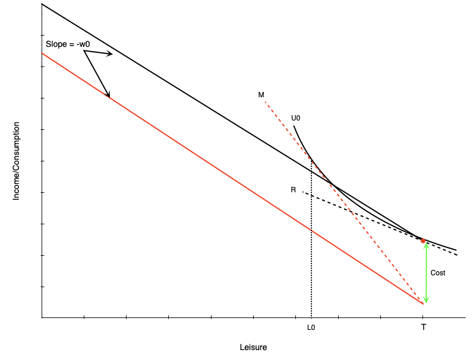
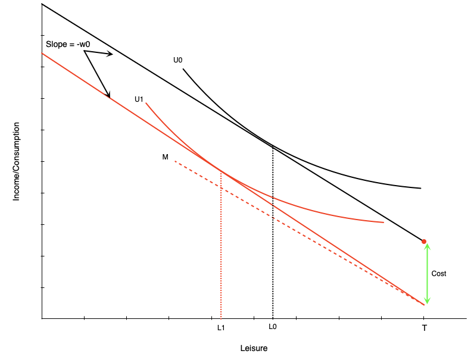
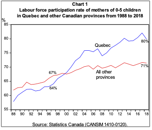

<h1>Labour Supply and Early Career Decisions</h1>

<h2>EC306- Wages and Employment</h2>

<h2>Justin Smith</h2>

<h2>Wilfrid Laurier University</h2>

<h2>Fall 2026</h2>

{.absolute top="275" left="900" width="550"}

# Goals of This Section

## Goals of This Section

In this section we will:

- Show patterns of labour supply over a person's lifetime
- Discuss issues comparing labour supply of people at different ages
- Introduce the lifetime labour supply model
- Discuss household production
- Analyze fertility decisions and family-related policy

# Life Cycle Labour Supply

## Introduction

[Previous discussion:]{.fg style="color: #2780e3;"}

- Focused on labour supply at a moment in time
- Supply changed immediately in response to wages, non-labour income, or policies

[In reality:]{.fg style="color: #2780e3;"}

- People can plan work over their lifetime
- Participation is highest in prime working years
- Life events alter labour supply decisions now and in the future
  - Marriage, children, education, health, retirement

::: {.callout-tip}
A life cycle approach helps us understand these patterns
:::

## Life Cycle Participation for Men

::: columns
::: {.column width="50%"}

:::

::: {.column width="50%"}
[Graph follows labour supply of men born in different years]{.fg style="color: #2780e3;"}

- Participation rises quickly in early 20s, peaks in late 40s, then declines

[Differences across birth cohorts:]{.fg style="color: #2780e3;"}

- At younger ages, younger cohorts participate a bit less
- At older ages, younger cohorts participate more
:::
:::

## Life Cycle Participation for Women

::: columns
::: {.column width="50%"}

:::

::: {.column width="50%"}
[Women follow similar lifetime pattern]{.fg style="color: #2780e3;"}

- Rates are shifted down a bit relative to men
- Participation [higher for younger cohorts]{.fg style="color: #c7254e;"} at all ages
  - Consistent with rising female labour force participation over time
:::
:::

## Cohort Effects vs Age Effects

::: {.callout-important}
## The Problem with Cross-Sectional Data
When we look at participation by age in a single year, we are mixing [age effects]{.fg style="color: #2780e3;"} and [cohort effects]{.fg style="color: #c7254e;"}
:::

[Previous graphs highlight a technical point:]{.fg style="color: #2780e3;"}

- Each graph contains a line that looks at life cycle pattern in year 2020
  - Participation of people in 2020 at different ages
- Problem: people at different ages are born at different times
  - 20 year olds in 2020 born in 2000
  - 60 year olds in 2020 born in 1960

## Cohort Effects vs Age Effects

[Definitions:]{.fg style="color: #2780e3;"}

- [Age effects:]{.fg style="color: #5cb85c;"} how labour supply changes as people get older
- [Cohort effects:]{.fg style="color: #f0ad4e;"} how labour supply differs for people born at different times

[Cohort effects can be significant]{.fg style="color: #2780e3;"}

- In particular for women where it has been increasing for younger cohorts
- Cannot look at participation by age in a single year and interpret as pure age effects

[Better approach:]{.fg style="color: #2780e3;"}

- Look at participation by age for a single birth cohort
- This is done in the graphs on the previous two slides
- Notice that the lines shift up and down for different birth cohorts
- Pattern across age is similar but there are some differences

## Cohort Effects vs Age Effects

::: {.callout-note}
## Practical Challenge
Very few datasets have data on the same people over their entire life
:::

[Difficulties:]{.fg style="color: #2780e3;"}

- Hard to track people over time
- People die, move, refuse to respond
- Data that does track people are often restricted access

[Solution: Quasi-cohorts]{.fg style="color: #5cb85c;"}

- Group people by birth year in cross-sectional (single year) data
- Look at how participation changes for these groups over time
- This is what the graphs on the previous two slides do
- Can be done with the Canada Census

## Cohort Effects vs Age Effects

[You can do this with the Canada Census:]{.fg style="color: #2780e3;"}

- Census is collected every 5 years
- Each Census collects information on age and labour force status (among many other things)
- Can follow a birth cohort across different Census years as they get older

|              |      |            |          |      |      |
|--------------|------|------------|----------|------|------|
|              |      | **Census** | **Year** |      |      |
| Birth Cohort | 1981 | 1986       | 1991     | 1996 | 2001 |
| 1950         | 31   | 36         | 41       | 46   | 51   |
| 1951         | 30   | 35         | 40       | 45   | 50   |
| 1952         | 29   | 34         | 39       | 44   | 49   |
| 1953         | 28   | 33         | 38       | 43   | 48   |
| 1954         | 27   | 32         | 37       | 42   | 47   |
| 1955         | 26   | 31         | 36       | 41   | 46   |

## Cohort Effects vs Age Effects

::: {.callout-warning}
## Caveat
In each Census year, people in a birth cohort are different people — not following the exact same individuals over time. This is generally accepted as a reasonable approximation.
:::

## Cohort Effects vs Age Effects

::: columns
::: {.column width="50%"}
| Born in 1975       |      |      |      |
|--------------------|------|------|------|
| Observed in        | 2000 | 2005 | 2010 |
| Age                | 25   | 30   | 35   |
| Participation Rate | 75%  | 80%  | 85%  |
| **Born in 1980**   |      |      |      |
| Observed in        | 2000 | 2005 | 2010 |
| Age                | 20   | 25   | 30   |
| Participation Rate | 75%  | 80%  | 85%  |
:::

::: {.column width="50%"}
[Illustrates problem with following ages in single Census year]{.fg style="color: #2780e3;"}

- Tracks birth cohorts across Census years
- Shows age and participation rate
- For each cohort participation rises 5 points per year
- But looking at ages in a single Census year, they appear not to change
:::
:::

## Cohort Effects vs Age Effects

[Where do cohort effects come from?]{.fg style="color: #2780e3;"}

People are in part defined by their generation:

- Social attitudes, economic conditions and policies change over time
- Generations experience different significant events (e.g. wars, disease)

[We therefore expect cohorts to differ:]{.fg style="color: #2780e3;"}

- Women born in early 1930s had higher labour supply than previous generations
- They were influenced by their mothers working during war
- Male children also more likely to be married to working women later in life

::: {.callout-important}
Important to separate these from effects of pure aging
:::

## {background-color="#f0f4f8"}

::: {style="text-align: center; font-size: 1.3em;"}
**Think About It**

Suppose you observe that 50-year-olds have higher labour force participation than 25-year-olds in 2025. Can you conclude that people work more as they age? Why or why not?
:::

# Dynamic Life Cycle Models

## Introduction

[We now know that labour supply varies over the life cycle]{.fg style="color: #2780e3;"}

- The allocation of work over time can be modeled
- Models examine the effects on labour supply of wage changes

[Wages can change in different ways:]{.fg style="color: #2780e3;"}

- At different ages
- For a short time or permanently
- Anticipated or unanticipated

::: {.callout-note}
Different types of changes have different effects on labour supply
:::

## Model

[Individuals maximize utility over consumption and leisure over their lifetime]{.fg style="color: #2780e3;"}

$$
u = U(C_1, C_2, \ldots, C_N, L_1, L_2, \ldots, L_N)
$$

- Here $U(.)$ is a function (e.g. logarithmic, Cobb-Douglas, etc.)

[To define the budget constraint:]{.fg style="color: #2780e3;"}

- We can consume and work in each period
- In theory, we can consume more than our income in a period by borrowing
- We can also save some income to consume later
- Need to be conscious of the interest rate on saving and borrowing

## Model

[Consider a two period model]{.fg style="color: #2780e3;"}

The budget constraint says that the [present value of consumption]{.fg style="color: #5cb85c;"} equals the [present value of income]{.fg style="color: #f0ad4e;"}:

$$
C_1 + \frac{C_2}{1+r} = W_1 H_1 + \frac{W_2 H_2}{1+r}
$$

- $r$ is the interest rate for borrowing and saving
- This is the present (period 1) value formulation

[Future (period 2) value formulation:]{.fg style="color: #2780e3;"}

$$
(1+r)C_1 + C_2 = (1+r)W_1 H_1 + W_2 H_2
$$

## Model

[The ability to borrow and save means a person can consume more than their income in a period]{.fg style="color: #2780e3;"}

Rearranging the future value of the budget:

$$
C_2 = (1+r)(W_1 H_1 - C_1) + W_2 H_2
$$

[Two cases:]{.fg style="color: #2780e3;"}

- If $W_1 H_1 > C_1$: person [saved]{.fg style="color: #5cb85c;"} some income in period 1
  - Savings grows with interest: $(1+r)(W_1 H_1 - C_1)$ to spend in period 2

- If $W_1 H_1 < C_1$: person [borrowed]{.fg style="color: #d9534f;"} to consume more than income
  - $(1+r)(W_1 H_1 - C_1)$ is negative and reduces income in period 2

## Model

[Reexpress in terms of leisure]{.fg style="color: #2780e3;"} (note that $H_t = T - L_t$):

$$
C_1 + \frac{C_2}{1+r} + W_1 L_1 + \frac{W_2 L_2}{1+r} = W_1 T + \frac{W_2 T}{1+r}
$$

[Interpretation:]{.fg style="color: #2780e3;"}

- You can consume two goods (consumption and leisure)
- Price of consumption is 1 in both periods
- Price of leisure is $W_1$ in period 1 and $W_2$ in period 2
- You consume these out of ["full income"]{.fg style="color: #c7254e;"}
  - Full income = income if you worked all available hours in both periods
- Period 2 values are discounted by the interest rate

## Model

[If you maximize utility subject to the budget constraints:]{.fg style="color: #2780e3;"}

- You get a labour supply function
- Tells you optimal labour supply as a function of wages, interest rates, lifetime resources

[Like previous models, we can examine effects of wage changes]{.fg style="color: #2780e3;"}

[Three types:]{.fg style="color: #2780e3;"}

1. Permanent unanticipated change in the wage in all periods
2. Anticipated future change in the wage
3. Temporary unanticipated change in the wage in one period only

These lead to substitution and income effects (more complicated because of the extra time dimension)

## Permanent Wage Change

::: columns
::: {.column width="50%"}

:::

::: {.column width="50%"}
[Permanent, unanticipated change in the wage:]{.fg style="color: #2780e3;"}

- Increases wage in all periods
- Shifts wage schedule up

[Two effects:]{.fg style="color: #2780e3;"}

- [Income effect:]{.fg style="color: #f0ad4e;"} higher wage → higher lifetime income → more leisure (less work)
- [Substitution effect:]{.fg style="color: #5cb85c;"} higher wage → leisure more expensive → less leisure (more work)
:::
:::

::: {.callout-warning}
Labour supply effect is [ambiguous]{.fg style="color: #c7254e;"}
:::

## Anticipated Wage Change

::: columns
::: {.column width="50%"}

:::

::: {.column width="50%"}
[An anticipated wage change moves person along their wage schedule]{.fg style="color: #2780e3;"}

[No income effect:]{.fg style="color: #f0ad4e;"}

- Person optimized over their lifetime income
- Lifetime income has not changed

[Substitution effect:]{.fg style="color: #5cb85c;"}

- Shifts leisure to where wage is lower
- If wage is higher in period 2, leisure is more expensive in period 2
- Less leisure in period 2 and more in period 1
- Person works more in period 2 and less in period 1
:::
:::

## Temporary Unanticipated Wage Change

::: columns
::: {.column width="50%"}

:::

::: {.column width="50%"}
[A temporary unanticipated wage change:]{.fg style="color: #2780e3;"}

- Alters wage for one period (or small number) only
- e.g. bonus pay, overtime pay
- Creates a temporary blip upward in wage schedule

[Two effects:]{.fg style="color: #2780e3;"}

- [Small income effect:]{.fg style="color: #f0ad4e;"} slightly higher lifetime income → more leisure (less work)
- [Substitution effect:]{.fg style="color: #5cb85c;"} leisure more expensive in period with higher wage → less leisure (more work)
:::
:::

## Comparing Effects of Wage Changes

::: {.callout-tip}
## Strongest Effect: Anticipated Wage Change
- Pure substitution effect
- No offsetting income effect
:::

::: {.callout-note}
## Next Strongest: Temporary Unanticipated Change
- Substitution effect
- Small income effect
- Person works more in period with higher wage
:::

::: {.callout-warning}
## Ambiguous: Permanent Unanticipated Change
- Substitution effect
- Larger income effect
- Ambiguous effect on labour supply
:::

## Evidence on Life Cycle Labour Supply

[Interesting experiment on bike messengers in Zurich:]{.fg style="color: #2780e3;"}

- Messengers paid a percentage of daily revenues
- Can choose their own total work hours

[Research design:]{.fg style="color: #2780e3;"}

- Researchers randomly assigned messengers to:
  - [Group A:]{.fg style="color: #5cb85c;"} 25% higher wage for one month in September
  - [Group B:]{.fg style="color: #f0ad4e;"} 25% higher wage for one month in November
- Each acted as control group for the other
- Both get same increase in lifetime income, so difference is substitution effect

::: {.callout-note}
## Finding
Messengers shift labour supply to periods with higher wage
:::

## {background-color="#f0f4f8"}

::: {style="text-align: center; font-size: 1.3em;"}
**Discussion**

A government announces today that the minimum wage will increase by 20% starting in two years. Using the life cycle model, how would you expect workers near the minimum wage to adjust their labour supply now versus after the increase takes effect?
:::

# Household Production

## Introduction

::: {.callout-note}
## Previous Assumption
People choose between consumption and leisure, where leisure = time not working for pay
:::

[In reality, people also spend time on household production:]{.fg style="color: #2780e3;"}

- Cooking, cleaning, childcare, home maintenance, shopping, etc.
- Produces goods and services that can be consumed
  - Meals, clean clothes, child supervision, etc.

[In this section we explicitly model household production]{.fg style="color: #c7254e;"}

## Model

[People gain utility from the consumption of goods and services:]{.fg style="color: #2780e3;"}

$$u = f(Z_{1}, Z_{2}, \ldots, Z_{N})$$

- $Z_1, Z_2, \ldots, Z_n$ are final goods and services
- $f(.)$ is a function (e.g. Cobb-Douglas, logarithmic, etc.)

[Each good/service is produced by the household using:]{.fg style="color: #2780e3;"}

- A set of market inputs $X_1, X_2, \ldots, X_n$
- Time $h_{i}$

[Time is divided between:]{.fg style="color: #2780e3;"}

- Market work
- Household production tasks

## Model

[What does it mean that households "produce" the goods they consume?]{.fg style="color: #2780e3;"}

Does not mean that literally everyone is producing goods from raw materials

[Instead:]{.fg style="color: #2780e3;"}

Every good/service consumed requires some time to prepare

- Hiring contractors to remodel a home requires a small amount of home production
  - Time spent explaining what you need, keeping contractor on schedule
- Remodelling your basement by yourself requires much more time

[In this model:]{.fg style="color: #2780e3;"}

We explicitly account for substituting time between various uses:

- Work, home production of various goods, leisure

## Model

::: {.callout-note}
## Example: Household Consumes Two Goods
[Nutrition and rest]{.fg style="color: #2780e3;"} — These would be $Z_1$ and $Z_2$ in the utility function
:::

[Nutrition is produced using:]{.fg style="color: #2780e3;"}

- Processed or raw food, and time
- These are $X_1$, $X_{2}$ and $h$
- Raw food takes time to prepare equal to $h = d$ hours

[Each of the three purchased goods has a price:]{.fg style="color: #2780e3;"}

[Processed food:]{.fg style="color: #5cb85c;"}

- Price per unit of nutrition is $P_c$
- Takes no time to prepare

## Model

[Raw food:]{.fg style="color: #f0ad4e;"}

- Price per unit of nutrition is $P_r + W_{d}$
- The added time cost is valued at the wage rate $W$ times $d$ hours

[Leisure:]{.fg style="color: #c7254e;"}

- Price is the wage rate $W$

## Comparative Statics

[What happens when we start changing some of the prices?]{.fg style="color: #2780e3;"}

[Increase in wage rate $W$:]{.fg style="color: #c7254e;"}

- Cost of time affects both rest and production of raw food
- Higher wage makes home production more expensive
  - Time spent cooking becomes more expensive
  - Substitute away from home production to processed food
  - [Substitution effect:]{.fg style="color: #5cb85c;"} less home production, more processed food
  - [Income effect:]{.fg style="color: #f0ad4e;"} higher wage → higher income → more consumption of all goods

## Comparative Statics

[Increase in wage rate $W$ (continued):]{.fg style="color: #c7254e;"}

- Effect on rest is same as before
  - [Substitution effect:]{.fg style="color: #5cb85c;"} less rest, more work
  - [Income effect:]{.fg style="color: #f0ad4e;"} higher income → more rest

## Comparative Statics

[Decrease in price of processed food $P_c$:]{.fg style="color: #5cb85c;"}

- Processed food becomes cheaper relative to other goods
- [Substitution effect:]{.fg style="color: #5cb85c;"} more processed food, less home production
- [Income effect:]{.fg style="color: #f0ad4e;"} lower price → higher real income → more consumption of all goods

[Decrease in price of raw food $P_r$:]{.fg style="color: #f0ad4e;"}

- Raw food becomes relatively cheaper
- [Substitution effect:]{.fg style="color: #5cb85c;"} more raw food, less processed food
- [Income effect:]{.fg style="color: #f0ad4e;"} lower price → higher real income → more consumption of all goods

## Comparative Statics

[Decrease in time required to prepare raw food $d$:]{.fg style="color: #2780e3;"}

- Example: technology that reduces cooking time (e.g. Instant Pot)
- Home production becomes relatively cheaper (through lower time cost)

[Effects:]{.fg style="color: #2780e3;"}

- [Substitution effect:]{.fg style="color: #5cb85c;"} more raw food, less processed food
- [Additional substitution effect:]{.fg style="color: #5cb85c;"} higher real wage (keep more of their wage) → less rest, more work
- [Income effect:]{.fg style="color: #f0ad4e;"} lower time cost → higher real income → more consumption of all goods

## Discussion

[Model adds more real world complexity:]{.fg style="color: #2780e3;"}

- Matches what people actually do
- Emphasizes that people do not just choose between work and leisure
- Also emphasizes the role of the household relative to the individual
  - Household members can specialize in different tasks
  - Changes for one household member can affect others

::: {.callout-note}
## Household Production Function
Different households have different abilities to produce goods. This can affect their choices and responses to changes in prices.
:::

## {background-color="#f0f4f8"}

::: {style="text-align: center; font-size: 1.3em;"}
**Think About It**

What would happen to a household's use of home-cooked meals versus takeout food if one partner receives a large raise at work? Explain using the household production model.
:::

# Fertility and Childbearing

## Introduction

[Fertility is a key life event that affects labour supply]{.fg style="color: #2780e3;"}

- Particularly for women, but also men to some degree
- Children are typically planned to some degree
  - Timing of children is often chosen to fit with work plans
  - Number of children is often chosen based on lifetime work plans

[Economists have developed models to analyze fertility decisions]{.fg style="color: #2780e3;"}

- These models are similar to the life cycle labour supply model
- We will not go over the model (beyond the scope of this course)
- But we will discuss some of the key variables that affect fertility decisions

## Variables Affecting Fertility - Income

::: {.callout-tip}
## Theoretical Prediction
Income is positively related to the number of children — higher income → higher ability to pay for children. Children are a "normal good."
:::

[Some disagreement on whether children are considered a normal good:]{.fg style="color: #2780e3;"}

- Empirically, higher income families and countries have [lower fertility rates]{.fg style="color: #c7254e;"}
- Explanation: substitution effect of higher income dominates income effect
  - Higher income → higher opportunity cost of time spent on children

## Variables Affecting Fertility - Price of Children

[Like goods, the demand curve for children slopes down]{.fg style="color: #2780e3;"}

- Higher "price" of children → fewer children are chosen

[Price of children includes:]{.fg style="color: #2780e3;"}

- [Direct costs:]{.fg style="color: #5cb85c;"} food, clothing, housework, etc.
- [Opportunity costs:]{.fg style="color: #f0ad4e;"} time spent caring for children could be spent working for pay

## Variables Affecting Fertility - Price of Children

[A higher price (wage rate) creates income and substitution effects:]{.fg style="color: #2780e3;"}

- [Income effect:]{.fg style="color: #f0ad4e;"} higher wage → higher lifetime income → more children
- [Substitution effect:]{.fg style="color: #5cb85c;"} higher price → time with children more expensive → fewer children

::: {.callout-note}
Effect is theoretically ambiguous, but empirically substitution effect dominates
:::

## Variables Affecting Fertility - Price of Related Goods

[Many goods are consumed as part of having children:]{.fg style="color: #2780e3;"}

- Childcare, education, etc.
- These are [complementary goods]{.fg style="color: #c7254e;"}
  - If you have more children, you will consume more of these goods
  - You could also consider these direct costs of children

::: {.callout-important}
## Economic Principle
An increase in the price of a complementary good reduces demand. Higher price of childcare or education → fewer children.
:::

## Variables Affecting Fertility - Tastes

[Tastes for children vary across people and over time:]{.fg style="color: #2780e3;"}

- Some people really want children, others do not
- Some cultures value children more than others
- Attitudes towards children have changed over time

[A stronger taste for children means more children]{.fg style="color: #5cb85c;"}

- This is like a shift in the demand curve for children

[Over time in Canada:]{.fg style="color: #c7254e;"}

- There has been a shift away from children
- Fertility rates have declined over time
- People are having fewer children than in the past

## Variables Affecting Fertility - Technology

[Technology in this case could mean several things:]{.fg style="color: #2780e3;"}

- Could refer to the "production" of children
- Might also relate to the goods and services used with children (e.g. home automation, disposable diapers)

[Key developments in the last few decades:]{.fg style="color: #2780e3;"}

- [Birth control:]{.fg style="color: #5cb85c;"} allows people to better plan timing and number of children
- [Fertility treatments:]{.fg style="color: #5cb85c;"} allows some people to have children who otherwise could not
- [Medical care:]{.fg style="color: #5cb85c;"} reduces infant mortality, so fewer children needed to ensure some survive
- [Home technology:]{.fg style="color: #5cb85c;"} reduces time cost of childcare, so lower opportunity cost of children

## Variables Affecting Fertility - Technology

::: {.callout-tip}
Higher technology in any of these areas tends to increase demand for children
:::

## Empirical Evidence

[Economists have examined the relationship between income and fertility]{.fg style="color: #2780e3;"}

::: {.callout-warning}
## Challenge: Omitted Variables
A simple correlation between income and fertility tends to be negative. Important to hold constant other variables that affect both income and fertility.
:::

[Example:]{.fg style="color: #2780e3;"}

- Education levels are positively related to income and negatively related to fertility

[When other variables are held constant:]{.fg style="color: #5cb85c;"}

- Income tends to be positively related to fertility
- Consistent with children being a normal good
- Tax incentives also tend to increase fertility

## {background-color="#f0f4f8"}

::: {style="text-align: center; font-size: 1.3em;"}
**Discussion**

Why might we observe that countries with the most generous parental leave policies do not necessarily have the highest fertility rates?
:::

# Child Care Subsidies

## Introduction

[Canada's child care expansion:]{.fg style="color: #2780e3;"}

::: {.nonincremental}
- Goal: reduce average cost to [$10/day by 2026]{.fg style="color: #c7254e;"}
- More than half of provinces already at $10/day average
- Subsidy varies substantially by province
- Requires provincial-federal agreements
:::

::: {.callout-note}
## Quebec Case Study
Had $10/day child care since 1997. Provides useful evidence on effects.
:::

## Child Care Costs: Non-Working Case

::: columns
::: {.column width="50%"}

:::

::: {.column width="50%"}
[Budget line becomes discontinuous:]{.fg style="color: #2780e3;"}

- At zero hours: red dot
- For any work: drops by child care costs
- Then straight line with slope = wage

[Effect:]{.fg style="color: #2780e3;"}

- Child care costs [increase reservation wage]{.fg style="color: #c7254e;"}
- Need higher wage to induce work
- This person chooses not to work
:::
:::

## Child Care Costs: Working Case

::: columns
::: {.column width="50%"}

:::

::: {.column width="50%"}
[Person with reservation wage below wage + costs:]{.fg style="color: #2780e3;"}

- Works positive hours
- Child care costs = [negative pure income effect]{.fg style="color: #d9534f;"}
- Choose less leisure, more work
- Must work more to offset income loss
:::
:::

## Child Care Costs: Labour Supply Gap

::: columns
::: {.column width="50%"}

:::

::: {.column width="50%"}
::: {.callout-important}
## Creates Gap in Labour Supply Schedule
- Person who works will work minimum of $H_0 = T - L_0$ hours
- Not worth working less due to large child care costs
- Labour supply schedule [jumps from zero to $H_0$ hours]{.fg style="color: #c7254e;"}
:::
:::
:::

## Child Care Subsidies: Effects

[A full subsidy (costs → zero) would:]{.fg style="color: #2780e3;"}

::: {.nonincremental}
1. Move budget line up in parallel
2. [Reduce reservation wage]{.fg style="color: #5cb85c;"}
   - Lower barrier → encourages participation
   - Especially encourages part-time work

3. Create positive income effect
   - Increases consumption of leisure
   - Reduces work hours
:::

## Evidence: Quebec's $5/Day Program

::: columns
::: {.column width="50%"}

[Program details:]{.fg style="color: #2780e3;"}

- Implemented in 2000
- Currently sliding scale: $8.25 to $21.45

:::
::: {.column width="50%"}
[Research design:]{.fg style="color: #2780e3;"}

- Difference-in-differences approach
- Compared Quebec mothers to mothers in other provinces
- Other provinces = control group
:::
:::

::: {.callout-note}
## Key Finding
Labour force participation of mothers with young children ↑ [7.7 percentage points]{.fg style="color: #c7254e;"}
:::

## Evidence: Quebec's $5/Day Program

::: {.callout-warning}
Unfortunately also found negative effects on child mental health, non-cognitive behaviour, crime later in life
:::

## Evidence: Visual Summary

{fig-align="center" width="85%"}

## {background-color="#f0f4f8"}

::: {style="text-align: center; font-size: 1.3em;"}
**Think About It**

Quebec's $5/day child care program increased mothers' labour force participation by 7.7 percentage points but was associated with negative child outcomes. What does this trade-off suggest about how we should evaluate the success of a child care subsidy policy?
:::

## TODO — Labour Market Entry {background-color="#fff8e1"}

::: {.callout-warning}
## Not yet written

BFGLSS 2026 covers:

- Chapter 6 opens the early-career material with labour market entry — the
  school-to-work transition and early-career job mobility. No slides exist for it.
:::

## TODO — Family-Related Policy beyond Child Care {background-color="#fff8e1"}

::: {.callout-warning}
## Not yet written

BFGLSS 2026 covers:

- Parental leave and other family policy. The child care subsidy material above
  covers part of this section.
:::

# Summary

## Summary

[Labour supply changes over the life cycle:]{.fg style="color: #2780e3;"}

::: {.nonincremental}
- Cross-sectional age profiles confound age effects with cohort effects
- The dynamic model distinguishes anticipated, temporary, and permanent wage changes
- Household production widens the model beyond market work and leisure
- Fertility responds to income, the price of children, and technology
- Child care subsidies shift both participation and hours
:::

