<h1>Labour Demand</h1>

<h2>EC306- Wages and Employment</h2>

<h2>Justin Smith</h2>

<h2>Wilfrid Laurier University</h2>

<h2>Fall 2026</h2>

{.absolute top="275" left="900" width="550"}

# Goals of This Section

## Goals of This Section

In this section we will:

- Understand how firms decide how much labour to employ
- Compare short-run vs. long-run labour demand decisions
- Explain why labour demand is downward sloping
- Learn factors that affect the elasticity of labour demand
- Distinguish between workers and hours as an input into production
- Add costs that are independent of hours worked (quasi-fixed costs)

# Background

## Background

[Labour demand:]{.fg style="color: #2780e3;"} the number of workers firms want to hire at a given wage rate

::: {.callout-important}
## Derived Demand
Labour demand is linked to demand for goods/services produced — it is an input into that production
:::

[Several factors influence labour demand:]{.fg style="color: #2780e3;"}

- Firm's objectives and constraints
- Demand conditions in product markets
- State of technology
- Time horizon
  - [Short run:]{.fg style="color: #555;"} one or more inputs fixed (usually capital)
  - [Long run:]{.fg style="color: #555;"} all inputs variable

## Structure of Product Markets

- Labour demand is driven by the firm's output (labour is an input)
- Structure of the product market influences demand for labour
  - Ranges from perfect competition (many sellers) to monopoly (one seller)

- Structure of the labour market influences supply the firm faces
  - Ranges from perfect competition (many workers) to monopsony (one buyer)

::: {.callout-note}
In this section we examine [perfect competition]{.fg style="color: #5cb85c;"} in both product and labour markets
:::

# Demand in the Short Run

## Model

[As labour demand is derived from production, the model starts with a production function:]{.fg style="color: #2780e3;"}

$$ Q = F(K, N)$$

Where:

- $Q$ is quantity of output
- $K$ is capital ([fixed in short run]{.fg style="color: #c7254e;"} at $K_{0}$)
- $N$ is labour ([variable in short run]{.fg style="color: #5cb85c;"})

[Firm's objective:]{.fg style="color: #2780e3;"} maximize profit

In the short run this means choosing $N$ given fixed $K_0$

## Model

[To see this mathematically:]{.fg style="color: #2780e3;"}

Output prices are given (perfect competition)

Profit: 
$$\pi(N)= pQ - wN - rK_{0}$$ 
$$= pF(K_0,N) - wN - rK_{0} $$

Differentiate $\pi(N)$ w.r.t. $N$:

$$\frac{d\pi}{dN} = p\frac{\partial F}{\partial N}(K_{0},N) - w = p MP_N - w$$

## Model

::: {.callout-tip}
## Optimality Condition
Optimal $N^\ast$ satisfies: $pMP_N = w$
:::

Where:

- $MP_N$ is the [marginal product of labour]{.fg style="color: #2780e3;"}
- $pMP_N$ is the [marginal revenue product of labour]{.fg style="color: #2780e3;"} ($MRP$)
  - When firm is in perfectly competitive product market and $MR = p$ it is called [value of marginal product]{.fg style="color: #5cb85c;"} ($VMP$)
- $w$ is the wage rate (marginal cost of labour, $MC_N$)

Optimality requires that the value of the last unit of labour hired equals its cost

## Model

[Other key metrics:]{.fg style="color: #2780e3;"}

- [Total Revenue Product]{.fg style="color: #555;"} ($TRP$): Total revenue associated with labour employed 
  $$TRP = p \times Q$$
  
- [Average Revenue Product]{.fg style="color: #555;"} ($ARP$): Average revenue per unit of labour employed 
  $$ARP = \frac{TRP}{N} = \frac{p \times Q}{N}$$

The firm's optimal choice of labour is where $MRP_N = w$

- This defines its labour demand curve in the short run
- As $w$ varies, the firm adjusts $N$ to maintain equality

## Labour Demand Curve in Short Run

::: columns
::: {.column width="50%"}
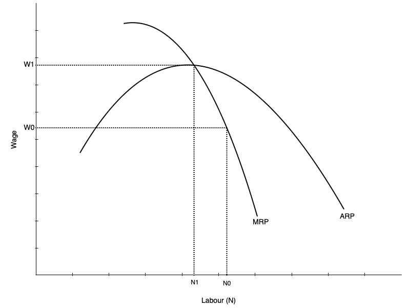
:::

::: {.column width="50%"}
[The short run labour demand curve is the MRP curve below ARP]{.fg style="color: #2780e3;"}

- Shows amount of labour demanded at every wage
- Slopes down because of [diminishing marginal product]{.fg style="color: #c7254e;"} of labour
  - As more labour is employed, extra output produced falls
  - Not because of inferior labour, but because more labour uses fixed capital

As wage falls, firm is willing to use more labour
:::
:::

## Demand Curve and Competition in Product Market

- Labour demand depends on demand for the product being produced
- Also depends on structure of the product market
- Firm always maximizes profit by choosing labour where $MRP_N = w$

[But marginal revenue differs across market structures:]{.fg style="color: #2780e3;"}

- In [perfect competition]{.fg style="color: #5cb85c;"}: $MR = p$, and $MR$ does not fall with more $N$
- In [monopoly]{.fg style="color: #d9534f;"}: $MR < p$, and $MR$ falls as $N$ increases

::: {.callout-warning}
With less competition in product market, labour demand is lower and falls faster with more $N$
:::

## {background-color="#f0f4f8"}

::: {style="text-align: center; font-size: 1.3em;"}
**Think About It**

A firm currently employs workers where $pMP_N = w$. Suppose the government introduces a per-unit subsidy on the firm's output, raising the effective price the firm receives. What happens to the firm's short-run demand for labour, and why?
:::

# Demand in the Long Run

## Introduction

::: {.callout-note}
## Long Run Differs from Short Run
All inputs are variable — firms can adjust capital as well as labour
:::

This makes the decision more complicated:

- Must consider substitution between labour and capital
- Must consider economies of scale

[Approach to find optimum occurs in two steps:]{.fg style="color: #2780e3;"}

1. Minimize cost holding output constant
2. Choose output to maximize profit given cost function

## Cost Minimization

[First step: minimize cost of producing given output $Q_0$]{.fg style="color: #2780e3;"}

Occurs when an isoquant is tangent to an isocost line:

- [Isoquant:]{.fg style="color: #5cb85c;"} shows combinations of $K$ and $N$ that produce $Q_0$
- [Isocost line:]{.fg style="color: #f0ad4e;"} shows combinations of $K$ and $N$ that cost the same amount
- Analogous to utility maximization with indifference curves and budget constraints

Assume cost of capital is $r$ and cost of labour is $w$

- Total cost: $C = rK + wN$
- Production function: $Q = F(K,N)$
- Minimize $C$ subject to $Q = Q_0$

## Cost Minimization

::: columns
::: {.column width="50%"}
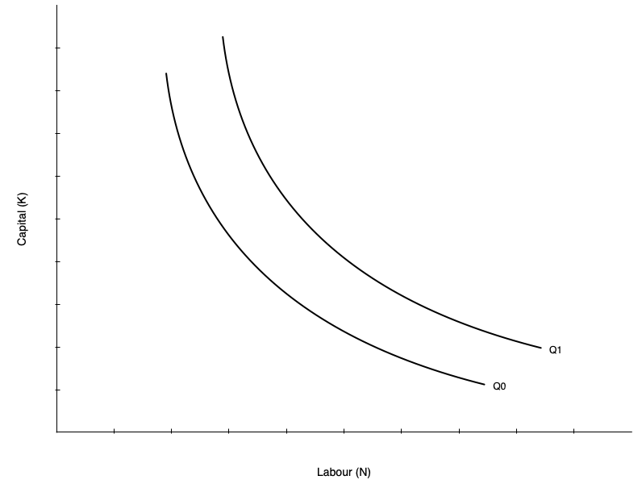
:::

::: {.column width="50%"}
[Graph shows two isoquants]{.fg style="color: #2780e3;"}

- Combinations of capital and labour that produce the same quantity
- Shape given by the production function
  - Shown as convex, but could be different shapes
  - Linear isoquant → perfect substitutes
  - L-shaped isoquant → perfect complements

[Slope of isoquant is the MRTS]{.fg style="color: #c7254e;"}

- Marginal rate of technical substitution
- Rate at which you can substitute labour for capital holding output constant
:::
:::

## Cost Minimization

[The slope of the isoquant is given by the MRTS:]{.fg style="color: #2780e3;"}

$$MRTS = \frac{MP_N}{MP_K}$$

Tells you amount of capital you can give up for one more unit of labour holding output constant

::: {.callout-note}
## Diminishing MRTS
Isoquants typically display diminishing MRTS — when a lot of capital is used, you can give up a lot for one more unit of labour; when a lot of labour is used, you can give up only a little capital
:::

## Cost Minimization

[The isocost line gives combinations of $K$ and $N$ that cost the same amount]{.fg style="color: #2780e3;"}

Total cost: $$C = rK + wN$$

Rearranging gives the isocost line equation:

$$K = \frac{C}{r} - \frac{w}{r}N$$

[Slope of isocost line:]{.fg style="color: #2780e3;"} ratio of input prices

- As $w$ increases, isocost line becomes steeper
- As $r$ increases, isocost line becomes flatter

## Cost Minimization

::: columns
::: {.column width="50%"}
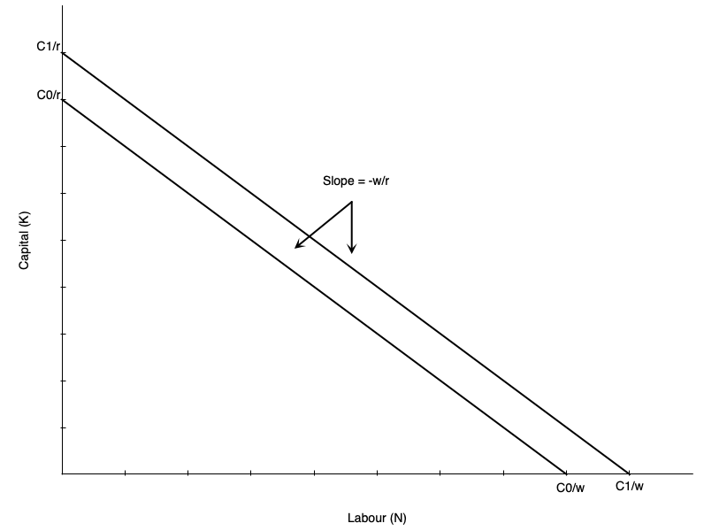
:::

::: {.column width="50%"}
[Example isocost:]{.fg style="color: #2780e3;"}

- Slope is ratio of input prices $-w/r$
- If firm uses only labour: $C/w$
- If firm uses only capital: $C/r$
- As labour falls by one unit, capital must rise by $w/r$ units to keep cost constant

Higher cost line shifts isocost outward (when $C_0$ increases to $C_1$)
:::
:::

## Cost Minimization

::: columns
::: {.column width="50%"}
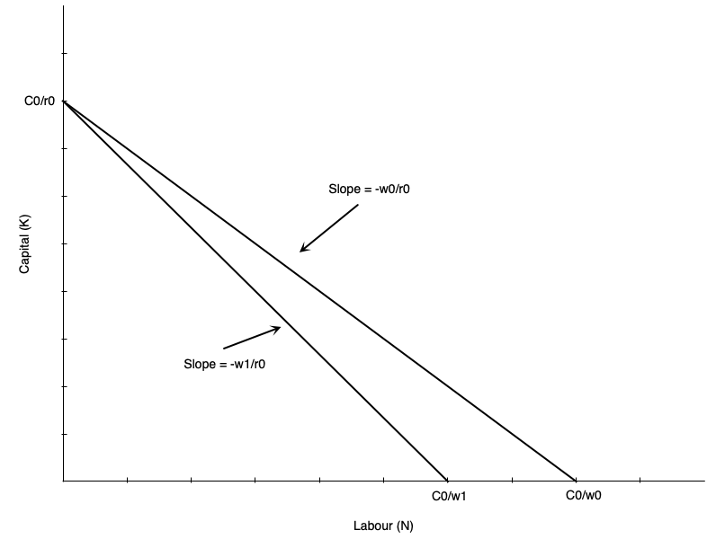
:::

::: {.column width="50%"}
[Suppose wage rises from $w_0$ to $w_1$]{.fg style="color: #c7254e;"}

Holding cost constant at $C_0$:

- Isocost line pivots inward
- Steeper slope as $w/r$ increases
- If firm uses only capital, vertical intercept stays at $C_0/r$
- If firm uses only labour, horizontal intercept falls to $C_0/w_1$

All combinations of new isocost lie below old isocost
:::
:::

## Cost Minimization

::: columns
::: {.column width="50%"}
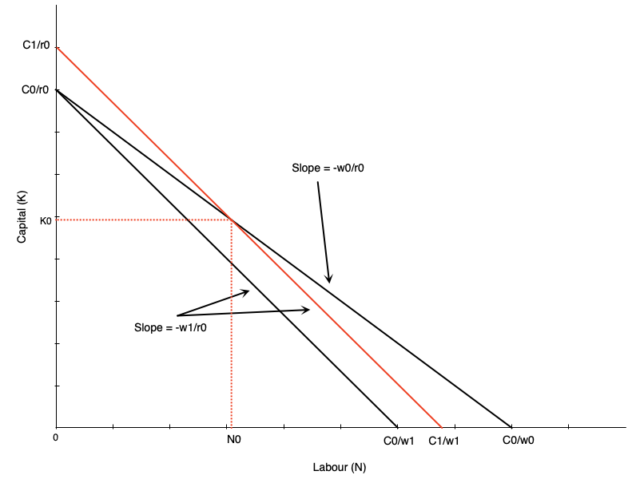
:::

::: {.column width="50%"}
To use any of the old combinations of $K$ and $N$ firm must increase cost

- Shifts isocost outward to $C_1$
- Magnitude of shift depends on which combination is chosen

Example depicted shows cost curve shifting out to use combination $(N_{0}, K_{0})$ at new prices
:::
:::

## Cost Minimization

::: {.callout-tip}
## Cost Minimizing Bundle
Where isoquant is tangent to isocost line
:::

In mathematical terms:

$$\frac{MP_N}{MP_K} = \frac{w}{r}$$

Says that MRTS equals the ratio of input prices

Alternatively:

$$\frac{MP_N}{w} = \frac{MP_K}{r}$$

The last dollar spent on each input must yield the same marginal product

## Cost Minimization

::: columns
::: {.column width="50%"}
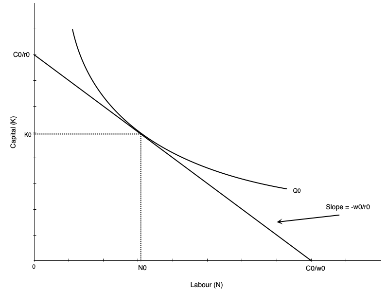
:::

::: {.column width="50%"}
Cost minimization depicted

- Hold output constant at $Q_0$
- Find optimal combination of $K$ and $N$
- Happens at tangency point between isoquant and isocost line
:::
:::

## Cost Minimization

::: {.callout-note}
## Two-Step Process
We have only done cost minimization here — lowest cost given output level $Q_0$. Profit maximization involves choosing output level as well.
:::

- Second step: choose $Q$ to maximize profit given cost function
- Second step is not depicted here

[If wage rate goes up, firm re-optimizes:]{.fg style="color: #2780e3;"}

- Firm marginal and average cost curves shift up
- Each firm reduces output
- Market price rises
- Isoquants at profit max shift inward

## Cost Minimization – Math

Suppose production exhibits [decreasing returns to scale]{.fg style="color: #c7254e;"}:

$$y = F(K,N) = K^{\alpha} N^{\beta}, \quad \alpha>0,\;\beta>0,\;\alpha+\beta<1$$

Input prices: $r$ (capital), $w$ (labour)

Cost-minimization problem:

$$\min_{K,N} \; C = rK + wN \quad \text{s.t.} \quad K^{\alpha} N^{\beta} \ge y$$

Lagrangian:

$$\mathcal{L} = rK + wN + \lambda\big(y - K^{\alpha} N^{\beta}\big)$$

## Cost Minimization – Math

First-order conditions:

$$\frac{\partial \mathcal{L}}{\partial K} = r - \lambda\,\alpha\, K^{\alpha-1} N^{\beta} = 0$$ 
$$\frac{\partial \mathcal{L}}{\partial N} = w - \lambda\,\beta\, K^{\alpha} N^{\beta-1} = 0$$ 
$$y = K^{\alpha} N^{\beta}$$

Divide the first two conditions to eliminate $\lambda$:

$$\frac{\beta}{\alpha} \frac{K}{N}=\frac{w}{r}$$

This is the familiar result: $\frac{MP_N}{MP_K} = \frac{w}{r}$

## Cost Minimization – Math

From production $y = K^{\alpha} N^{\beta}$:

$$N = \left(\frac{y}{K^{\alpha}}\right)^{\frac{1}{\beta}}$$

Then:

$$\frac{K}{N} = K \left( \frac{K^\alpha}{y} \right)^{1/\beta} 
    = K^{\frac{\alpha + \beta}{\beta}}\, y^{-1/\beta}$$

## Cost Minimization – Math

Plug into $\frac{\beta}{\alpha} \frac{K}{N}=\frac{w}{r}$:

$$\frac{\beta}{\alpha}K^{\frac{\alpha + \beta}{\beta}}\, y^{-1/\beta} = \frac{w}{r}$$

$$K^{\frac{\alpha+\beta}{\beta}}=\frac{\alpha}{\beta}\frac{w}{r}\,y^{1/\beta}$$

Solving for optimal $K$:

$$K^*(y;w,r)=y^{\frac{1}{\alpha+\beta}}\left(\frac{\alpha\,w}{\beta\,r}\right)^{\frac{\beta}{\alpha+\beta}}$$

## Cost Minimization – Math

Use $\dfrac{K}{N}=\dfrac{\alpha w}{\beta r}$ to get $N^*$:

$$N^*(y;w,r)=\frac{\beta r}{\alpha w}\,K^* =y^{\frac{1}{\alpha+\beta}}\left(\frac{\alpha\,w}{\beta\,r}\right)^{-\frac{\alpha}{\alpha+\beta}}$$

The cost function:

$$C(w,r,y)= r K^*(y;w,r) + w N^*(y;w,r) = \phi(w,r)\, y^{\frac{1}{\alpha+\beta}}$$

## Cost Minimization – Math

Where:

$$\phi(w,r) = r \left( \frac{\alpha w}{\beta r} \right)^{\frac{\beta}{\alpha+\beta}} + w \left( \frac{\alpha w}{\beta r} \right)^{-\frac{\alpha}{\alpha+\beta}}$$

## Cost Minimization – Math

[Stage 2: choosing output level to maximize profit]{.fg style="color: #2780e3;"}

Suppose firm is a price taker in product market with price $p$

Profit:

$$\pi(y)= py - C(y;w,r) = py - \phi(w,r)\, y^{\frac{1}{\alpha+\beta}}$$

Optimize profit with respect to $y$:

$$\frac{d\pi}{dy}=p-
\phi(w,r) \cdot \frac{1}{\alpha+\beta} 
\cdot y^{\frac{1}{\alpha+\beta} - 1}$$

Optimal output level (set $\frac{d\pi}{dy}=0$):

$$y^*(w,r,p)=\left(\frac{(\alpha+\beta)\,p}{\phi(w,r)}\right)^{\!\frac{\alpha+\beta}{1-(\alpha+\beta)}}$$

## Cost Minimization – Math

You can then plug in to get optimal inputs:

$$K^*(w,r,p)=\left(\frac{(\alpha+\beta)\,p}{\phi(w,r)}\right)^{\!\frac{1}{1-(\alpha+\beta)}}\left(\frac{\alpha\,w}{\beta\,r}\right)^{\frac{\beta}{\alpha+\beta}}$$ 

$$N^*(w,r,p)=\left(\frac{(\alpha+\beta)\,p}{\phi(w,r)}\right)^{\!\frac{1}{1-(\alpha+\beta)}}\left(\frac{\alpha\,w}{\beta\,r}\right)^{-\frac{\alpha}{\alpha+\beta}}$$

## Cost Minimization – Math

::: {.callout-warning}
## Don't Get Bogged Down
I will not ask you to recreate this derivation on exams
:::

[Key points:]{.fg style="color: #2780e3;"}

- First minimize cost → optimal inputs as function of output and input prices
  - As you vary any of those three things, the inputs change
  
- Given cost function, choose output to maximize profit
  - Output depends on product price and input prices
  - Changes in input prices change both optimal inputs and output level

## {background-color="#f0f4f8"}

::: {style="text-align: center; font-size: 1.3em;"}
**Think About It**

A firm currently satisfies $\frac{MP_N}{w} = \frac{MP_K}{r}$. Suppose the rental rate of capital $r$ suddenly doubles while the wage $w$ stays the same. In what direction will the firm adjust its mix of labour and capital, and what happens to the isocost line?
:::

# Deriving Labour Demand in Long Run

## Deriving Labour Demand

[The labour demand curve plots combinations of $w$ and $N$ such that firm is maximizing profit]{.fg style="color: #2780e3;"}

To derive it, consider changing wage from $w_0$ to $w_1$:

- Isocosts get steeper as $w/r$ increases
- Firm finds cost minimizing combination of $K$ and $N$ at new wage for each output level
- Because cost increases, firm reduces output (optimal isoquant shifts left)

At new optimum:

- [Lower]{.fg style="color: #c7254e;"} quantity of labour demanded
- [Higher]{.fg style="color: #c7254e;"} wage

## Deriving Labour Demand

::: columns
::: {.column width="50%"}
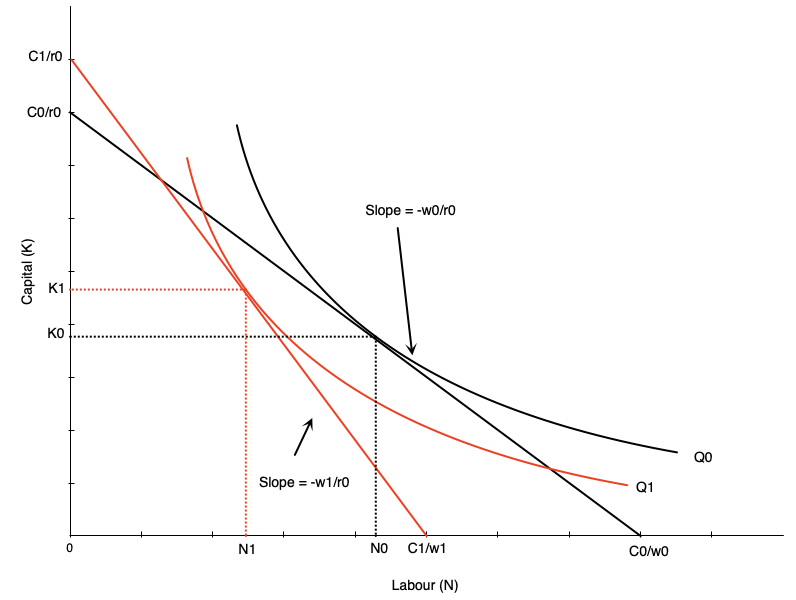
:::

::: {.column width="50%"}
[Effect of wage increase on labour:]{.fg style="color: #2780e3;"}

- Wage goes up → isocost line steepens
- Firm scales down production to lower isoquant
- Tangency between new isoquant and new isocost shows new optimal labour and capital
- This involves less labour employed

[Effect on capital:]{.fg style="color: #2780e3;"} depends on substitutability between labour and capital (shape of isoquant)
:::
:::

## Deriving Labour Demand

::: columns
::: {.column width="50%"}

:::

::: {.column width="50%"}
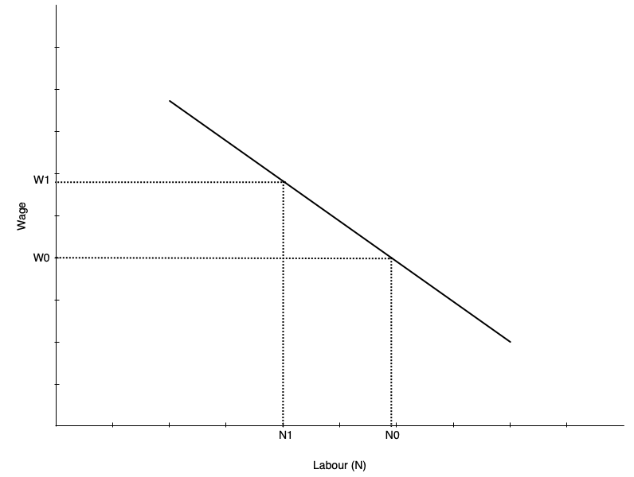
:::
:::

## Deriving Labour Demand

[The labour demand curve summarizes optimal choices of labour at different wage rates]{.fg style="color: #2780e3;"}

- Previous slide shows two points on labour demand curve: $(w_0, N_0)$ and $(w_1, N_1)$
- To derive full demand curve, vary wage rate to other levels

::: {.callout-important}
## Ceteris Paribus
Demand curve shows amount of labour demanded at every wage [all else equal]{.fg style="color: #c7254e;"} — other determinants will shift the curve
:::

## Scale and Substitution Effects

::: {.callout-note}
## Two Effects When Wage Changes
- [Substitution effect:]{.fg style="color: #5cb85c;"} change in input mix due to change in relative input prices
- [Scale effect:]{.fg style="color: #f0ad4e;"} change in output due to change in cost of production
:::

[Substitution effect:]{.fg style="color: #5cb85c;"}

- Makes firms substitute capital for labour
- Leads to less labour demanded when wage rises (more capital demanded)

[Scale effect:]{.fg style="color: #f0ad4e;"}

- Comes from reduction in output
- As production becomes more expensive, firms produce less
- Leads to less labour demanded when wage rises (use less labour and capital)

## Scale and Substitution Effects

::: {.callout-tip}
## For Labour Demand
Scale and substitution effects work in the [same direction]{.fg style="color: #5cb85c;"} — both reduce labour when wage rises
:::

::: {.callout-warning}
## For Capital Demand
Scale and substitution effects work in [opposite directions]{.fg style="color: #d9534f;"} — effect is ambiguous
:::

## Scale and Substitution Effects

::: columns
::: {.column width="50%"}
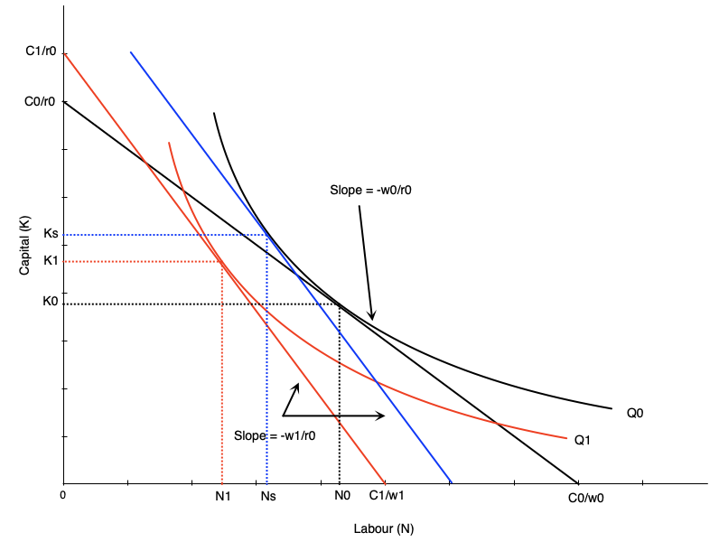
:::

::: {.column width="50%"}
[To find substitution effect:]{.fg style="color: #5cb85c;"}

- Find cost minimizing bundle at new wage and old output
- Blue line in graph
- Substitution effect: $N_{0} \rightarrow N_{s}$

[Scale effect:]{.fg style="color: #f0ad4e;"}

- Change from optimum at new wage/old output to new wage/new output
- Shift from blue to red line in graph
- Scale effect: $N_{s} \rightarrow N_{1}$
:::
:::

## Scale and Substitution Effects

[Notice that scale and substitution effects have opposing effects on capital]{.fg style="color: #2780e3;"}

When wage rises:

- [Substitution effect]{.fg style="color: #5cb85c;"} → more capital used (firms substitute capital for labour)
- [Scale effect]{.fg style="color: #f0ad4e;"} → less capital used (firms reduce output, use less of all inputs)

::: {.callout-warning}
Effect on capital is [ambiguous]{.fg style="color: #c7254e;"}
:::

## Relationship to Short-Run Demand

[In the short run:]{.fg style="color: #2780e3;"}

- Capital is fixed → no substitution effect

[In the long run:]{.fg style="color: #2780e3;"}

- Both substitution and scale effects occur

::: {.callout-tip}
## Key Result
Long-run labour demand is [more elastic]{.fg style="color: #5cb85c;"} than short-run labour demand — firms can adjust all inputs in the long run, making them more responsive to wage changes
:::

## Relationship to Short-Run Demand

::: columns
::: {.column width="50%"}
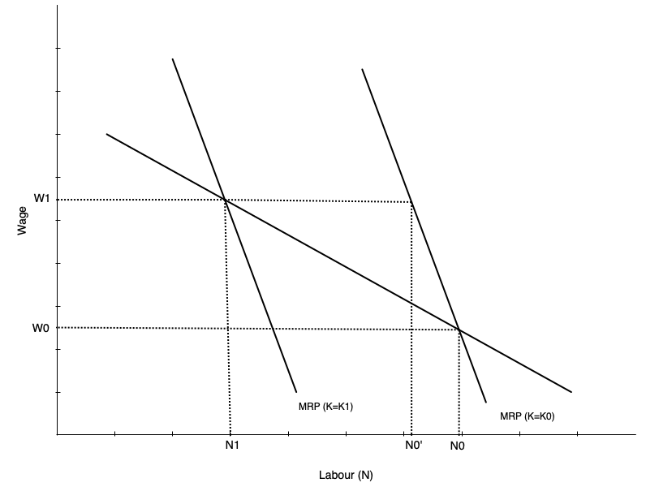
:::

::: {.column width="50%"}
[Graph shows short-run and long-run labour demand curves]{.fg style="color: #2780e3;"}

- Start with capital fixed at $K_0$
- Wage goes from $w_0$ to $w_1$
- In short run: move along SR demand curve from $N_0$ to $N_{'}$
- In long run: firm substitutes capital for labour
- Short run curve shifts left
- Equilibrium at intersection of wage and new short run demand
:::
:::

## {background-color="#f0f4f8"}

::: {style="text-align: center; font-size: 1.3em;"}
**Discussion**

When wages rise, the substitution and scale effects both reduce labour demand, but they have opposing effects on capital demand. Can you think of a real-world industry where the substitution effect on capital would clearly dominate the scale effect, and one where the scale effect might dominate? What makes those industries different?
:::

# Elasticity of Demand for Labour

## Elasticity of Demand

[Recall:]{.fg style="color: #2780e3;"} elasticity of demand measures responsiveness of quantity demanded to changes in price

In this case, responsiveness of labour demanded to changes in wage rate

[Elastic labour demand curve:]{.fg style="color: #5cb85c;"}

- Proportionately larger change in quantity than change in wage
- Curve is flatter

[Inelastic labour demand curve:]{.fg style="color: #c7254e;"}

- Proportionately smaller change in quantity than change in wage
- Curve is steeper

## Factors Affecting Elasticity

[Several factors affect elasticity of labour demand:]{.fg style="color: #2780e3;"}

1. [Ease of substitution]{.fg style="color: #555;"} between labour and other inputs
   - More/easier substitutes → more elastic demand

2. [Elasticity of supply]{.fg style="color: #555;"} of other inputs
   - Inelastic supply of other inputs → harder to substitute → less elastic labour demand
   - Happens because other inputs become more expensive when firm tries to substitute

3. [Elasticity of demand]{.fg style="color: #555;"} for the final product
   - Output responding more to price changes → more elastic labour demand

4. [Labour share]{.fg style="color: #555;"} in total costs
   - Higher labour cost share → more elastic labour demand (operates via scale effect)

## Evidence on Elasticity

[In the USA:]{.fg style="color: #2780e3;"}

- Elasticity between [-0.15 and -0.75]{.fg style="color: #c7254e;"} (relatively inelastic)
- Elasticities have increased over time
- Long run elasticities are larger

[In Canada:]{.fg style="color: #2780e3;"}

- Elasticity between [-0.1 and -0.6]{.fg style="color: #c7254e;"}
- Depends on geography and industry

::: {.callout-tip}
## Key Result
Studies confirm that labour demand does slope down
:::

## {background-color="#f0f4f8"}

::: {style="text-align: center; font-size: 1.3em;"}
**Discussion**

Why might we observe that labour demand has become more elastic over time in both Canada and the USA? Which of the four factors affecting elasticity do you think has changed the most, and why?
:::

# Adjusting Workers versus Hours Worked

## Background

::: {.callout-note}
## Previous Assumption
Labour is a purely variable input paid a wage per hour worked
:::

[In reality it is not so simple:]{.fg style="color: #2780e3;"}

- Workers are sometimes paid other benefits besides wages
  - CPP, EI, retirement benefits, paid vacation, sick leave, etc.
- There are costs beyond the hourly wage
  - Hiring and training costs
  - Costs of dismissal
  - Non-wage benefits described above

These benefits and costs complicate the labour demand decision

# Quasi-fixed Costs

## Introduction

::: {.callout-important}
## Important Distinction
Some costs are incurred per worker regardless of hours worked. Others are incurred per hour worked.
:::

[Quasi-fixed costs:]{.fg style="color: #c7254e;"} costs that occur per worker but are relatively independent of hours worked

- Pure quasi-fixed costs do not vary with hours worked at all
- In practice, many costs are partially quasi-fixed
- Some recurring (e.g. monthly EI premiums), others one-time (e.g. hiring and training costs)

## Examples of Quasi-fixed Costs

[Hiring costs:]{.fg style="color: #2780e3;"}

- Recruiting, interviewing, and training are costly
- Incurred when a worker is hired regardless of hours worked
- Firms generally try to minimize hiring costs by retaining workers

[Termination costs:]{.fg style="color: #2780e3;"}

- Severance pay, legal fees, and administrative costs
- Initially depend on time with company, but have a maximum so become fixed
- Firms may be reluctant to lay off workers because of these costs

## Examples of Quasi-fixed Costs

[Employer contributions to payroll taxes:]{.fg style="color: #2780e3;"}

- EI and CPP are initially related to work hours
- But they have a ceiling so become [quasi-fixed]{.fg style="color: #c7254e;"} for high hours worked

[Other non-wage benefits:]{.fg style="color: #2780e3;"}

- Employer contributions to life insurance, medical, dental plans
- Often have a fixed component regardless of hours worked

::: {.callout-note}
If a cost always varies with hours worked it is **not** quasi-fixed — e.g. hourly wage, overtime premiums, per-hour health and safety costs
:::

## Effects of Quasi-fixed Costs

[Previously:]{.fg style="color: #2780e3;"} labour demand determined by equating $MRP_L$ to the wage rate

With quasi-fixed costs, the cost of hiring a worker is higher. There is also a [dynamic component]{.fg style="color: #c7254e;"} — firms amortize costs over time:

- Firms may pay high training costs now
- But expect the worker to remain to recoup those costs

[A profit maximizing firm will hire workers up to the point where:]{.fg style="color: #2780e3;"}

$$H + T + \sum_{t=1}^{N} \frac{w_t}{(1 + r)^t} = \sum_{t=1}^{N} \frac{VMP_t}{(1 + r)^t}$$

Where $H$ = hiring cost, $T$ = training cost, $w_t$ = wage, $VMP_t$ = value of marginal product, $r$ = discount rate, $N$ = expected tenure

## Effects of Quasi-fixed Costs

[This equation has several implications:]{.fg style="color: #2780e3;"}

- Firms reluctant to hire workers for short periods if hiring costs are high
- Wage does not have to equal marginal product in each period
- Future productivity matters, but is discounted
- Firms may pay more than current marginal product if future productivity is expected to be high

[When hiring costs are a factor, future productivity must exceed the total wage:]{.fg style="color: #2780e3;"}

$$\sum_{t=1}^{N} \frac{VMP_t}{(1 + r)^t} > \sum_{t=1}^{N} \frac{w_t}{(1 + r)^t}$$

## Effects of Quasi-fixed Costs

::: {.callout-tip}
## Like Any Other Investment Decision
Firms invest in workers when the present value of future returns exceeds the present value of costs
:::

- [Hiring and training costs]{.fg style="color: #555;"} → "upfront" investment costs
- [Wages]{.fg style="color: #555;"} → "ongoing" investment costs
- [Future productivity]{.fg style="color: #555;"} → returns on investment
- You only make the investment if you expect to earn at least as much as you spend

## Effects of Quasi-fixed Costs

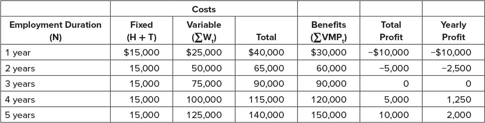{fig-align="center" width="85%"}

## {background-color="#f0f4f8"}

::: {style="text-align: center; font-size: 1.3em;"}
**Think About It**

What would happen to firm hiring behaviour if the government introduced a large new per-worker tax that does not vary with hours worked?
:::

# Things Explained by Quasi-Fixed Costs

## Overtime

[Firms sometimes work employees longer despite higher overtime wages]{.fg style="color: #2780e3;"}

::: {.callout-note}
## Explanation
High quasi-fixed costs of hiring additional workers make it cheaper to pay overtime than incur hiring and training costs — especially true for high-skill workers requiring a lot of training
:::

## Temp and Gig Workers

[Firms do not always hire part- or full-time employees directly]{.fg style="color: #2780e3;"}

They sometimes use temp agencies or "gig" workers:

- Laurier hires a cleaning firm and does not employ many janitors directly
- Uber classifies drivers as independent contractors

::: {.callout-note}
## Explanation
By doing this, firms avoid paying quasi-fixed costs
:::

## Layoffs

[During downturns firms sometimes keep workers around]{.fg style="color: #2780e3;"}

::: {.callout-note}
## Explanation: Labour Hoarding
- Paying severance and legal fees may be costly
- Firms may prefer to keep workers on payroll if they expect a quick recovery
- Firms reluctant to lay off skilled workers due to high training costs
:::

This also explains why [highly educated workers]{.fg style="color: #5cb85c;"} tend to suffer less unemployment during recessions

## Layoffs

::: columns
::: {.column width="50%"}
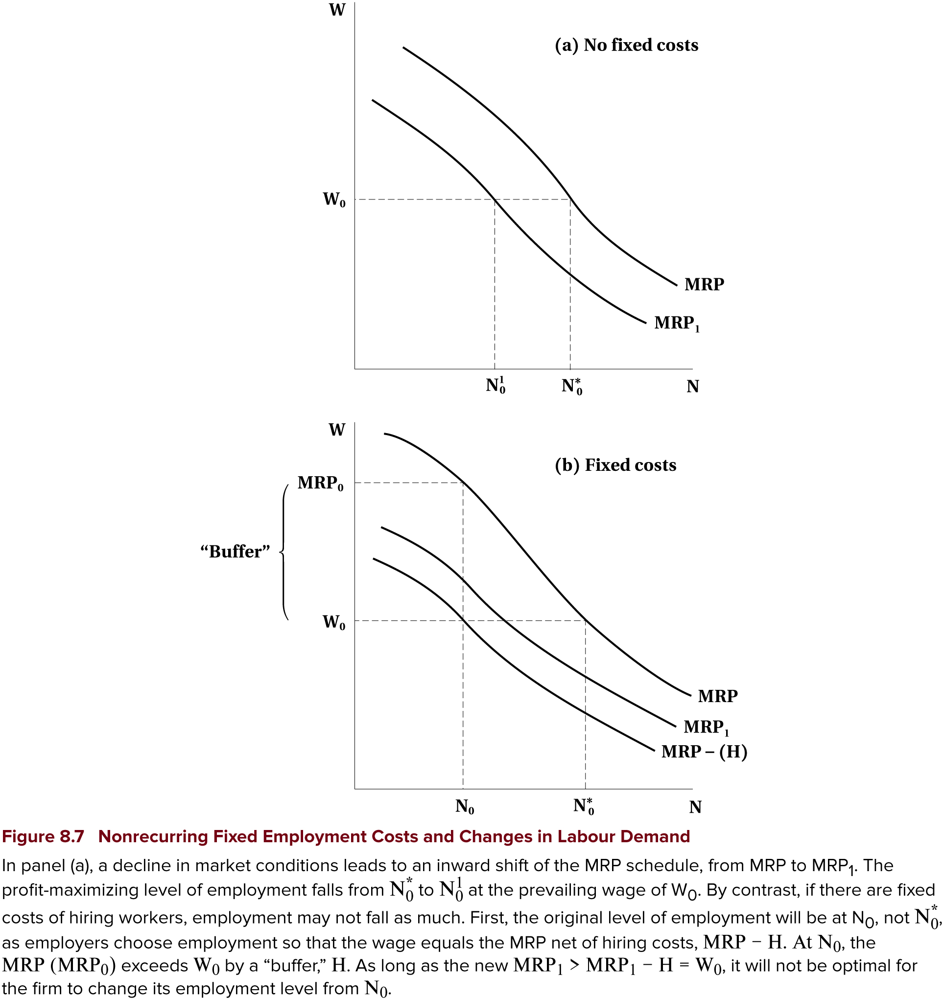{width="500"}
:::

::: {.column width="50%"}
[Top panel — without quasi-fixed costs:]{.fg style="color: #2780e3;"}

- Firm hires to point where $MRP = w$
- In downturn, $MRP$ shifts down (lower demand for output)
- With same wage, firms hire fewer workers

:::
:::

## Layoffs

::: columns
::: {.column width="50%"}
{width="500"}
:::

::: {.column width="50%"}

[Bottom panel — with quasi-fixed costs:]{.fg style="color: #2780e3;"}

- Quasi-fixed costs shift $MRP$ curve down prior to downturn
  - Firm hires to point where $MRP - H = w$
- Creates wedge between $MRP$ and wage
- After downturn, $MRP$ shifts down
  - But because of wedge, firm may not change employment
:::
:::

## Segmentation

[Hiring costs mean trained and untrained employees are different]{.fg style="color: #2780e3;"}

- Firms reluctant to hire untrained workers because of high training costs
- When quasi-fixed costs are high, firms prefer to retain or hire trained workers
- Leads to a [segmentation]{.fg style="color: #c7254e;"} into protected and unprotected workers

[Also leads firms to work employees more intensively rather than hire new workers]{.fg style="color: #2780e3;"}

::: {.callout-note}
## Example
Big law firms work associates long hours instead of hiring new associates
:::

## {background-color="#f0f4f8"}

::: {style="text-align: center; font-size: 1.3em;"}
**Think About It**

Why might we observe that highly skilled workers are more likely to work overtime, while lower-skilled positions are more likely to be filled by temp or gig workers?
:::

## Work Sharing

[Some individuals would embrace work sharing]{.fg style="color: #2780e3;"}

- Two or more people share a job
- Hire more people to each work less hours for same total hours

::: {.callout-warning}
## Why Firms Resist
Quasi-fixed costs make it costly to bring on additional workers — firms prefer fewer workers working more hours, even if total hours worked is the same
:::

# Work Sharing

## Introduction

::: {.callout-note}
## Canada's Work Sharing Program
Government program that subsidizes employee wages during downturns, administered through Employment Insurance
:::

[How it works:]{.fg style="color: #2780e3;"}

- Allows firms to reduce hours instead of laying workers off
- Employees form a "work sharing group" and agree to reduce hours
- Maximum duration of [26 weeks]{.fg style="color: #c7254e;"} with possible extensions

The key idea is to avoid layoffs and employ more people

## Introduction

[Other possible work sharing schemes:]{.fg style="color: #2780e3;"}

- Delayed entry into the labour force
- Early retirement
- Short work weeks
- Reduced overtime
- Increased vacation time

::: {.callout-important}
## Key Question
Do any of these schemes actually increase the number of jobs?
:::

## Overtime Restrictions

[One way to share work is to restrict overtime]{.fg style="color: #2780e3;"}

- Some governments have enacted legislation to prevent excessive overtime
- Firms do not like this because it could increase costs

[It is not clear that these laws increase employment:]{.fg style="color: #2780e3;"}

- Firms may not hire more workers
- Increased costs reduce overall demand for labour
- New workers may not be as productive as existing workers
- There may not be enough employable workers available

## Overtime Restrictions

::: {.callout-warning}
## Lump of Labour Fallacy
The belief that there is a fixed number of jobs in the economy — leading people to think employees working longer hours take jobs away from others
:::

[In reality:]{.fg style="color: #5cb85c;"}

- The number of jobs is not fixed
- As people become employed, the economy grows and more jobs are created
- Fallacy is commonly used to argue against immigration

::: {.callout-note}
## Evidence
Studies show that restricting work hours does not lead to increased employment — but may still be useful in the short term during economic downturns
:::

## Subsidized Work Sharing

[Canada subsidizes work sharing programs for economic downturns]{.fg style="color: #2780e3;"}

- Main goal: keep people employed during recessions
- Would be good if it also protects jobs longer term

::: {.callout-note}
## Evidence
- Many firms use the program
- It does help keep people employed during downturns
- But [little evidence]{.fg style="color: #c7254e;"} that it increases employment longer term
  - Employees were laid off when subsidy ran out
:::

## Employee Demand for Work Sharing

::: {.callout-important}
## Key Point
Employees need to also buy in for work sharing to be successful — it is not clear that they do in many cases
:::

[Example: union jobs]{.fg style="color: #2780e3;"}

- Unions often resist work sharing programs
- Prefer to keep full-time jobs with benefits
- May see work sharing as a threat to job security
- May also see it as a way for employers to reduce wages and benefits

## {background-color="#f0f4f8"}

::: {style="text-align: center; font-size: 1.3em;"}
**Discussion**

Given what we know about the lump of labour fallacy, why do politicians and the public still frequently argue that reducing work hours or restricting immigration will create more jobs?
:::

# Non-Wage Benefits

## Non-wage Benefits

[Compensation typically includes more than just wages]{.fg style="color: #2780e3;"}

[Common non-wage benefits:]{.fg style="color: #2780e3;"}

- [Health insurance]{.fg style="color: #555;"} (beyond public health care)
- [Retirement benefits]{.fg style="color: #555;"}
- [Paid vacation and sick leave]{.fg style="color: #555;"}
- [Other perks]{.fg style="color: #555;"} (gym memberships, childcare, etc.)

- These benefits have value to workers
- Increased as a share of total compensation through the 90s and early 2000s

## Non-wage Benefits

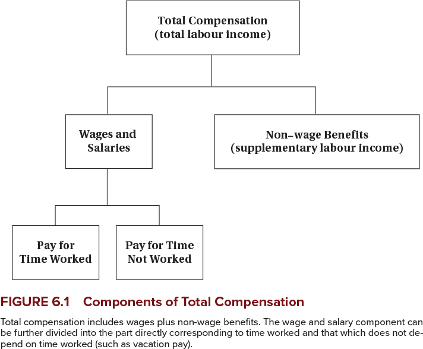{fig-align="center" width="85%"}

## Non-wage Benefits

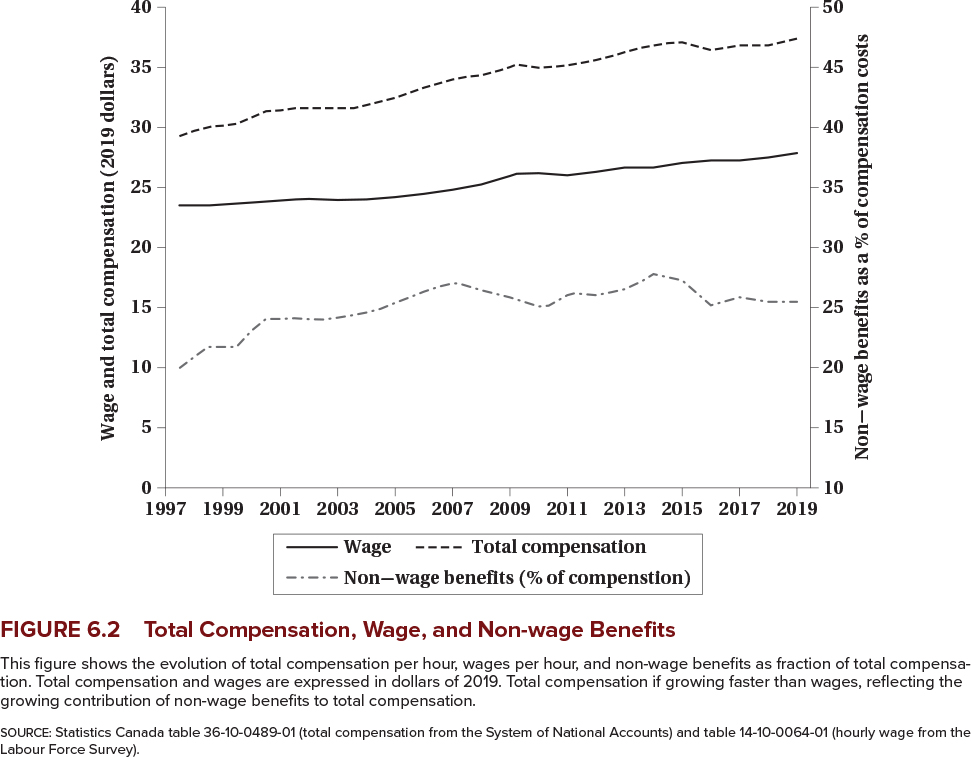{fig-align="center" width="85%"}

## Non-wage Benefits

[Why do firms pay benefits instead of wages?]{.fg style="color: #2780e3;"}

- [Tax advantages:]{.fg style="color: #555;"} sometimes benefits are not taxed
- [Economies of scale:]{.fg style="color: #555;"} pensions and insurance are cheaper when provided to a group (avoids adverse selection)
- [Worker preferences:]{.fg style="color: #555;"} risk-averse workers may prefer health insurance to wages
- [Legal requirements]{.fg style="color: #555;"}

## Non-wage Benefits

[More reasons:]{.fg style="color: #2780e3;"}

- [Better firm planning:]{.fg style="color: #555;"} benefits like sick leave reduce absenteeism and provide contingency plans
- [Productivity:]{.fg style="color: #555;"} subsidized meals keep people working
- [Deferred compensation:]{.fg style="color: #555;"} retirement benefits help retain workers
  - Workers may accept lower wages in exchange for future benefits
  - Acts as a screen for good workers

## Non-wage Benefits

[Governments also prefer and mandate them:]{.fg style="color: #2780e3;"}

- Firm pensions reduce need for public pensions
- Better health outcomes reduce public health care costs
- Improve social safety net through sick leave and unemployment insurance

::: {.callout-tip}
With all these reasons, it is not surprising that non-wage benefits are common
:::

## {background-color="#f0f4f8"}

::: {style="text-align: center; font-size: 1.3em;"}
**Discussion**

If non-wage benefits are so advantageous for both firms and workers, why do some firms still offer minimal benefits and rely almost entirely on wage compensation?
:::

# Summary

## Summary

[Labour demand:]{.fg style="color: #2780e3;"}

::: {.nonincremental}
- In the short run firms hire to the point where the wage equals the value of the
  marginal product
- In the long run they minimize cost, and a wage change has scale and substitution effects
- Long-run demand is more elastic than short-run demand
- Elasticity depends on substitutes, the elasticity of output demand, and the labour cost share
- Quasi-fixed costs make workers and hours imperfect substitutes, and explain
  overtime, labour hoarding, and segmented workforces
:::

