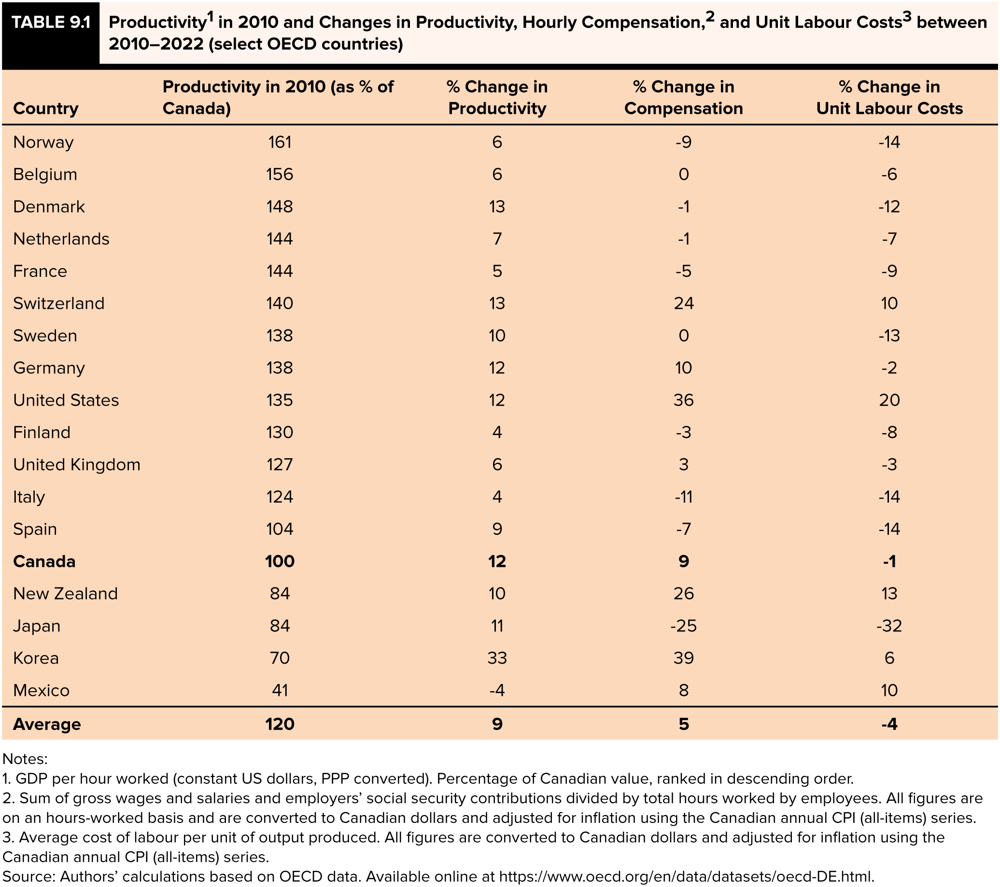
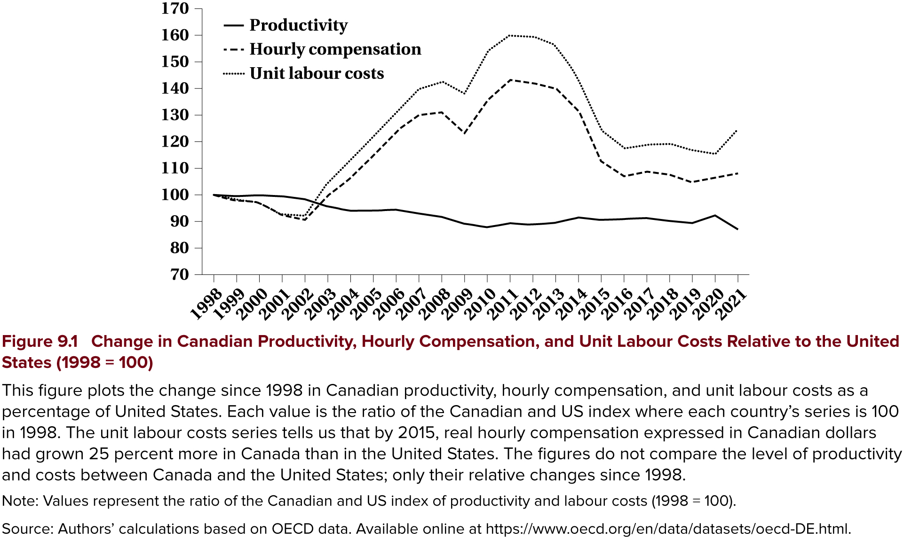

<h1>Labour Demand in Global Markets</h1>

<h2>EC306- Wages and Employment</h2>

<h2>Justin Smith</h2>

<h2>Wilfrid Laurier University</h2>

<h2>Fall 2026</h2>

{.absolute top="275" left="900" width="550"}

# Goals of This Section

## Goals of This Section

In this section we will:

- Understand the impact of free trade and international competition on the Canadian labour market
- Analyze the effect of trade on a single labour market
- Consider the cross-sectoral impact of trade
- Examine the evidence on trade and labour demand

# Globalization and Offshoring

## Introduction

[Over time Canadian firms have faced increasing globalization]{.fg style="color: #2780e3;"}

Has led to concerns over what happens to Canadian workers:

- People worry firms will move operations to countries with lower wages
- That this will destroy Canadian jobs
- Clear concern in the USA right now

::: {.callout-note}
Effect of globalization on jobs is always a concern when trade agreements are reached — manufacturing is especially prominent, with automotive industry currently a focus
:::

## Effect of Trade on Single Market

[Consider global competition with a specific product]{.fg style="color: #2780e3;"}

Increased global competition lowers the price a product can sell for globally

In a competitive market, this reduces the value of the marginal product:

- Recall that $VMP = p \times MP_N$
- Shifts demand for Canadian labour inward

## Effect of Trade on Single Market

[Another approach:]{.fg style="color: #2780e3;"} consider Canadian and foreign labour as two inputs to production

The optimal choice of Canadian and foreign labour occurs where:

$$\frac{MP_{N_C}}{MP_{N_F}} = \frac{w_C}{w_F}$$

The marginal product per dollar spent on foreign and Canadian workers are the same

## Effect of Trade on Single Market

[What effect does a fall in foreign wages have on Canadian labour demand?]{.fg style="color: #2780e3;"}

[Two effects occur:]{.fg style="color: #2780e3;"}

- [Substitution effect:]{.fg style="color: #5cb85c;"} firms substitute foreign workers for Canadian workers
  - Reduces demand for Canadian workers
  
- [Scale effect:]{.fg style="color: #f0ad4e;"} lower costs lead to more production
  - Increases demand for Canadian workers

::: {.callout-warning}
## Overall Effect is Ambiguous
- If close substitutes, substitution effect dominates → less Canadian labour demanded
- If scale effect dominates → could be more Canadian labour demanded
:::

## Effect of Trade on Single Market

::: {.callout-important}
## Cost is Not the Only Factor
Productivity is also important — if Canadian workers are more productive, firms will still want to hire them
:::

[How productive are Canadian workers compared to foreign workers?]{.fg style="color: #2780e3;"}

Next slides show international comparisons for OECD countries:

- Productivity, compensation, unit labour costs
- Changes over time

## Effect of Trade on Single Market

{fig-align="center" width="85%"}

## Effect of Trade on Single Market

{fig-align="center" width="85%"}

## Effect of Trade Across Sectors

::: {.callout-note}
## Single Sector Misses Key Points
Trade openness affects the entire economy with adjustments across sectors
:::

[Recall from EC120:]{.fg style="color: #2780e3;"} countries specialize in production of goods where they have comparative advantage

- Expands consumption possibilities

In a globalized market:

- Countries allocate more resources towards their comparative advantage sectors
- Labour moves from non-comparative advantage sectors to comparative advantage sectors

## Evidence on Trade and Labour Demand

[Many trade agreements with other countries]{.fg style="color: #2780e3;"}

Most prominent in Canada: NAFTA and more recently CUSMA

These present opportunities to study effects of trade on labour demand

::: {.callout-note}
## Evidence Shows
- About [10%]{.fg style="color: #c7254e;"} of Canadian jobs lost in early 90s were due to free trade
- Productivity grew [faster]{.fg style="color: #5cb85c;"} in manufacturing industries affected by trade
:::

## Non-Trade Demand Factors

[At the same time trade is changing, the Canadian labour market is changing:]{.fg style="color: #2780e3;"}

- Jobs have shifted away from manufacturing over long term
- Professional, managerial, and administrative service jobs have been increasing
- Flex or "gig" jobs have been increasing

[All changing for various reasons:]{.fg style="color: #2780e3;"}

- Technology
- Consumer preferences
- Demographics

## {background-color="#f0f4f8"}

::: {style="text-align: center; font-size: 1.3em;"}
**Think About It**

Suppose a Canadian auto parts manufacturer faces a drop in wages in Mexico. Under what conditions would this actually *increase* demand for Canadian auto workers rather than decrease it?
:::

# Summary

## Summary

[Trade and labour demand:]{.fg style="color: #2780e3;"}

::: {.nonincremental}
- Trade shifts labour demand, but the direction differs by sector
- A single-market analysis misses the reallocation across sectors
- Cost is not the only factor driving offshoring decisions
- The evidence finds effects concentrated in trade-exposed industries
:::

