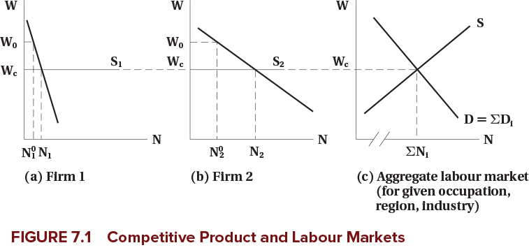
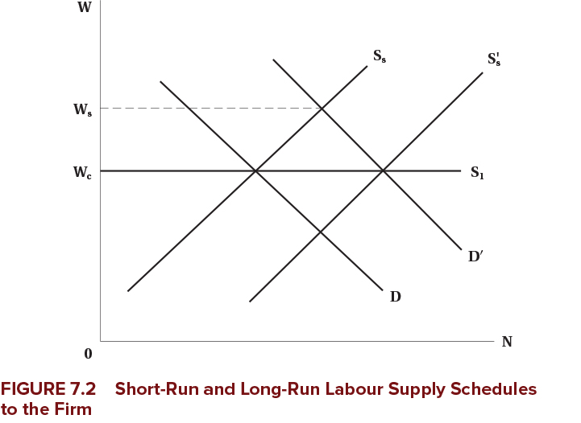
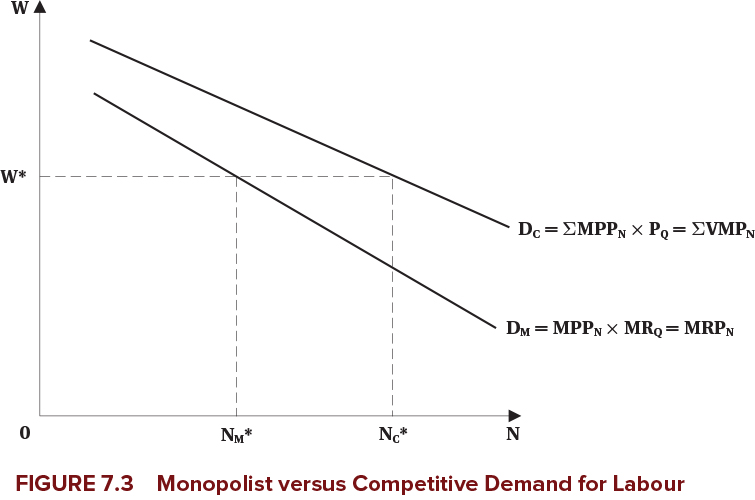
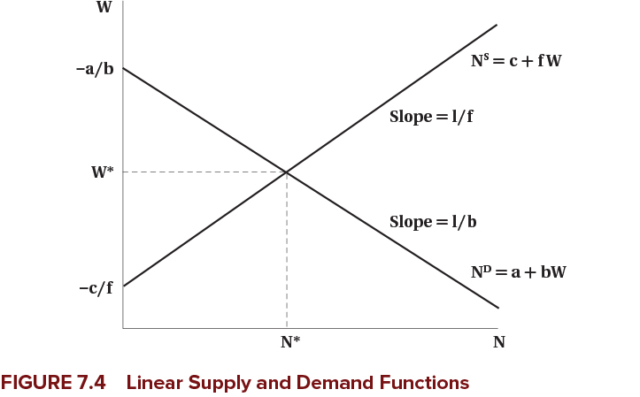
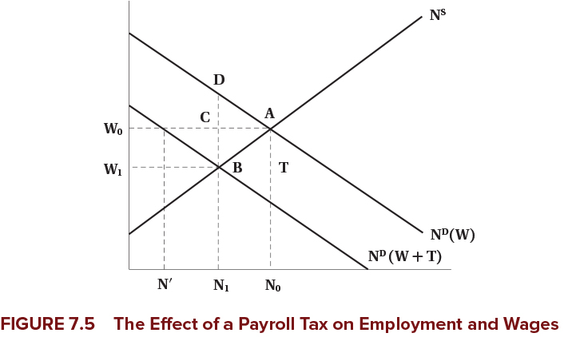

---
format:
  revealjs:
    theme: [default, hygge.scss]
    center-title-slide: false
    slide-number: true
    height: 900
    width: 1600
    chalkboard:
      theme: whiteboard
      src: drawings.json
    post-render: "scripts/decktape.sh"
editor: visual
---

<h1>Competitive Labour Markets</h1>

<h2>EC306- Wages and Employment</h2>

<h2>Justin Smith</h2>

<h2>Wilfrid Laurier University</h2>

<h2>Fall 2026</h2>

{.absolute top="275" left="900" width="550"}

# Goals of This Section

## Goals of This Section

In this section we will:

- Bring together demand and supply to determine wages and employment
- Discuss the effect of market power in the goods market on equilibrium wages and employment
- Work with linear supply and demand functions
- Analyze the incidence of a payroll tax

# Introduction

## Introduction

- We have analyzed labour demand and supply separately in detail
- [Equilibrium wage and employment]{.fg style="color: #2780e3;"} is determined by the interaction of the two
- Market power plays an important role
  - In both goods markets and labour markets
- With a full understanding on how wages and employment are determined, we can analyze policies
- The [minimum wage]{.fg style="color: #2780e3;"} is one of the most prominent labour market policies
  - In theory, it leads to unemployment
  - The evidence is more mixed

# Competitive Firms

## Introduction

::: {.callout-note}
## Assumptions
We start with firms that are [competitive in both goods and labour markets]{.fg style="color: #5cb85c;"}

- Firms take the market wage as given
- They take the market price as given
- Competition means they are too small to influence either
:::

- We analyze the equilibrium wage and employment for a [homogeneous]{.fg style="color: #2780e3;"} type of labour
  - All workers are the same

## Market Demand and Supply

- The [market demand and supply]{.fg style="color: #2780e3;"} are the sum of the individual firms' demand and supply at each wage
- Here we determine the demand and supply curve for a single labour market
  - Could be a specific occupation in a specific region
  - Example: electricians in Ontario, professors in Canada, etc.
  - How the market is defined depends on context
  - But it is for a single type of labour

## Market Demand and Supply

- Example is two firms with different elasticities of demand
  - Each firm demand curve is their value of marginal product
  - Firms may face different product prices if they sell different things (but hire the same labour)
- Each firm faces the same wage in the labour market
  - They perceive the supply curve as [horizontal in the long run]{.fg style="color: #5cb85c;"}
  - They take the wage as given and can get as much labour as they want at that wage
  - Market supply is upward sloping
- [Market demand]{.fg style="color: #2780e3;"} is horizontal sum of individual demands
  - Add up the quantities demanded at each wage for each firm
  - Repeat for all wages

## Market Demand and Supply

{fig-align="center"}

## Firm Demand and Supply in the Short Run

- Above we analyzed the longer run
  - Firms can get as much labour as they want at the going wage
- In the [short run]{.fg style="color: #c7254e;"}, firms may face an upward sloping supply curve
  - They have to pay higher wages to attract more workers
  - This could be because of contracts, or other frictions
- If demand rises, they would pay higher wages to attract workers
- But because wages are high, over the long term more workers enter the market
  - Short run supply shifts out
  - Wage falls back down to long run level

## Firm Demand and Supply in the Short Run

{fig-align="center"}

## {background-color="#f0f4f8"}

::: {style="text-align: center; font-size: 1.3em;"}
**Think About It**

If a new technology increases labour demand in a competitive market, what happens to wages and employment in the short run versus the long run? Why do the outcomes differ?
:::

# Imperfect Competition in the Product Market

## Monopoly

::: {.callout-important}
## Monopoly
[Monopoly:]{.fg style="color: #2780e3;"} a single seller with market power — the ability to set prices above marginal cost
:::

- For a monopolist, the labour demand curve is where wage equals marginal revenue product:
  $$w = MR \times MPP_N$$
- For a monopolist, [marginal revenue is less than price]{.fg style="color: #c7254e;"}
  - Because to sell more, they have to lower price on all units sold
  - So marginal revenue product is less than value of marginal product ($VMP$)

## Monopoly

{fig-align="center"}

## Monopoly

::: {.callout-warning}
Monopolists raise the price of their product above the competitive level, which decreases output — so they demand [fewer workers]{.fg style="color: #c7254e;"} than a competitive firm in the same market
:::

- Note that power in the product market does not mean power in the labour market
  - The firm is still one of many hiring workers in a particular labour market

## Monopolistic Competition and Oligopoly

- Many markets are neither perfectly competitive nor pure monopoly

[Monopolistic competition:]{.fg style="color: #2780e3;"}

- Many firms selling differentiated products
- Each firm has some market power because of product differentiation
- Can set prices above marginal cost

[Oligopoly:]{.fg style="color: #2780e3;"}

- A few firms dominate the market
- Each firm has significant market power
- But must consider reactions of competitors when setting prices

## Monopolistic Competition and Oligopoly

::: {.callout-note}
In both cases, demand for labour is based on marginal revenue product — which is less than VMP — so firms hire fewer workers than in competitive markets
:::

## Additional Details

- All of the previous analysis assumes that labour markets are perfectly competitive
  - Firms can hire all labour they want at the given wage
- That is not always the case in reality when firms have power in the product market
  - Employees may unionize
  - Firms may hire a large number of the market's workers
- In these cases, firms may not face a perfectly elastic supply curve for labour
- Later we will analyze imperfect competition in the labour market

## {background-color="#f0f4f8"}

::: {style="text-align: center; font-size: 1.3em;"}
**Discussion**

Why might a monopolist pay lower wages than a competitive firm, even if both firms hire workers from the same labour market?
:::

# Math of Labour Market Equilibrium

## Introduction

- We know that market equilibrium is where demand and supply are equal
- You can do that graphically or mathematically
- In this section we cover both
- To make the math easier, we use [linear demand and supply curves]{.fg style="color: #2780e3;"}
  - This is just for simplicity — the same principles apply with non-linear curves

## Demand and Supply Functions

[Variables in the model:]{.fg style="color: #2780e3;"}

- Demand: $N^D = f(w, Z)$
  - $Z$ is a list of other factors affecting demand
- Supply: $N^S = g(w, X)$
  - $X$ is a list of other factors affecting supply

[Exogenous variables]{.fg style="color: #555;"} ($Z$ and $X$) shift the curves:

- Examples: technology, prices of other inputs, preferences, demographics
- Determined [outside]{.fg style="color: #c7254e;"} the model

[Endogenous variables]{.fg style="color: #555;"} ($N^D$, $N^S$, and $w$):

- Determined [within]{.fg style="color: #5cb85c;"} the model

## Demand and Supply Functions

Assume the demand and supply functions are [linear]{.fg style="color: #2780e3;"}:

- Demand: $N^D = a + b w$ (where $a$, $b$ are constants)
- Supply: $N^S = c + f w$ (where $c$, $f$ are constants)

To find equilibrium, set demand equal to supply:

$$a + b w^* = c + f w^*$$

## Demand and Supply Functions

::: {.callout-tip}
## Equilibrium Solutions

Equilibrium wage:
$$w^* = \frac{c - a}{b - f}$$

Equilibrium employment:
$$N^* = \frac{b c - a f }{b - f}$$
:::

Use these equations to analyze how changes in exogenous variables affect equilibrium:

- Changing $a$ shifts the demand curve (e.g., increase in product price)
- Changing $c$ shifts the supply curve (e.g., increase in population)

## Demand and Supply Functions

To draw the demand and supply curves, we need $w$ on the left side:

Rearranging the demand function:
$$w = \frac{N^D - a}{b}$$

Rearranging the supply function:
$$w = \frac{N^S - c}{f}$$

## Demand and Supply Functions

{fig-align="center"}

## Payroll Tax

- We can use this model to analyze various policies
- One common policy is a [payroll tax on employers]{.fg style="color: #2780e3;"}
  - Examples: Canada Pension Plan (CPP), Employment Insurance (EI)
- These are typically a percentage of wages paid by employers
- We will analyze a fixed amount per hour for simplicity: suppose the tax is $T$ per hour
- This drives a "wedge" between the wage paid by employers and the wage received by workers:

$$w_r = w_e - T$$

## Payroll Tax

The demand function is:
$$w_e = \frac{N^D - a}{b} $$

The supply function is:
$$w_r = \frac{N^S - c}{f}$$

## Payroll Tax

Substitute into the equilibrium price equation and set quantity demanded equal to quantity supplied:

$$\frac{N^* - c}{f} = \frac{N^* - a}{b} - T $$

Rearranging to solve for equilibrium employment:

$$N^* = \frac{b c - a f - b f T}{b - f} $$

## Payroll Tax

::: {.callout-tip}
## Equilibrium Wages Under Payroll Tax

Wage received by workers:
$$w_r^* = \frac{c-a}{b-f} - \frac{b}{b-f} T $$

Wage paid by employers:
$$w_e^* = \frac{c-a}{b-f} - \frac{f}{b-f} T $$
:::

## Payroll Tax

{fig-align="center"}

## Payroll Tax

::: {.callout-important}
## Tax Incidence
- [Statutory incidence:]{.fg style="color: #2780e3;"} who is legally responsible for paying the tax (here: firms)
- [Economic incidence:]{.fg style="color: #2780e3;"} who actually bears the burden of the tax (here: shared between firms and workers)
:::

Economic incidence depends on [elasticities of supply and demand]{.fg style="color: #2780e3;"}:

- More elastic supply → workers bear [less]{.fg style="color: #5cb85c;"} of the tax burden
- More elastic demand → firms bear [less]{.fg style="color: #5cb85c;"} of the tax burden

## Evidence

::: {.callout-note}
## Empirical Findings on Payroll Taxes
- In the long run, [workers bear most of the burden]{.fg style="color: #c7254e;"} through lower wages
- Employment effects are [small]{.fg style="color: #5cb85c;"}
:::

## {background-color="#f0f4f8"}

::: {style="text-align: center; font-size: 1.3em;"}
**Think About It**

A payroll tax is legally imposed on employers, yet economists say workers bear most of the burden in the long run. What mechanism causes the tax burden to shift from employers to workers over time?
:::

# Summary

## Summary

[Competitive labour markets:]{.fg style="color: #2780e3;"}

::: {.nonincremental}
- Market demand and supply jointly determine the wage and employment level
- The competitive firm takes that wage as given
- Product market power lowers the wage below the value of the marginal product
- A payroll tax is shared between workers and firms according to the relative
  elasticities of supply and demand
:::

