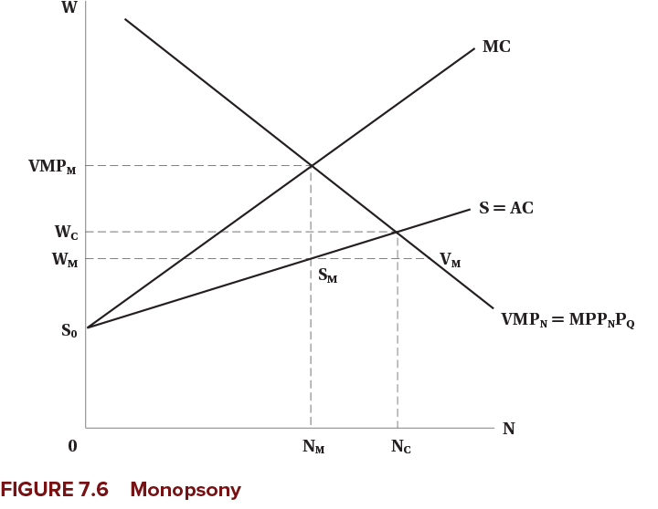
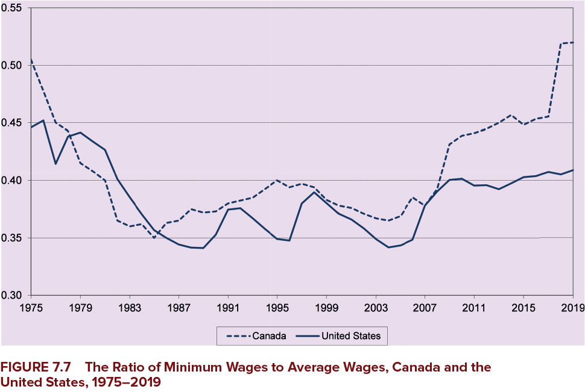
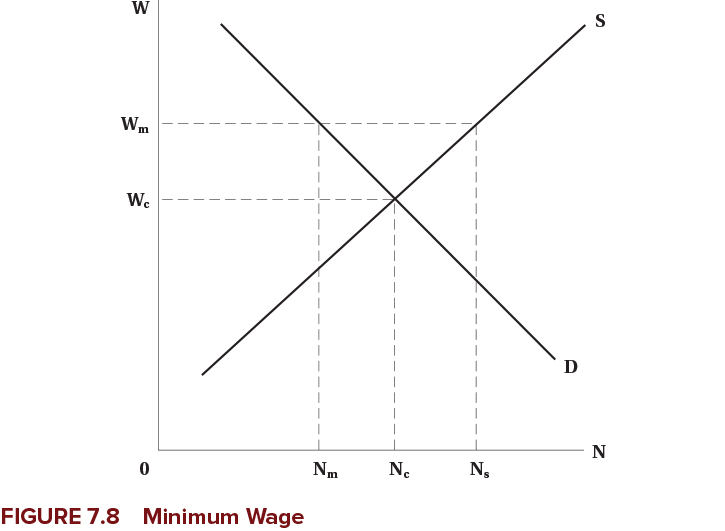
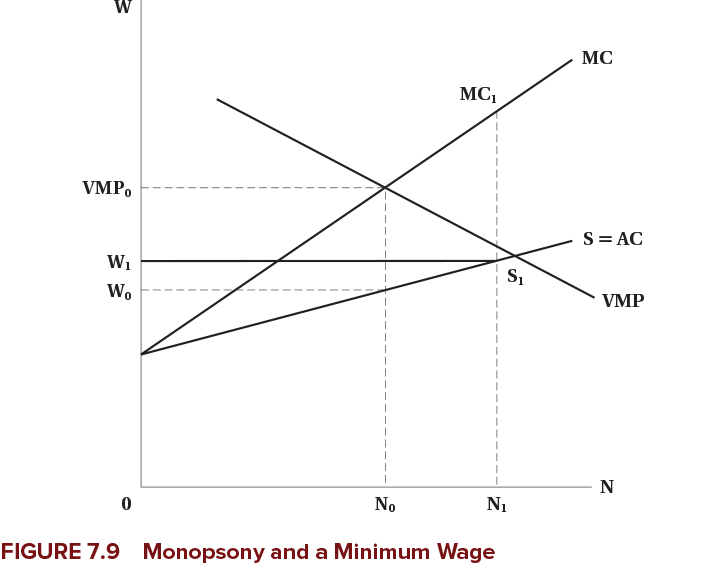
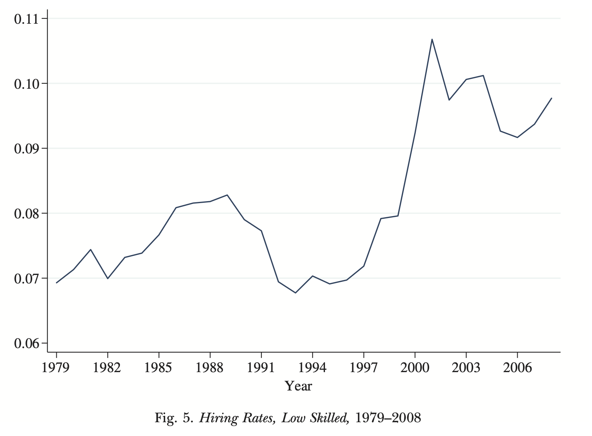

---
format:
  revealjs:
    theme: [default, hygge.scss]
    center-title-slide: false
    slide-number: true
    height: 900
    width: 1600
    chalkboard:
      theme: whiteboard
      src: drawings.json
    post-render: "scripts/decktape.sh"
editor: visual
---

<h1>Imperfectly Competitive Labour Markets</h1>

<hr>

<h2>EC306- Wages and Employment</h2>

<h2>Justin Smith</h2>

<h2>Wilfrid Laurier University</h2>

<h2>Fall 2026</h2>

{.absolute top="275" left="900" width="550"}

# Goals of This Section

## Goals of This Section

In this section we will:

- Discuss the effect of market power in the labour market on equilibrium wages and employment
- Derive the equilibrium in a monopsonistic labour market
- Examine the evidence for monopsony power
- Analyze minimum wages in competitive and monopsonistic markets

# Monopsony in the Labour Market

## Introduction

::: {.callout-important}
## Monopsony
[Monopsony:]{.fg style="color: #2780e3;"} a single buyer with market power in the labour market

- Contrast with [monopoly]{.fg style="color: #555;"}: single seller with market power in the goods market
:::

Some examples of monopsony in the labour market:

- Company/factory towns
- Hospital labour markets
- University professor labour markets
- Public sector in small areas

In all cases, there is a large buyer of labour — giving the buyer power to set wages, affecting both wages and employment

## Simple Monopsony

- In a monopsony, the firm faces the [market supply curve]{.fg style="color: #2780e3;"} for labour
  - Supply is upward sloping
  - Contrast to perfect competition where supply is [horizontal]{.fg style="color: #5cb85c;"}
  - To hire more workers, the firm must pay a higher wage

::: {.callout-important}
## Marginal Cost of Labour
The firm's [marginal cost of labour is above the supply curve]{.fg style="color: #c7254e;"}

- To hire an additional worker, the firm must raise the wage for **all** workers
- MC = cost of additional worker + increase in wage paid to existing workers
- Analogous to how monopolists face MR below demand
:::

## Simple Monopsony

:::::: columns
:::: {.column width="50%"}
::: {layout="[[-1], [1], [-1]]"}
{fig-align="center"}
:::
::::

::: {.column width="50%"}
- Firm demand is its value of marginal product
- Faces upward sloping supply curve
- MC is above supply
- [Optimal labour is where MC = VMP]{.fg style="color: #2780e3;"}
- Wage comes from supply curve at that quantity of labour
:::
::::::

## Simple Monopsony

:::::: columns
:::: {.column width="50%"}
::: {layout="[[-1], [1], [-1]]"}
{fig-align="center"}
:::
::::

::: {.column width="50%"}
Compared to competitive equilibrium, monopsony results in:

- [Wage below VMP]{.fg style="color: #c7254e;"}
- [Wage below competitive wage]{.fg style="color: #c7254e;"}
- [Employment below competitive level]{.fg style="color: #c7254e;"}

The rectangle $(VMP_m - W_m) \times N_m$ represents [surplus transferred to the monopsonist]{.fg style="color: #c7254e;"} — the gap between what workers produce at the margin and what they are paid
:::
::::::

## Simple Monopsony

:::::: columns
:::: {.column width="50%"}
::: {layout="[[-1], [1], [-1]]"}
{fig-align="center"}
:::
::::

::: {.column width="50%"}
Monopsonies also leave [jobs vacant]{.fg style="color: #c7254e;"}:

- They restrict employment to maintain low wages
- This creates inefficiency in the labour market
- Vacancies are $V_m - S_m$

At wage $W_m$:

- VMP is above wage
- Firms would like to hire more
- But to hire, must raise wages — so it is optimal to not hire more
:::
::::::

## {background-color="#f0f4f8"}

::: {style="text-align: center; font-size: 1.3em;"}
**Think About It**

What would happen to wages and employment if a monopsonist suddenly faced competition from a new firm entering the same labour market?
:::

## Characteristics of Monopsonies

Monopsonies tend to be:

- [More prevalent in the short run]{.fg style="color: #2780e3;"}
  - In the long run, workers can move to find other jobs
  - In the short run, frictions may prevent this
- [Large relative to the labour market]{.fg style="color: #2780e3;"}
  - Does not have to be a big firm, just large relative to the market
  - Example: a restaurant in a seasonal tourist town
- [Associated with workers who have specialized skills]{.fg style="color: #2780e3;"}
  - May naturally be few employers for specialized labour
  - Like academia, sports teams

## Characteristics of Monopsonies

::: {.callout-note}
Wages under monopsony are [lower than competitive equilibrium]{.fg style="color: #c7254e;"}, but not necessarily low in an absolute sense

- Example: sports players are not paid low wages, but market power makes them lower than they would be otherwise
:::

## Wage Differentiation

- In previous analysis, we assumed all workers are the same (single supply curve)
- This leaves some [surplus for workers]{.fg style="color: #5cb85c;"}
  - There are workers willing to work for less than the equilibrium wage
- A firm can capture that surplus by [differentiating wages]{.fg style="color: #2780e3;"}
  - Paying different workers different wages based on their reservation wage

## Wage Differentiation

:::::: columns
:::: {.column width="50%"}
::: {layout="[[-1], [1], [-1]]"}
{fig-align="center"}
:::
::::

::: {.column width="50%"}
If the firm can pay different wages:

- It can pay each worker their [reservation wage]{.fg style="color: #2780e3;"}
- MC curve becomes equal to supply curve
- Firm will hire up to [competitive level]{.fg style="color: #5cb85c;"}
  - It no longer has to increase wage for all workers to hire more

To do this, firms try to make wages secret:

- Prevent workers from knowing what others are paid
- Could use non-wage benefits for specific workers
:::
::::::

## Evidence of Monopsonies

[Pro sports:]{.fg style="color: #2780e3;"}

- Baseball: free agency increased wages significantly — increases competition among teams
- Hockey: not much evidence of monopsony power

[Academia and nursing:]{.fg style="color: #2780e3;"}

- Some evidence of monopsony power
- In Canada, a bargaining model may be more appropriate given these labour markets are unionized

::: {.callout-note}
Some academics argue that monopsonies are relatively common — firms can set wages only if they have some market power, and evidence suggests this is widespread
:::

## {background-color="#f0f4f8"}

::: {style="text-align: center; font-size: 1.3em;"}
**Discussion**

Why might monopsony power be more common than we think? Consider industries where workers have few alternative employers, even if the employer is not literally the only firm in town.
:::

# Minimum Wages

## Introduction

::: {.callout-important}
## Minimum Wage
A [minimum wage]{.fg style="color: #2780e3;"} sets a legal floor on wages that employers must pay workers

- Intended to raise wages of low-wage workers, reduce poverty, increase standard of living
:::

- Standard economic theory predicts that minimum wages lead to [unemployment]{.fg style="color: #c7254e;"}
  - Because they set a wage above the equilibrium wage
  - Quantity of labour supplied exceeds quantity demanded
- But statistical evidence is [much more mixed]{.fg style="color: #5cb85c;"}

## Nominal Minimum Wage by Province, 2000–2025

```{r}
library(tidyverse)
library(readr)
library(janitor)

minwage <- read_csv("canada_minimum_wage_2000_2025.csv") %>%
  clean_names() %>%
  group_by(province) %>%
  left_join(read_csv("cpi.csv") %>%
              clean_names(),
            by = "year") %>%
  mutate(cpi2025 = 100*cpi / 160.9,
         rminimum_wage = 100*minimum_wage / cpi2025)

ggplot(minwage, aes(x = year, y = minimum_wage, color = province)) +
  geom_line(linewidth = 1) +
  labs(
    x = "Year",
    y = "Minimum Wage (CAD)",
    color = "Province"
  ) +
  theme_minimal() +
  theme(
    plot.title = element_text(hjust = 0.5, size = 16, face = "bold"),
    axis.title = element_text(size = 14),
    legend.title = element_text(size = 12),
    legend.text = element_text(size = 10)
  )


```

## Real Minimum Wage by Province, 2000–2025

```{r}
ggplot(minwage, aes(x = year, y = rminimum_wage, color = province)) +
  geom_line(linewidth = 1) +
  labs(
    x = "Year",
    y = "Minimum Wage (CAD)",
    color = "Province"
  ) +
  theme_minimal() +
  theme(
    plot.title = element_text(hjust = 0.5, size = 16, face = "bold"),
    axis.title = element_text(size = 14),
    legend.title = element_text(size = 12),
    legend.text = element_text(size = 10)
  )
```

## Minimum Wages in Canada and USA

{fig-align="center"}

## Minimum Wages in Competitive Labour Market

In a [competitive labour market]{.fg style="color: #5cb85c;"}:

- Market demand is downward sloping
- Market supply is upward sloping

A minimum wage acts as a [wage floor]{.fg style="color: #c7254e;"} set above the competitive equilibrium wage:

::: {.callout-warning}
A binding minimum wage in a competitive market creates [excess supply of labour]{.fg style="color: #c7254e;"}, leading to unemployment
:::

## Minimum Wages in Competitive Labour Market

:::::: columns
:::: {.column width="50%"}
::: {layout="[[-1], [1], [-1]]"}
{fig-align="center"}
:::
::::

::: {.column width="50%"}
- Minimum wage $W_m$ is above competitive level $W_c$
- Creates excess supply of labour
- Unemployment = $N_s - N_m$
  - [Previously employed, now not:]{.fg style="color: #c7254e;"} $N_c - N_m$
  - [New entrants drawn in by higher wage:]{.fg style="color: #555;"} $N_s - N_c$
:::
::::::

## Minimum Wages in Competitive Labour Market

- Employment effects depend on [elasticity of demand]{.fg style="color: #2780e3;"}
  - More elastic demand → larger employment effects
- In the real world, industries with minimum wage workers tend to have elastic demands
  - Lots of substitutes for low-wage labour
  - Labour costs are a large share of total costs
- Nevertheless, we will see that minimum wages may not affect employment much in practice

## Minimum Wages in Monopsony

::: {.callout-tip}
## Key Result
In a [monopsonistic]{.fg style="color: #2780e3;"} labour market, minimum wages can [increase both wages and employment]{.fg style="color: #5cb85c;"}, depending on where the minimum wage is set
:::

## Minimum Wages in Monopsony

:::::: columns
:::: {.column width="50%"}
::: {layout="[[-1], [1], [-1]]"}
{fig-align="center"}
:::
::::

::: {.column width="50%"}
- Prior to minimum wage: wage is $W_0$, employment is $N_0$
- Minimum wage set above $W_0$ but below competitive wage
- MC curve = minimum wage up to $S_{1}$, then jumps to previous MC curve
- Optimize where MC = VMP
- [Employment increases to $N_1$]{.fg style="color: #5cb85c;"}
:::
::::::

## Minimum Wages in Monopsony

Why would minimum wages cause employment to [increase]{.fg style="color: #5cb85c;"}?

- Previously, firm had to increase wages to attract more labour
- With minimum wage, it does not
  - Everyone is paid the same wage
  - Wage increases no longer inhibit employment growth
- [Effectively, minimum wage lowers marginal cost]{.fg style="color: #2780e3;"}

This may be partly why we do not see large employment effects of minimum wages

::: {.callout-note}
Note that monopsonists do not like minimum wages — they reduce market power, increase costs, and reduce profits
:::

## Offsetting Factors for Minimum Wage

As usual, in models we hold all else equal — but in reality, many things change at once:

- [Demand changes]{.fg style="color: #2780e3;"} may accompany minimum wage increases
  - E.g., fiscal stimulus increasing demand for goods and labour
- [Technology changes]{.fg style="color: #2780e3;"} may follow
  - May change demand for labour
- [Firms might choose to absorb costs]{.fg style="color: #2780e3;"}
  - Reducing profits rather than cutting employment

## Evidence

- Minimum wages are one of the most researched areas in labour economics
- Large amounts of evidence going back at least 50 years
- [Early studies]{.fg style="color: #555;"} looked at time trends in employment and minimum wages
  - Subject to a lot of bias — things often trend together over time without direct causation
- [Research in the early 1990s]{.fg style="color: #2780e3;"} used better methods
  - Natural experiments
  - Difference-in-differences

## Evidence

::: {.callout-important}
## Card and Krueger (1994)
- Looked at fast food restaurants in [New Jersey]{.fg style="color: #5cb85c;"} (raised minimum wage) and [Pennsylvania]{.fg style="color: #555;"} (did not)
- Used difference-in-differences to estimate employment effects
- Found [no negative employment effects]{.fg style="color: #5cb85c;"} from the minimum wage increase
- Has been reevaluated several times — conclusion remains that employment effects are small or non-existent
:::

## Evidence

In Canada:

- Minimum wages [increase youth unemployment]{.fg style="color: #c7254e;"}
  - Studies looked at minimum wage changes across provinces in the 1990s
- Some Canadian studies look deeper at [labour market dynamics]{.fg style="color: #2780e3;"}
  - In any month, roughly 6% of employed people separate, 8% of non-employed people are hired
  - Evidence shows minimum wages reduce both hiring and separations
  - [Net effect on employment is approximately zero]{.fg style="color: #5cb85c;"}

## Evidence

{fig-align="center"}

## Evidence

{fig-align="center"}

## Evidence

::: {.callout-warning}
Minimum wages are generally [not effective at reducing poverty]{.fg style="color: #c7254e;"}

- Many poor individuals do not work
- Many people on minimum wages are not poor (e.g., youth living in high-income families)

Both Canadian and US studies show no link between minimum wages and poverty reduction
:::

## {background-color="#f0f4f8"}

::: {style="text-align: center; font-size: 1.3em;"}
**Discussion**

If minimum wages do not effectively reduce poverty, what alternative policies might be more effective at helping low-income workers, and why?
:::

# Summary

## Summary

[Imperfectly competitive labour markets:]{.fg style="color: #2780e3;"}

::: {.nonincremental}
- A monopsonist faces an upward-sloping supply curve, so marginal cost of labour
  exceeds the wage
- The result is a wage and employment level below the competitive outcome
- A minimum wage reduces employment in a competitive market but can raise it
  under monopsony
- The empirical evidence on minimum wage employment effects is mixed and
  concentrated near zero
:::

